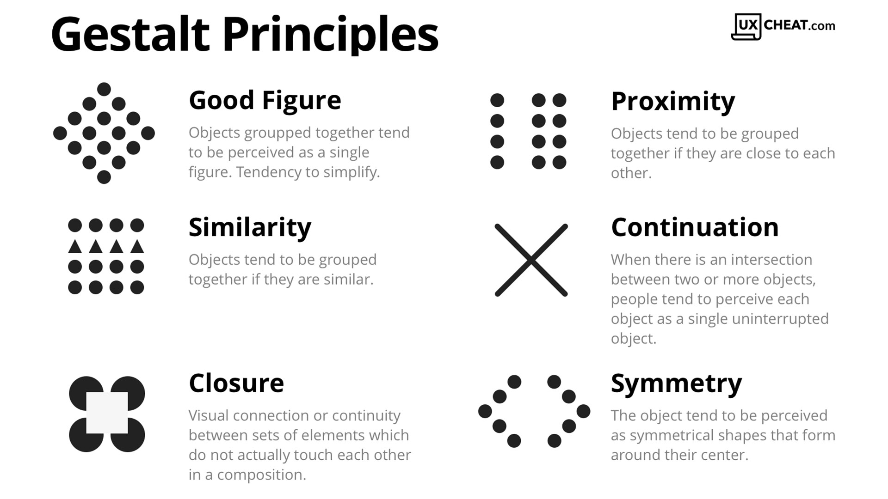

---
output:
  pdf_document: default
---

```{r include_packages, include = FALSE}
library(knitr)
library(palmerpenguins)
library(tidyverse)
library(nycflights13)
data(flights)

library(ggpcp)
library(ggplot2)
library(dplyr)
data(nasa)

library(scales)
library(datasets)
data("ChickWeight")
library(formatR)

```


<!--
----

\svp{I think it might be most effective to have several sub-sections of the lit review that are somewhat connected.}

First: Outline the general topic - creation of interactive graphics and dashboards to enable end-users to understand their own data. Explain that this is a highly interdisciplinary topic. Conclude this paragraph by explaining that you will explore the major sub-topics sequentially and then outline the interface between them at the end of the literature review.

- Graphics
    - Perceptual principles - cognitive load, working memory, etc.
    - Exploratory Data Analysis
    - Grammar of Graphics - with examples of code!
    - Big Data and graphical solutions - overplotting, binning, interactivity
    - Interactive Graphics

- Human Computer Interaction/UI-UX
    - User analysis - general process, not focused on your projects at all - you'll talk about that later on
    - Protocols for testing design - think aloud, eye tracking, feedback/surveys.
    - General Dashboard stuff

Conclusion: Connections between EDA and dashboards - not all dashboards are designed for EDA, but most dashboards are designed with end-users, not statisticians, in mind. This requires a different set of optimizations than if we designed for experts. 

---
-->

# Introduction
<!-- General purpose of this section: 
Motivate Dashboards and conclude that it is important to understand how graphs are perceived and used by various target audiences. -->

Statisticians use graphs in almost every stage of their work: we create charts when we get new data, to explore what we have and identify potential problems and opportunities. 
We fit models based on relationships between variables which are often identified visually. 
We identify problems with those models based on residual plots and other visual diagnostics. 
When our modeling work has been completed, we present our results to interested parties using visual displays, because non-statisticians often find it easier to understand data and models through an intuitive visual medium rather than through the mathematical formulae which underlie the statistical work.

Given the wide range of uses for graphs and visual data displays in statistical modeling, it is unsurprising that some graphs are more useful for specific applications such as exploratory analysis, and are unsuitable for other applications, such as presentation to an outside group.
In addition, we know that not all visual displays have equal perceptual value [@aspillaga1996]. 
The best graphics are designed to account for both the features of the dataset and the features of the intended audience.
Some design constraints stem from limitations of the human perceptual system and are common to most potential consumers of the visualization: the sine illusion [@vanderplas2015] affects anyone with binocular depth perception, and color recommendations are built around the specific characteristics of the human retina.
Other design constraints are due to the audience's experience level: are they used to working with data? 
Do they understand specialized techniques such as principal component analysis to the point where a plot of factor loadings might be \svp{a} useful \svp{visual display}?
When we create visualizations for public consumption we have to consider both perceptual factors and the target audience's domain knowledge.
In this introduction, we explore previous research related to the construction of interactive and static visual displays for different audiences and consider the implications of this research when designing interactive data displays such as dashboards.

<!-- We wish to discuss and analyze the exploration of using density plots or categorical plots as "best" plots in the field. --> <!-- Wait, what? Density plots or categorical plots are the best plots?? -->
<!-- We will analyze statistical data and graphics alongside dashboard design, starting with Steven Few's principles.  --><!-- This is said in the prev paragraph, minus Few, which we can cite later -->
<!-- It would be worthwhile to investigate the development of dashboards from static graphical representations in a practical setting to dynamic representations in an application setting.  -->
\svp{Most research in statistical graphics has been done on static graphics; usually, research also strips away all but the most essential contextual information. 
As a result, it can be hard to generalize this research to practical applications, where the contextual information surrounding the data is critical and the chart does not just exist in a vacuum.}
<!-- We would like to see the application of research to practice. -->


<!-- Consider a novel concept in research can be less practical or useful in the field more often than not.  -->
\svp{In the "real world", however, conventions and familiarity often win out over best practice validated by perceptual experiments.}
For example, in sports, many coaches desire printable diagrams containing all necessary and valuable information on a single page. 
As data in sports becomes more prominent, extensive, and collected, this information must be refined. 
<!-- We will adopt the concept of dynamically introducing the application to stakeholders with a static representation and migrating them into an active application.  -->
<!-- Once this dynamic application is utilized or migrated to that space, it is necessary to comprehend why categorical representations are more critical than density representations in the field.  -->
<!-- In regards to speaking about the same data being represented, most of the data is then categorized.  -->
<!-- Is it because categorical shot charts in tables are perceived to be digestible or because density plots become cluttered and difficult to comprehend?  -->
<!-- Where do we draw the line between what is viewed as an impediment to the development of applicable graphics methodology? -->
\svp{Thus, in addition to the experimental evidence, we must consider the human element: how to introduce new graphical concepts to stakeholders, and the considerations involved in encouraging stakeholders to adopt these improved graphics.}
\svp{Let us first consider the audience characteristics that affect the selection of graphics. 
Then, we will engage with considerations based on the data to be displayed. 
Finally, we will consider the interactions between the audience and the data: how graphics are tested, amended, and hopefully eventually adopted into common use.}


## Audience Considerations

Several factors, including perception, attention, and expertise, can influence our desire and ability to read and engage with data visualization.


### Perception

\db{Why is it essential to comprehend perception laws when working with data visualization? 
First of all, they can guide your decision-making when creating a graph or dashboard. 
In addition, they assist the reader in quickly organizing and interpreting charts and graphs and making visual sense of the information.
Assigning meaning is not a statistical or computational step but a cognitive one. 
Each step in the data analysis process is part of a more extensive mental process.
To read reality from images is to solve a problem: a series of extremely difficult problems that persist throughout an individual's lifetime. 
Errors are illusions. 
Certain situations present unique challenges and lead to systematic errors; can these provide insight into how the brain solves the problem of which objects are represented by which images in general @gregory1968.
Human perception plays a direct role in the area of visualization and graphics. 
Data Analysis tasks closely resemble the cognitive process known as sensemaking. 
Tukey and Wilk highlight the role of cognitive processes in their initial descriptions of Exploratory Data Analysis (EDA) @tukey1966.
Additionally, short-term memory is crucial to the effectiveness of statistical graphics. 
Research indicates that our short-term memory can only store a limited amount of information at any given time. 
Therefore, designers must present data in a manner that is simple to comprehend and remember. 
Utilizing parallel coordinate plots is one method for achieving this. 
These plots enable viewers to compare multiple variables concurrently, thereby reducing cognitive load and making it easier to identify patterns and trends.}

\db{Untrained analysts can and do "analyze" data with only their natural mental abilities - The mind performs its data analysis-like process to create detailed understandings of reality from bits of sensory input.}

\db{The theory of Gestalt has philosophical and psychological roots that date back to the late 1800s. 
At its most basic, the entire form is perceived (or emerges to our visual pathways) as opposed to its component parts. 
Our visual interpretation of the world is a major factor in why humans perceive the world and its objects as organized, regular, and simple shapes, schemas, figures, or forms.
Without diving too deeply into sensory perception, brain pathways, and the biology of the eye, let's establish two essential facts:}

(1) Vision, and how we perceive or interpret what we see, is primarily the result of our brain and nervous system transmitting sensory stimuli through neural pathways. 
This is why people with perfectly functioning eyes, such as those with Cortical Visual Impairment, may be unable to see if the pathways to the brain are miswired or damaged (see a viz on that here).

(2) While 70% of our experience of the world is gained through vision, our brains can only simultaneously process less than 5% of our visual environment.

\db{All of this suggests that our brain frequently perceives things differently than what is actually present. 
If you are familiar with optical illusions or the famous "gorilla in the crowd" experiment, you are aware that we do not always process everything in our visual field. 
There is simply too much information for our brains to process, and if we tried to interpret it all, we would be rendered paralyzed.
We organize the world according to Gestalt principles and pre-attentive attributes so that it is familiar, makes sense, and is easy to process.
These principles guide how people perceive and make sense of the world around them, and they play a critical role in designing effective visual displays, such as dashboards.}

Gestalt principles include:

- Proximity: Objects close to each other are perceived as related or grouped.
- Similarity: Objects that are similar in some way (e.g., shape, color, size) are perceived as related or grouped.
- Continuation: The human eye follows lines and patterns, so designers can use this principle to guide the viewer's gaze through a display.
- Closure: The human brain tends to complete incomplete figures or patterns, so designers can use this principle to create the illusion of missing information.
- Figure-Ground: The human brain separates the foreground (figure) from the background (ground), so designers can use this principle to create visual hierarchy and emphasis.
- Contrast: The human eye is drawn to high-contrast areas, so designers can use this principle to create emphasis and hierarchy.
- Symmetry and Balance: The human eye finds symmetry and balance visually pleasing, so designers can use this principle to create a sense of harmony and order.

```{r gestalt, echo=FALSE, out.width = "75%", fig.cap='Gestalt Principles with Examples',fig.show='hold',fig.align='center'}

```


\db{These principles are based on cognitive psychology and understanding how the human brain processes visual information.}

\db{Eye tracking regression is a method used in eye tracking studies to analyze eye movement data and identify the factors that influence a participant's gaze behavior. 
In eye tracking regression, the eye movement data is regressed on a set of predictor variables, such as visual features of the stimulus or task instructions, to determine the degree of influence each variable has on eye movements.
On the other hand, statistical regression is a technique used in statistics to identify the relationship between a dependent variable and one or more independent variables. 
Statistical regression is used to make predictions or to explain the relationship between variables. 
It is used in various fields, such as economics, psychology, and biology, to analyze and understand complex data.
While both techniques involve regression analysis, they are used for different purposes and with different types of data. 
Eye-tracking regression is specific to eye-tracking data and is used to understand visual attention and perception. 
Statistical regression, however, is a more general technique that can be applied to any type of data and is used for modeling relationships between variables.}


### Attention and Memory

Short-term memory (STM), also known as working memory, is the stage of temporary storage and processing where the majority of memory retention effort is expended. 
According to @baddeley2012, STM is a limited-capacity system prone to interference and decay. 
Selective attention is essential for the maintenance of STM because it allows us to filter out irrelevant information and concentrate on what is essential @cowan2001.

Visual aids such as charts and diagrams can improve short-term memory by allowing us to encode and retain information more effectively, according to research @alvarez2004.

Consequently, utilizing visual aids such as charts can be advantageous for enhancing our short-term memory.

Furthermore, annotations can also be useful in aiding short-term memory. 
By adding annotations, such as notes or highlights, to information we are trying to remember, we can improve our recall of the information later on @alvarez.


<!-- Feature Integration Theory -->
According to the Feature Integration Theory (FIT), STM is composed of two stages: pre-attentive processing and focused attention @treisman1998. 
Parallel and independently, the brain processes the physical characteristics of an object, such as its color, shape, and orientation, during pre-attentive processing. 
However, focused attention is required to bind these features into a coherent object representation in STM.
STM can be improved through various strategies, such as rehearsal, chunking, and elaboration @oberauer2009. 
For example, by repeating a phone number several times or breaking it down into chunks of two or three digits, we can increase the likelihood of it being stored in STM. 
Similarly, by elaborating on the information we want to remember, such as creating mental associations or visual images, we can enhance its retention in STM @bui2015.

STM is a dynamic and malleable cognitive system that is crucial to our daily lives. 
Understanding the mechanisms underlying STM and how to improve it can have significant implications for learning, memory, and the treatment of memory disorders.

### Constructing Meaning

Gestalt psychology suggests that humans actively construct meaning by organizing information into patterns and wholes @wertheimer1923.
Both top-down and bottom-up processing are involved in the process of meaning construction. 
Bottom-up processing entails analyzing sensory data from the environment and constructing perceptions based on this data. 
Top-down processing is the influence of prior knowledge, expectations, and context on the perception and interpretation of incoming sensory data.

Together, top-down and bottom-up processing facilitate the encoding and retrieval of information in the context of short-term memory. 
Selective attention, the ability to focus on relevant information while ignoring irrelevant information, is an example of top-down processing that aids in the encoding and retrieval of information in short-term memory @cowan2010.  
According to the feature integration theory, the perception of objects involves both the bottom-up analysis of individual features and the top-down processing of higher-level features in order to form a complete perception @treisman1980.

The Gestalt principles of perception emphasize the significance of bottom-up and top-down processing in constructing meaning from sensory data. 
Both types of processing are involved in encoding and retrieving information, which has significant implications for understanding how short-term memory works.

### Expertise
The development of expertise is a gradual and iterative process that is influenced by numerous psychological factors, such as cognitive processes, automaticity, readily accessible information, and practice effects.

Cognitive Processes - the way we think about and approach a task.

As we become more proficient in a particular skill, we develop more complex and efficient mental models or schemata. 
These mental models help us to organize information in a meaningful way, and to quickly identify and solve problems related to the task. 
This process is known as cognitive restructuring and is facilitated by developing domain-specific knowledge @ericsson1996. 
For example, a chess master is able to quickly recognize patterns and positions on the board that are common in chess, which allows them to make decisions more quickly and accurately than a novice player.


Automaticity - the ability to perform a task without conscious effort or attention

As our proficiency in a task increases, our performance becomes more automatic, thereby freeing up cognitive resources for other tasks.
The development of procedural knowledge, which is the ability to perform a series of steps or actions in a particular order, facilitates this process @Fitts1967. 
For instance, a skilled typist can type without looking at the keyboard because their finger movements have become automatic.


Information Readily Available - the way we process information related to a task

As our proficiency increases, we can recognize and retrieve pertinent information more rapidly and precisely than a novice. 
This is made possible by the creation of domain-specific knowledge structures that allow us to retrieve pertinent information from memory quickly @Chase1973. 
For instance, a medical expert can quickly identify signs and diagnose a patient using their knowledge of disease symptoms and risk factors.


Practice Effects - extensive practice and experience

Practice effects are the performance enhancements that result from repeated practice. 
These gains are frequently most significant at the outset of practice, but gradually diminish as the individual approaches their performance ceiling @Anderson1982. 
The development of procedural knowledge and automaticity, which allow for more efficient and accurate task performance, facilitates the effects of the practice.


### Engagement with the data
<!-- This is a good paragraph -- but I'm not sure it's in the right place.  -->
\db{
The goal of data analysis is to extract meaningful insights, patterns, and knowledge from data. 
The process of data analysis involves collecting, cleaning, transforming, and modeling data, followed by the use of statistical and machine learning methods to uncover patterns and relationships within the data. 
The end goal of data analysis is to support decision making and provide a basis for informed action. 
Data analysis can help organizations to better understand their customers, market trends, and operational performance. }
<!-- What about organizations which aren't profit-driven? They still need to understand the relationship between different variables in the dataset. -->
\db{Additionally, data analysis can support scientific research by helping researchers to test hypotheses, develop theories, and gain a deeper understanding of complex phenomena. 
Ultimately, data analysis aims to turn data into actionable insights and information that can inform and improve decision-making.}


## Data Considerations
Grammar allow us to separate data type from rendering 


<!--### How do we classify graphics? -->

In the field of graphical communication, semiology, or the study of signs and symbols and their use in communication, has been a valuable tool.
One of the fundamental principles of semiology is the relationship between signifier and signified, in which a visual element (the signifier) represents a particular meaning or concept (the signified) (@Barthes1972). 
Another essential concept in semiology is the utilization of syntax and semantics to effectively convey meaning in graphic communication. 
This includes both the syntax and semantics of a graphic's visual elements (@Bertin1983).

The use of color to represent data on maps is an example of successful graphical communication utilizing semiology. 
By using different colors to represent different data points, viewers can comprehend patterns and relationships in the data quickly and easily. 
Jacques Bertin (1983) writes in "Semiology of Graphics" that color can be used to "emphasize a point, distinguish one category from another, or establish a relationship between two points." 
In addition, Bertin explains that the use of color can help overcome language barriers, making it easier for the audience to comprehend the presented information.

Graphs are another tool that can be used to effectively communicate information via semiology. 
By utilizing visual elements such as bars and lines to represent data, graphs can make complex information more understandable to viewers. 
For instance, a line graph can be used to illustrate the change in value of a stock over time, making it easier for investors to identify trends and patterns. Leland Wilkinson (@wilkinson2012) writes in his book "The Grammar of Graphics" that "graphical methods are not only superior to other forms of communication, but also superior to numerical or verbal methods for certain types of data and reasoning."

The application of semiology in graphical communication is not devoid of obstacles. 
One difficulty is the possibility of misinterpretation, in which viewers may assign a different meaning to a visual element than was intended (@Bertin1983). 
Another concern is the possibility of cultural differences in interpretation, in which a visual element may have a different meaning in one culture versus another (@Norman2013).

Despite these obstacles, semiology in graphical communication remains an indispensable tool for effectively conveying information. 
By understanding semiology principles and syntax and semantics' role in graphical communication, designers can create compelling visual representations that convey information clearly and concisely.

An important contribution made by Friendly has been historical research on statistical graphics. 
He has investigated the origins and development of graphic techniques, tracing their evolution from antiquity to the present. 
In his book "Milestones in the History of Thematic Cartography, Statistical Graphics, and Data Visualization," Friendly (2019) provides a comprehensive overview of the key milestones in the evolution of statistical graphics, including the contributions of pioneers like William Playfair, Charles Minard, and John Tukey.

Friendly's contributions have significantly advanced the field of statistical graphics. 
His historical research has yielded significant insights into the origins and evolution of graphical methods, while his development of new techniques has increased the number of data visualization tools available. 
By emphasizing the role of graphical methods in scientific discovery, Friendly has helped to promote their use in a vast array of disciplines, from the natural sciences to the social sciences and beyond.

<!--### what do we know about "better" graphics for certain tasks? -->


<!-- ### General guidelines -->

\db{Exploratory Data Analysis (EDA) analyzes and summarizes a dataset to discover patterns, trends, and insights. 
It is a crucial step in the data analysis process and is often used to identify which variables are essential, what the data looks like, and what the underlying structure of the data is. 
EDA is typically done using various techniques, such as visualizations, statistical summaries, and data transformations.}

\db{John Tukey was the first to organize the collection and methods associated with philosophy into Exploratory Data Analysis (EDA). 
John Tukey, creator of stem-and-leaf plot, boxplot-resistant smooth, and the violin plot (also known as rootgram) who taught us to utilize these methods to organize and demonstrate EDA. 
He was a strong advocate for the importance of EDA as a crucial first step in the data analysis process and emphasized the need for visualization and interactive techniques to understand patterns and relationships in data.}

```{r violin_plot, echo=FALSE,out.width='.49\\linewidth', fig.width=3, fig.height=3, fig.show='hold', fig.align='center'}
ggplot(ChickWeight, aes(x = Diet, y = weight)) + 
  geom_violin(aes(fill = Diet), trim = FALSE) +
  geom_boxplot(width = 0.1) +
  theme_classic() +
  theme(legend.position = "none")

p <- ggplot(ChickWeight, aes(x=Diet, y=weight, fill=Diet)) +
  geom_boxplot()
p + scale_fill_brewer(palette="Dark2")
```


<!-- \svp{Ok, he was a bit more than a person. He's the creator of the boxplot, stem and leaf plot, and rootogram, afaik. Add pictures demonstrating these things. Explain why they're important.} -->

\db{Tukey's Principles in EDA:}

1. Graphical exploration looking for patterns or displaying fit.
- The method demonstrates things about data that are not understood by a single numeric metric. This has been useful in graphing the data before you develop summary statistics.

2. Describing the general patterns of the data.
- This step should be insensitive to outliers. In general, think about the types of resistant measures (i.e., median or mean). This step is making sure to determine data patterns.

3. The natural scale/state that the data are at their best. This will be the step at which the scale of data can be helpful for analysis. The reexpressing data to a new scale by taking the square root or logarithmic scale.

4. The mostly known parts of EDA but is done in the way of accessing fit of the data. This is taught in every statistics 101 class. The growth of machine learning and prediction methods have now used residuals more in the toolbox to assessing the best prediction models.
- The idea generally is to determine the deviations in the data from a general pattern by looking at the data from the fit of the data.}

<!-- \svp{assessing, not accessing. Use an example in this section to provide a clear demonstration of what each principle might look like. The flights data or the diamonds data might be good options here, since they're both large.} -->


```{r flights_data_example, echo=FALSE, out.width='.49\\linewidth', fig.width=3, fig.height=3, fig.show='hold',fig.align='center'}
# Stacked Density plot
ggplot(data=flights %>% filter(dest %in% c("ATL", "ORD","MDW") ), aes(x=distance, fill=carrier)) +
geom_density(position="stack")

# Histogram
ggplot(data=flights %>% filter(dest %in% c("ATL", "ORD","MDW") ), aes(x=distance, fill=carrier)) +
geom_histogram(position="stack")

```


\db{On the other hand, Dashboards are interactive interfaces that display data visually to provide insights and support decision-making. 
Dashboards can be used to monitor key performance indicators, track progress over time, and identify patterns and trends in data. 
They often display real-time data and can be customized to show the most relevant data to the user.}

\db{Interactive graphics, are central to EDA [@unwin1999]. 
Beyond the limitations of static statistical displays, interactive graphics enable visualizations to advance alongside the analysis. 
User interaction and direct manipulation are required for dynamic graphics to reach their full potential (@cook1995; @unwin1999).
The connection between EDA and dashboards is that EDA is the process of preparing and understanding the data, which is the first step for building a dashboard, as the data has to be cleaned, transformed, and analyzed to be used efficiently on the dashboard. 
EDA results can be used to identify the most relevant data and metrics to include in the dashboard and to design the visualizations that will be used to display the data. 
And also, the EDA process can be used to identify the outliers, patterns, trends, and insights that will be useful to show in the dashboard to support decision-making.}

\db{Visualizations of data are essential for exploratory data analysis (EDA) along with model diagnostics. 
Plots for EDA are a valuable tool for guiding an analyst in discovering the relationships between variables in their data. 
When using plots in model diagnostics, plots help analysts determine whether or not the model is an appropriate way to model. 
During the initial EDA stage, an analyst may find that a variable or a covariate is directly related to the dependent variable when looking at a correlation heatmap or a scatterplot. 
This will be important to know before starting a linear model analysis. 
Much of our general understanding is from introductory statistics courses. 
The basic understanding can be formalized to visualize the discovery process.}

### Variable Types

Not all variables should be used to create all types of charts - variable type informs chart structure
\db{
Categorical Data Visualization is the process of visualizing data that can be divided into distinct categories or groups. Categorical data are non-numeric and often represented by words, labels, or symbols, such as gender, product type, color, etc.}

\db{Visualizing categorical data helps uncover patterns and relationships between categories and can provide insights into the data distribution. 
Categorical data visualization techniques include bar charts, pie charts, histograms, stacked bar charts, and others. 
The choice of visual representation will depend on the data's nature and the insights being sought. 
The goal of categorical data visualization is to communicate the information effectively and make it easier to understand and interpret.}

\db{Friendly detailed using SAS with hands-on experiments to present categorical data analysis visually [@friendly2014]. 
Researchers have used PCPs to visualize categorical data. 
Beygelzimer, Perng, Ma and Hellerstien created a fast ordering categorical data analysis algorithm that helped visualization, where their algorithms helped organize the original parallel coordinate plots clearer ([@beygelzimer2001]; [@ma2001]). 
Hammock plots are modified versions of similar coordinate plots invented by Schonlau to visualize categorical data [@schonlau2003]. 
His design replaces coordinate polygons with rectangles to present the number. 
Treemaps are modified to support categorical data visualization.}

\db{CatTree gives a hierarchical categorical data visualization with interaction [@kolatch2001]. 
Fernstad developed an interactive system combining parallel coordinates, tables, and scatterplot matrices for an overview explorative analysis. 
Thoroughly research categorical data visualization to support algorithm understanding. 
The novel contingency wheel presented by [@alsallakh2011] supports visual analytics in categorical data, and he measured association based on Pearson's residuals and used visual abstraction based on elements frequency.  }

\db{High-Dimensional Data Visualization represents complex data sets with many variables or features (also known as high-dimensional data). 
The goal is to find effective ways to express such data in a form that allows easy understanding, analysis, and interpretation.
This is typically achieved by reducing the dimensionality of the data, for example, by projecting the data onto a lower-dimensional space or by aggregating the data in some way. 
The resulting visualizations can then reveal patterns, relationships, and other insights that would otherwise be difficult to detect from the raw data. 
For example, high-dimensional data visualization techniques include scatter plots, parallel coordinate plots, heat maps, and many others.}

\db{A popular research area in visualization since high-dimensional data is always fuzzy to mining. 
Direct visualization includes geometric visualizations:}

- scatterplots: use dots in coordinate to present data points.
- parallel coordinates: present each dimension as axes, and every data item intersects dimensions as a polygon line at a particular position
- RadViz/ PolyViz
- GridViz

\db{Besides these traditional geometric visualization methods, iconographic displays like human faces and star glyphs used funny ways to present multivariate data. 
Hierarchical methods are used widely in parallel coordinates, which give analysts an intuitive view of clustering information [@fua1999]; [@johansson2005]. 
Rearrange the dimensions by dimension similarity on parallel coordinates, circle segments, and recursive patterns [@ankerst1998]. 
Guo used an interactive feature selection method to help users identify interesting subspaces from high-dimensional data sets [@guo2003].}

### Grammar of Graphics
\db{Frame as a way to easily change between appropriate forms of presentation for a given variable or set of variables.}


It doesn't help us decide which is better - for that we need user testing.

\db{The grammar of graphics (gg of ggplot2) is a theory that is well-defined for creating statistical graphics with work from Wilkinson [@Wilkinson1999] and Hadley Wickham [@ggplot2]. 
The Grammar of Graphics is a framework for understanding the structure of statistical graphics developed by Leland Wilkinson. 
It proposes that any statistical graphic can be broken down into a set of essential components, or "grammar," that can be combined in different ways to create a wide range of visualizations. }

\db{Grammar of graphics is defined as the framework which follows a layered approach to describe and construct visualizations or graphics in a structured manner.}

The components of the grammar of graphics include:

- Data: The raw data being visualized represents a set of observations or values. 
- Aesthetic Mappings: The mapping of data variables to visual properties such as position, color, shape, and size. 
- Scales: The mapping of data values to visual values, such as mapping a numerical value to a bar height. 
- Geometries: The basic shapes representing the data, such as points, lines, bars, and histograms.
- Facets: The plot division into multiple subplots, each representing a different subset of the data.

\db{For example, a bar chart can be created by mapping a categorical variable to the x-axis, mapping a numerical variable to bar heights, and using rectangular bars as the geometry. 
For example, mapping two numerical variables can create a scatter plot to the x and y positions and use points as the geometry.
Finally, the Grammar of Graphics provides a systematic way of thinking about visualizations, making it easier to choose the appropriate visual representation for a given dataset.
}
```{r graphics2, echo=FALSE, out.width = "45%",fig.cap='Grammar of Graphics Diagram of Wickham and Wilkinson\'s work',fig.show='hold',fig.align='center'}
#knitr::include_graphics("figure/gglayers.png")
#knitr::include_graphics("figure/graphic-flowchart.png")
knitr::include_graphics(rep(c("figure/gglayers.png","figure/graphic-flowchart.png"),1))
```


#### Interactive Graphics

\db{The area of interactive graphics is still very much a work in progress despite existing as a field of research since the late 1960s—developments are driven partly by new technology, such as `d3` [@bostock2011]. 
Visualizations are more than just a picture. 
They are now a tool that facilitates analytic activity through different modes of interaction [@yi2007]. 
Visualization is context-free, as it can mean different things to different people depending on the situation [@parsons2014]. }

\db{The van Wijk Simple Visualization Model is a diagrammatic representation that provides a simple and effective way to understand and visualize the flow of information and data through a system. 
It is a commonly used tool in Exploratory Data Analysis (EDA), which is the initial step in the data analysis process. 
The van Wijk model can be used to represent the flow of data from data sources, through intermediate processing stages, to the final visualization of results. 
van Wiij's simple visualization model shows how insights are generated as the human participates in a feedback loop between reading and interacting with visualization [@van2005]. }

\db{This model is also context-free, allowing for the focus to be on the feedback loops between visualization and the user.}

<!-- \svp{This is new to me, but seems like it would be a good way to bridge between the graphics and UI/UX sections I proposed above. } -->

\begin{center}
\includegraphics[width=\textwidth]{figure/vanWiijSimpleModel.png}
\captionof{figure}{van Wiij Simple Visualization Model}
\end{center}

\db{Interaction allows the user to define what data they see and how they see it, creating a dialogue between the user and the system. 
Theories behind visual representation include:}

- graphical comprehension ([@cleveland1984])
- preattentive processing ([@ware2012])
- gestalt theory ([@few2009])
- graphical excellence ([@tufte2001])

Theories behind the manipulation of visualizations include but are not limited to:

- cognitive fit ([@vessey1991])
- visual perceptual approaches ([@baker2009])
- human information processing

\db{As interactive visualizations play a more significant role in information systems, designers must know what tasks, visual representations, and interaction techniques are available and how they work to facilitate analytical reasoning. 
They must decide on the most effective visual representation without being able to estimate every user's ability to read and interpret the visualization.} <!-- [@boy2014].-->

\db{Interactive visualization is a commonly used tool in Exploratory Data Analysis (EDA), which is the initial step in the data analysis process. 
The goal of EDA is to gain a high-level understanding of the data and to identify patterns, relationships, and anomalies in the data. }

\db{Visualizations have become more effective in recent years due to the pandemic and the Johns Hopkins University COVID-19 Dashboard [@JHPHDashboard] [Dashboard](https://coronavirus.jhu.edu/map.html).
We were glued to our computers, TVs, and phones for most of the world. 
As a result, we watched the dashboard change in real-time to adapt to the users' needs. 
In part to data growth and changing, the dashboard, as well as the visualizations, were needed in a condensed platform. 
The need to be concise and vastly informative is a struggle regarding data visualizations. }

\db{The human brain can only take in a set amount of data from a table or a paragraph. \svp{references?}
The space of infographics has been a much better way of looking at data on a creative scale.[@stat\_graph\_hist] 
While this may be a way of seeing the data in a friendly way, infographics need to include an interactive piece of data that many people would like to explore.}


\db{The relationship between the van Wijk Simple Visualization Model and Human-Computer Interaction (HCI) lies in the area of data visualization. 
The van Wijk Model provides a framework for understanding how information and data flow through a system to be displayed to the user. 
In the context of HCI, the model helps to understand how data is processed, transformed and presented to the user in a way that is intuitive, informative and engaging. 
The model helps to identify the various steps involved in the visualization process, from the collection and processing of data to the presentation of results. 
By doing so, it supports the design of more effective and user-friendly visualizations, which can enhance the overall user experience.}
}

### Multivariate Data Displays

- Difficulty of visualizing multivariate data
- Different approaches - briefly mention 
    - encoding with shape/color/etc.
    - tours
    - pcps
    - linked graphics (interactivity)

This section doesn't need to solve the problem - it just introduces it


```{r ggpcp_example, echo=FALSE, fig.width=3, fig.height=3,fig.show='hold',fig.align='center', eval = FALSE}
oranges <- c("#FDBF6F", "#F89D38", "#F37A00")
purples <- c("#CAB2D6", "#9A78B8", "#6A3D9A")
greens <- c("#b2df8a", "#73C05B", "#33a02c")

cols <-  c(oranges[2], greens[2], purples[2])

flights %>%
  filter(origin == "LGA") %>%
  pcp_select(dest:distance) %>%
  pcp_scale() %>%
  ggplot(aes_pcp()) +
  geom_pcp(alpha = 0.1) +
  theme_bw()


df_pcp %>%
  ggplot(aes_pcp())  +
  geom_pcp_axes() +
  geom_pcp(aes(colour = Observation), size=1,
           data = df_pcp %>% filter(pcp_id %in% c(1,275))) +
  geom_point(aes(shape=Observation, colour = Observation), size=5,
             data = df_pcp %>% filter(pcp_id %in% c(1,275))) +
  theme_bw() +
  xlab("") +
#  scale_shape_discrete("Observation") +
  scale_colour_manual("Observation", values=c("darkorange", "purple4")) +
  ylab("") +
  theme(axis.title.y = NULL, axis.text.y = NULL, axis.ticks.y = NULL) +
  scale_y_continuous(labels=c("low", "", "medium", "", "high"),
                     breaks=c(0,0.25, .5,.75, 1)) +
  scale_x_discrete(expand = expansion(add=0.2),
                   labels = c("Bill Length (mm)", "Bill Depth (mm)",
                              "Flipper Length (mm)", "Body Mass (g)"))


```


## Audience-Data Interactions

\db{User analysis is a crucial step in the design of user interfaces, especially in Human-Computer Interaction (HCI) and User Experience (UX) design. 
It involves studying the users of a system to understand their needs, goals, and behaviors. 
The purpose of user analysis is to create interfaces that are easy to use, efficient, and effective for the intended audience.}

Several methods can be used to conduct user analysis:

- Interviews: This involves conducting in-depth interviews with users to understand their needs, goals, and workflows.
- Surveys involve sending out surveys to users to gather data on their needs and preferences.
- Observations: This involves observing users as they complete tasks with the interface to understand their behaviors and workflows.
- Personas: This is a method of creating fictional characters that represent the different types of users; it helps to understand the users' needs and goals.
- Scenarios: This is a method of creating stories that describe how a user might interact with a system; it helps to understand the context and the user's needs.
- Focus groups: This is a method of gathering a small group of users and facilitating a discussion to understand the users' needs and goals.
- Contextual inquiry: This is a method of visiting the users in their work environment and observing them while they work; it helps to understand the context and the user's needs.

\db{The results of user analysis can be used to inform the design of the interface, including the layout, navigation, and functionality. 
It can also be used to identify areas of the interface that are confusing or difficult to use and to make recommendations for improvements. 
User analysis is an iterative process, and it should be done in multiple stages of the design process to ensure that the final product is tailored to the users' needs.}


### Testing static graphics

Brief overview of user studies that compare different types of graphics, accuracy, etc.

\db{Static Visualization is commonly used in the communication phase of data science workflows, and data scientists sometimes use them as part of the analysis. 
For example, John Tukey's EDA methods are currently known and well-vetted in the field. 
However, Satyanarayan et. al began to address this by introducing a high-level grammar of graphics called "Vega-Lite," which presents a set of standardized linguistic rules for producing interactive information visualizations using a concise JSON format for data to be represented by the grammar [@satyanarayan2016]. 
Vega-Lite has been directly implemented in R via the `ggvis` package using the same - albeit slightly lower-level.
Several protocols and methods can be used to test the design of a dashboard or other visual display. 
Some of these include:}

- Usability testing: This involves having users interact with the dashboard and providing feedback on its usability, including how easy it is to navigate, understand, and use.
- Cognitive walkthrough: This involves having experts in human-computer interaction evaluate the dashboard, focusing on the cognitive processes required to use it effectively.
- Eye-tracking: This involves using technology to track the users' gaze and interactions, to understand the user's focus and attention on the dashboard elements.
- A/B testing: This involves creating two versions of the dashboard, each with slightly different design elements, and comparing the results to see which design is more effective.
- Surveys: This involves asking users to complete a survey that measures their satisfaction and understanding of the dashboard and to provide feedback on improvements.
- Heat maps: This involves using heat maps to track where users are clicking on the dashboard to identify which elements are being used the most and which are being ignored.
- Card sorting: This is a method to understand the users' mental models and how they would like to organize and categorize the data; it is helpful to understand how to structure the dashboard navigation.

\db{These are just a few examples of the many protocols and methods that can be used to test the design of a dashboard. 
The selection of the appropriate way will depend on the specific goals of the testing and the resources available.}

\db{Remember that the user's feedback is crucial in the testing process; it will provide the necessary insight to improve the design and make it more efficient.}

### Testing interactive graphics

Overview of testing methods for interactive graphics - talk aloud, measuring user engagement, etc.
\db{Testing interactive graphics using human perception principles in psychology involves considering various aspects of human perception and cognition to evaluate the effectiveness and user experience of the graphics. Here are some steps you can follow to test your interactive graphics:}

\db{Usability testing: Conduct a usability test to assess the ease of use and accessibility of the graphics. 
This includes testing for navigation, user control, and overall user experience.}

\db{Perception of visual elements: Evaluate how the visual elements in your graphics, such as color, contrast, size, and position, impact the perception of the information being presented.}

\db{Cognitive load: Assess the cognitive load on the user by evaluating how easily they can process and understand the information being presented. Factors such as complexity, amount of information, and type of information presented can impact cognitive load.}

\db{Attention allocation: Observe where the user's attention is directed while interacting with the graphics. This can help identify areas that may require improvement or modification to better engage the user's attention.}

\db{Memory retention: Evaluate the user's ability to retain and recall information presented in the graphics. This can help determine the effectiveness of the design in supporting memory retention.}

\db{User feedback: Obtain user feedback through surveys, interviews, or focus groups to gain insights into the user experience and identify areas for improvement.}

\db{It is important to keep in mind that human perception and cognition can vary greatly between individuals and can be influenced by a range of factors, such as age, culture, and personal experience. Testing with a representative sample of your target audience can help ensure that your interactive graphics are optimized for a wide range of users.}

## Dashboard Design

Given that the audience has limitations, there are design constraints around the data, and the ability of the audience to successfully use the graphical displays of the data, what can we take from this body of research that applies to more complicated sets of graphics? 

How do we maintain user attention, desire to explore, and accurately communicate the data through the medium of an interactive data dashboard?

\db{A dashboard is a visual display of the essential information needed to achieve one or more objectives, consolidated and arranged on a single screen so the information can be monitored at a glance [@few]. 
Dashboards have particular characteristics:}

- Achieve specific objectives
- Fits on a single computer screen
- Information can be displayed in multiple mediums (web browser or mobile device)
- Can be used to monitor information at a high level

\db{Dashboards can present various statistical data, such as financial performance, website traffic, or customer engagement metrics. 
They allow users to quickly and easily understand complex data sets using visual elements such as charts, graphs, and tables to display the information. 
Additionally, statistics can be used to analyze data presented on a dashboard, providing insights into trends and patterns that can inform decision-making.}

\db{While a dashboard can be handy, it may be worth describing that a poorly designed dashboard will not be used. 
A dashboard should be concise, clear, and intuitive when displaying components in combination with a customized list of requirements of users.}

\db{Much of the work done within statistical research and dashboard design involves collaboration with other researchers and users. 
While this may be the best for the growth of the discipline, one will find that working with collaborators with non-STEM backgrounds.
Dashboards can help understand and support many data types in essential business objectives. 
There are many different ways to label and utilize dashboards in different kinds.}

\db{Dashboards are cognitive tools that should be used to improve understanding of data, which should help people visually find relationships, trends, patterns, and outliers. 
Most importantly, dashboards should leverage people's visual cognitive capabilities.}

\db{EDA refers to methods and procedures for exploring the data space to learn about a data set. 
By analogy, exploratory modeling analysis (EMA) refers to methods and procedures for exploring the space of models which may be fit to a data set.}

\db{Interactive graphics are excellent for EDA; they are designed for exploring rather than presenting information (and more) and can be obtained by directly querying the graphic [@unwin2003].}

- PCPs enable the display of multi-dimensional data in two-dimensional space.
- There must be some loss of information, but this can be partly counteracted by varying the order of the axes.
- Interactivity is valuable for reordering the axes flexibly and fast.
- Interaction is valuable for dealing with the dense mass of lines produced by large data sets.

\db{Being able to select subgroups of cases, highlight the chosen lines, and switch between different subgroups all assist in interpreting the otherwise intricate displays which arise.}

\db{Cowan suggested that the average person can only hold two to six pieces of information in their attention [@cowan2001]. 
People can develop detailed understandings of reality, which is infinitely complex.}

\db{Cognitive structures consist of mental models and their relationships ([@rumelhart1976], [@carley1992], [@jonassen1996]).
A schema is a mental model containing a breadth of information about a specific object or concept. 
Schemas are organized into semantic networks based on their relationships to other schemas [@wertheimer1938], [@rumelhart1976].
This arrangement helps the brain process its experiences instead of storing every sensory observation; the brain only needs to maintain its schemas, which are good summaries of all previous observations. 
Some "memories" may even be complete recreations built with a schema [@bartlett1932], [@klein2007]}

\db{Wixon introduce "contextual design" as a systems development method in which the researcher partners with the user at the user's place of work to "develop a shared understanding" of the user's activities, and they define contextual inquiry as the first part of the broader process [@cowan2001]. 
Contextual inquiry is the data collection step of the field research element of the contextual design method, and it emphasizes four essential principles:}

1. The context of the activity being performed by the user 
2. The partnership between the researcher and the participant
3. The spoken verification that the investigator's interpretation of the activity matches the user's
4. The focus of the study is central to the approach taken by the interviewer

\db{Kandal conducted what might be considered a contextual interview study similar to ours in that they analyzed data scientists' self-reported work processes [@kandel2012]. 
They proposes three main archetypes that data scientists may be classed into the following:}

- Hackers: who build processes chaining together multiple programming languages of different types (analytical, scripting, and database languages) and use visualization in various environments.
- Scripters: who perform most of their analysis in an analytical environment (e.g., R or Python) and execute the most complex statistical modeling of the types but who do not performstatements their ETL
- Application Users: who performed most or all of their work in an application such as Excel or SPSS and, like scripters, relied on others (namely, their organizations' IT departments) for ETL.

<!-- This is where your paragraph about 2 good graphics being suboptimal together should go -->

## Conclusion


\db{In this dissertation, I address this question of design for dashboards, as well as tools which can be used to support the display of multivariate data in an interactive context.
Chapter 1 presents a thorough review of the literature regarding graphical and human computer interaction/UI-UX methods. 
Chapter 2 will explore the process of designing dashboards for public use thorough parallel coordinate plots as a central component to data exploration to make decisions.
Chapter 3 focuses on graphical methods for multidimensional categorical variables and visualization methods have for growth.
We conclude with a Shiny application that facilitates a better understanding of the possible forms a parallel coordinate plots in exploratory data analysis can take by accommodating a through examination through variables and structural changes to the parallel coordinate plot with a click of a mouse.
Chapter 4 further explores multidimensional categorical data visualizations and develops an approach to using parallel coordinate plots to assess predictive model. 
We identify visual indicators for parameters in different models and extend the connection between parallel coordinate plots of binary tables and odds ratios to include logistic regression models with categorical variables.
}

