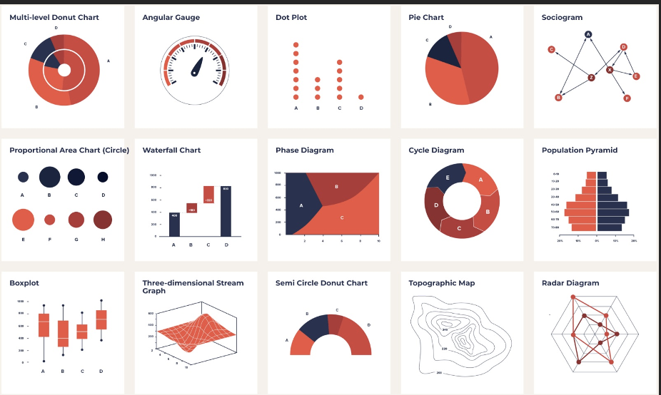

---
output:
  pdf_document: default
  word_document: default
---

```{r include_packages1, include = FALSE}
library(knitr)
library(palmerpenguins)
library(tidyverse)
library(nycflights13)
data(flights)

library(ggpcp)
library(ggplot2)
library(dplyr)
data(nasa)
library(GGally)
library(stats)

library(scales)
library(datasets)
data("ChickWeight")
library(formatR)

```

# Introduction

Our data-driven modern civilization now depends heavily on the ability to precisely evaluate and exploit huge and complex datasets, for example, in small rural towns where resources are often sparse. 
This dissertation aims to make big datasets more understandable and valuable by utilizing three related innovations: generalized parallel coordinate plots (GPCPs), reliable ways to look at missing data, and efficient methods to elaborate on the detection of unusual trends.
Each priority area is key for improving the GPCP technique to enable thorough and accurate data analysis across various datasets.

The accuracy of data interpretation is highest when dealing directly with numerical values or one-dimensional visual representations [@spence1990]. 
That is becoming more and more impractical as the size and dimension of datasets continue to increase.
To make judgments based on data, it is necessary to find methods of simplifying and consolidating datasets without sacrificing significant information.
Data visualization, such as graphs or tables, is often an essential and invaluable intermediate step between raw data and an observer's decision-making process.
An effective data visualization communicates the gist of a data set in a way that is easy for an observer to understand and evaluate; ideally, data visualizations slightly sacrifice accuracy (relative to a table of values) in favor of a greater understanding of the relationship between observations or variables. 


Most standard data visualizations work within the Cartesian coordinate system, with variables or functions of variables mapped to the x and y axis.
Additional variables can be mapped to different properties of the plotted points, bars, or lines, and analysts can also create small multiples that show subsets of the data; even with these additions, viewers quickly become overwhelmed by the amount of information when more than p = 3 or 4 variables are shown (including the x and y coordinates). 
When it is necessary to understand the relationship between more than four variables, visualizations on a Cartesian grid no longer work as well; extensions to additional dimensions are also ineffective [@reference]. 
Other approaches are necessary when it is necessary to understand $p > 4$ dimensions of data. 
Here, we examine parallel coordinate plots (PCPs) as a solution to $p > 4$ dimensional data visualization and assess the impact of different modifications of PCPs on their effectiveness for visualizing high N and/or high p dimensional data. 
We specifically evaluate the ability of each PCP version to facilitate the identification of overall trends, outliers, and clusters within $N > 4$ dimensional data across different magnitudes of N (observations) and p (variables). 

Stimulus-responsive attention often arises when an observer recognizes that a particular graphical element in a stimulus signals valuable information, guiding further search to improve judgment accuracy.
@spence1990 talked about the importance of visual psychophysics in figuring out how simple parts of graphs can be used to convey information.
He stressed that how well we can understand graphs relies on our cognitive and visual abilities.
Cleveland and McGill's study on graphical perception in 1985 found that people have different skill levels when decoding multidimensional data [@cleveland1984]. 
This shows that designs like generalized parallel coordinate plots must consider cognitive and perceptual variability. 
These plots show many dimensions within a single visual glyph, and the small changes between them make it much harder to understand complicated visual data. 
Additional studies, like @heer2010 and @simkin1987, built on these ideas by showing that mistakes happen at different points in information processing and that different graphs are better for different jobs depending on the user's accuracy.
It was emphasized by Carswell (1992) and Shah & Freedman (2011) that task difficulty and perceptual processes interact.
These articles say differences in how people think and perceive things should be considered when making generalized parallel coordinate plots to show multidimensional data.


## Parallel Coordinate Plots 

### Why?

Parallel coordinate plots (PCPs) are an excellent way to show data with many dimensions since each is shown on its plane. 
This means that complex relationships between different factors can be studied repeatedly. 
PCPs are great for drawing attention to trends, clusters, and outliers and efficiently show many variables in a small area. 
However, as with their Cartesian equivalents, PCPs are vulnerable to overplotting and can become difficult to read or interpret when N is large, but because they overplot, they can get messy with large datasets. 
It can be more challenging to understand the data than with Cartesian coordinates, and you must go through a learning process to get the majority of them as well.


Cartesian coordinates, on the other hand, are straightforward to understand because they are simple and well-known. 
They make it easier to tell the difference between different information points and their exact values by displaying data points in an easily understood manner. 
Cartesian coordinates are an excellent method to present data clearly because they can handle up to three dimensions. 
They also need help with growth because adding more dimensions requires a lot of subplots or complicated three-dimensional plots, which can get boring and challenging to follow. 
Cartesian graphs additionally can take up a lot of room, and for data with more dimensions, they usually need more than one plot.

```{r, echo=FALSE, fig.cap='A generalized pairs plot that shows bivariate relationships between each of the five variables in the Palmer penguins dataset',fig.show='asis', fig.align='center'}

ggpairs(penguins[,c(1, 3:6)], aes(colour = species))
```


```{r, echo=FALSE, fig.cap='A parallel coordinate plot. Note that this plot includes a single categorical variable (which is not allowable in the original PCP formulation), but this allows us to compare directly to the pairs plot shown in Fig above',fig.show='asis', fig.align='center'}

penguins %>%
  pcp_select(species, 3:6, species) %>%
  pcp_scale(method="uniminmax") %>%
  ggplot(aes_pcp()) +
  geom_pcp_axes() +
  geom_pcp(aes(colour = species))

```


### What?

Parallel coordinate plots (PCPs) leverage the projective space rather than the Cartesian coordinate system: each line in cartesian space is a set of points in projective space, and each point in cartesian space can be represented as a line in projection space [@Inselberg:1985].  
The result is that a single data point is For high-dimensional data, parallel coordinate plots (PCPs) are a standard visualization tool whereby data points are shown as a line intersecting a series of vertical axes representing the different variables in the dataset, therefore indicating a dimension.
Conventional PCPs can be difficult to interpret because of overplotting - lines overlap and need to be distinguishable, and when there are large datasets, even non-identical segments can be hard to identify because of the number of line segments. 
It needs to improve its interpretability by having clutter and overlapping lines while handling big datasets. 
Generalized PCPs (GPCPs) introduced several different methods: By including axis reordering, bundling, and dimensionality reduction to solve these problems, generalized parallel coordinate plots (GPCPs) expand the conventional PCP.
These improvements in clarity and usability of PCPs utilizing data pattern highlighting and visual clutter reduction help [@density-pcp], for example, present several approaches to bundle comparable trajectories in GPCPs, so minimizing overlap and improving pattern identification; Johannsen et al. (2012) address the advantages of dynamic axis reordering to highlight different data characteristics.

XXX Show a PCP and a Scatterplot matrix representing the same data. Focus on numeric data and use a standard PCP for this. Ensure p>=4 and that all variables are numeric. XXX

## Modifications to Parallel Coordinate Plots

Since Alfred Inselberg introduced parallel coordinate plots (PCPs) in 1985, considerable advances have been made to address the original method's framework and improve its capacity to depict high-dimensional data effectively.
The enhancements include changes to visual representation, handling various kinds of interactive data elements, and incorporating advanced computational approaches to increase the clarity and interpretability of the visualizations.
Here are some specific enhancements and modifications that have been made:

### Interactive and Dynamic

Initially, enhancements in parallel coordinate plots have dynamic features, which allow users to select, highlight, and filter data dimensions or specific data points in real-time. 
This has facilitated more precise and focused analysis within large datasets. 
Interaction allows users to engage with data intuitively, selectively focusing on areas of interest. 
“Interactive filtering and brushing make it easier to identify patterns within large datasets, aiding discovery and hypothesis generation” [@Wegman:1990].

In 1990, Wegman et al. introduced fundamental techniques for interaction with multidimensional data, laying the groundwork for modern interactive PCPs. 
Siirtola and Räihä (2006) developed interactive features like brushing and linking to assist in dimensional analysis, making comparing attributes within large datasets easier. 
Inselberg (2009) expanded these features by enabling dynamic filtering and axis rearrangement to tailor the display to user needs.

Increased complexity can overwhelm novice users, requiring more computational power and potentially slowing down analysis in high-dimensional datasets. 
Inselberg (2009) noted, "While interactivity provides insight, it can lead to user fatigue in complex datasets due to the cognitive load required for multi-step filtering.”


### Bundling and Curving
Bundling and curving techniques have been introduced to handle visual clutter, especially with high-dimensional data. 
These techniques group similar paths, making patterns more visible and reducing overplotting. 
Bundling and curving significantly reduce clutter, making spotting overarching trends and common patterns easier. 
Holten and van Wijk noted that “bundling offers a compelling solution to mitigate the chaos often found in high-dimensional visualizations” [@holten2009].

Holten and van Wijk pioneered edge bundling for PCPs, which visually aggregates similar paths to reduce clutter. McDonnell and Mueller (2008) furthered this approach by introducing curvilinear PCPs, where curved lines help distinguish intersecting paths for clearer visual analysis. Johansson and Forsell (2016) evaluated the effectiveness of bundling and curving in PCPs, establishing criteria for when these modifications enhance interpretability.

Curved lines can be altered to vary in curvature dependent on data attributes, which improves visual separation and pattern recognition, particularly in scenarios with strongly correlated dimensions. This strategy has improved PCPs' ability to visualize complicated datasets with overlapping points (Kachhway, 2013).

Moustafa et al. combine parallel coordinate plots (PCPs) with parallel coordinate density plots (PCDPs) to reduce clutter when working with big datasets. 
As part of Moustafa's methodology, the standard PCP is mutated into a density plot. 
This creates plot areas with more observations that stand out and reduce visual clutter.

```{r}

```


## Exploratory Data Analysis (EDA)

John Tukey, in the 1970s, introduced exploratory data analysis (EDA) as a more flexible approach to statistics. 
The concept places significant emphasis on utilizing visual tools to identify patterns and abnormalities in data before engaging in formal modeling. 
The use of visual aids can be critical for comprehending data [@david1977]. 
Some methods that can be used to demonstrate the concept are box plots, histograms, and Q-Q graphs. 

```{r, echo=FALSE, out.width = "55%", fig.cap='Exploratory Data Analysis Diagram',fig.show='asis', fig.align='center'}

```

Advancements in computer performance allowed the creation of models that were both more complex and dynamic. 
Tukey's Principles of Exploratory Data Analysis (EDA) underline the need of knowing data by means of exploration prior to the application of formal statistical techniques. 
These ideas center on the idea that research should come first so that scientists could find fundamental structures and patterns. Visual analysis is essential because graphic representations enable one to spot trends, anomalies, and deviations. 
Methods must be flexible to fit the specifics of the data rather than strictly following predetermined models; techniques should be resistant to departures from assumptions, such as outliers. 
Simplicity is also important; using simple resources and techniques that support understanding without needless complication helps to Considered as a process that is iterative, EDA promotes the modification of first ideas and studies. 
Comparative analysis is important to grasp variances and commonalities among several data subsets; data transformations should be taken into account to simplify relationships and expose more significant patterns. 
Lastly, striking the right balance between quantitative analysis and qualitative insights provides an overall knowledge of the information. 
Tukey's Principles of EDA are one of the most basic and extensively utilized frameworks for statistical analysis. 
By stressing the significance of visual exploration, data characterization, and model evaluation, Tukey's work has helped data professionals comprehend complex data sets and make educated decisions. 
In quantitative data analysis, Tukey's Principles have become the de facto norm and have significantly altered our perspective on data.

The relationship between the signifier and the signified is a fundamental principle in semiotics. Semiotics, as defined by Barthes, is the examination of the correlation between a visual element (signifier) and its associated meaning or concept (signified), [@barthes1972]. 
Another key concept in semiotics is using syntax and semantics to express meaning effectively through visual communication. 
The term "graphic composition" pertains to the organization and importance of the visual components of a graphic (Bertin, 1983).

Theories regarding visual representation include graphical theory [@cleveland1984], preattentive processing [@treisman1980], gestalt principles (Wertheimer, 1928), and graphical brilliance [@tufte2001]. 
At the same time as he criticized typical procedures that result in misleading data representations, Tufte underlined the significance of clean, clutter-free visuals that show data accurately and efficiently. 

Recent research suggests that using position and length to encode data visualization is the most effective since these visual cues fit human perceptual strengths rather perfectly. 
In comparison to those employing angles, areas, or colors, research indicates that visual representations leveraging the location on a common scale and length enable more precise and efficient data interpretation. 
Bar charts, for example, tend to be selected over pie charts since they reduce mistakes in quantitative comparisons via the use of length along a common axis.

Human perceptual capacities assist in emphasizing the need of lowering cognitive load and increasing decision-making accuracy by means of data visualization best practices. 
In disciplines including monitoring, data analysis, and scientific research—where exact data interpretation is important—effective visualizations are essential. 
Blending these ideas ensures that complicated material is clearly and effectively presented to multiple audiences, which improves the value and impact of visual data presentations. 

The basic work of Cleveland and McGill significantly influenced Hadley Wickham's `ggplot2`. 
Research by Cleveland and McGill in the 1980s emphasized the importance of graphical perception, particularly in regards of human decoding of quantitative data from visual representations. 
Their research—including "Graphical Perception: Theory, Experimentation, and Application to the Development of Graphical Methods"—established ideas including the need of appropriate visual encodings [@cleveland1984]. 
These ideas support the clear and simple construction of ggplot2 visualizations.

The comprehensive framework Leland Wilkinson's "The Grammar of Graphics" provided for analyzing the elements of statistical graphics directly informed the design of `ggplot2`. 
Highlighting the separation of data and visual representation, which Wickham embraced in `ggplot2`, Wilkinson's grammar presented an established approach for describe and build graphics [@wilkinson2005]. 
This grammar-based approach lets `ggplot2` be highly flexible and explicit, therefore allowing users to methodically create complex representations [@ggplot2].

An important part of the Grammar of Graphics is the layered approach to plot construction, in which the visualization is built by defining distinct components (such as scales and coordinate systems). 
Research by Wilkinson on perceptual concepts, such as the significance of position and length in properly communicating information (Wickham, 2010), has impacted this method.

Similarly, Michael L. Waskom's `seaborn` package was greatly inspired by Hadley Wickham's `ggplot2` work, grounded on Leland Wilkinson's "Grammar of Graphics". 
`seaborn` uses `ggplot2`'s ideas, which include the usage of a grammar of graphics, sensible default aesthetics, and layered graphics to help create intricate, visually appealing statistical visualizations. 
Waskom notes the inspirations in his work and emphasizes the importance of Wickham's contributions to modern data visualization tools, especially in terms of structured, high-level interfaces for Python plot generation [@waskom2021].

Additionally Michael L. Waskom's paper describes, the `seaborn` package's interface component provides a high-level, user-friendly API meant to isolate the complexity of `matplotlib` so simplifying the production of statistical visuals. 
For relational graphs (`scatterplot`, `lineplot`), categorical plots (`boxplot`, `violinplot`), distribution plots (`distplot`, `kdeplot`), and matrix charts (`heatmap`, `clustermap`). 
These features are designed to easily interact with data frames, manage data transformations, and apply statistical estimations straight-forwardly, so producing aesthetically pleasing graphs with little required customizing.


```{r violin_plot1, echo=FALSE,out.width='.49\\linewidth', fig.width=3, fig.height=3, fig.show='asis', fig.align='center', eval=FALSE}
ggplot(ChickWeight, aes(x = Diet, y = weight)) + 
  geom_violin(aes(fill = Diet), trim = FALSE) +
  geom_boxplot(width = 0.1) +
  theme_classic() +
  theme(legend.position = "none")

p <- ggplot(ChickWeight, aes(x=Diet, y=weight, fill=Diet)) +
  geom_boxplot()
p + scale_fill_brewer(palette="Dark2")
```


