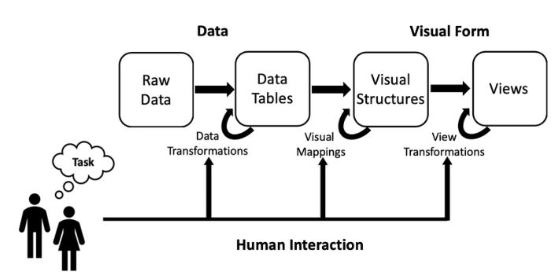

---
output:
  word_document: default
  html_document: default
---

```{r include_packages, include = FALSE}
library(knitr)
library(palmerpenguins)
library(tidyverse)
library(nycflights13)
data(flights)

library(ggpcp)
library(ggplot2)
library(dplyr)
data(nasa)

library(scales)
library(datasets)
data("ChickWeight")

```

<!-- \svp{You don't have to motivate your other papers here - that will come later. Focus on the essentials - describe the main pieces of work in the area you're trying to expound upon.} -->

<!-- Since we don't completely understand the way that basic statistical graphics are -->

<!-- When effectively adding advanced graphical representations to a naive user, what have we done to create a proper understanding of an engaging idea of what's going on? -->

<!--  
\svp{Start with a definition of what dashboards are. Maybe reference/quote Few? Key components - visualization, interactivity, update frequency, simplicity? (the last one is arguable). Transition to Exploratory Data Analysis by saying that one of the key ways dashboards are used is to allow people to explore the data, and that dashboards are particularly useful for non-experts, as they do not require writing code or understanding how to work with the underlying data. Reference Figure \ref{fig-design-map} in this paragraph.}

\begin{figure}
\includegraphics[width=\textwidth]{figure/DashboardDesignMap.png}
\caption{Dashboard Design Mind Map\label{fig-design-map}. \svp{Dashboard design includes components of exploratory data analysis, interactive graphics, big data analytics, human-computer interaction, and human cognition. XXX For the record, I think UI/UX design and HCI are the same, but that's me.}}
\end{figure}

----

\svp{I think it might be most effective to have several sub-sections of the lit review that are somewhat connected.}

First: Outline the general topic - creation of interactive graphics and dashboards to enable end-users to understand their own data. Explain that this is a highly interdisciplinary topic. Conclude this paragraph by explaining that you will explore the major sub-topics sequentially and then outline the interface between them at the end of the literature review.

- Graphics
    - Perceptual principles - cognitive load, working memory, etc.
    - Exploratory Data Analysis
    - Grammar of Graphics - with examples of code!
    - Big Data and graphical solutions - overplotting, binning, interactivity
    - Interactive Graphics

- Human Computer Interaction/UI-UX
    - User analysis - general process, not focused on your projects at all - you'll talk about that later on
    - Protocols for testing design - think aloud, eye tracking, feedback/surveys.
    - General Dashboard stuff

Conclusion: Connections between EDA and dashboards - not all dashboards are designed for EDA, but most dashboards are designed with end-users, not statisticians, in mind. This requires a different set of optimizations than if we designed for experts. 

---
-->

# Introduction
<!-- General purpose of this section: 
Motivate Dashboards and conclude that it is important to understand how graphs are perceived and used by various target audiences. -->

Statisticians use graphs in almost every stage of their work: we create charts when we get new data, to explore what we have and identify potential problems and opportunities. 
We fit models based on relationships between variables which are often identified visually. 
We identify problems with those models based on residual plots and other visual diagnostics. 
When our modeling work has been completed, we present our results to interested parties using visual displays, because non-statisticians often find it easier to understand data and models through an intuitive visual medium rather than through the mathematical formulae which underlie the statistical work.

Given the wide range of uses for graphs and visual data displays in statistical modeling, it is unsurprising that some graphs are more useful for specific applications such as exploratory analysis, and are unsuitable for other applications, such as presentation to an outside group.
In addition, we know that not all visual displays have equal perceptual value [@aspillaga1996]. 
The best graphics are designed to account for both the features of the dataset and the features of the intended audience.
Some design constraints stem from limitations of the human perceptual system and are common to most potential consumers of the visualization: the sine illusion [@vanderplas2015] affects anyone with binocular depth perception, and color recommendations are built around the specific characteristics of the human retina.
Other design constraints are due to the audience's experience level: are they used to working with data? 
Do they understand specialized techniques such as principal component analysis to the point where a plot of factor loadings might be \svp{a} useful \svp{visual display}?
When we create visualizations for public consumption we have to consider both perceptual factors and the target audience's domain knowledge.
In this introduction, we explore previous research related to the construction of interactive and static visual displays for different audiences and consider the implications of this research when designing interactive data displays such as dashboards.

<!-- We wish to discuss and analyze the exploration of using density plots or categorical plots as "best" plots in the field. --> <!-- Wait, what? Density plots or categorical plots are the best plots?? -->
<!-- We will analyze statistical data and graphics alongside dashboard design, starting with Steven Few's principles.  --><!-- This is said in the prev paragraph, minus Few, which we can cite later -->
<!-- It would be worthwhile to investigate the development of dashboards from static graphical representations in a practical setting to dynamic representations in an application setting.  -->
\svp{Most research in statistical graphics has been done on static graphics; usually, research also strips away all but the most essential contextual information. 
As a result, it can be hard to generalize this research to practical applications, where the contextual information surrounding the data is critical and the chart does not just exist in a vacuum.}
<!-- We would like to see the application of research to practice. -->


<!-- Consider a novel concept in research can be less practical or useful in the field more often than not.  -->
\svp{In the "real world", however, conventions and familiarity often win out over best practice validated by perceptual experiments.}
For example, in sports, many coaches desire printable diagrams containing all necessary and valuable information on a single page. 
As data in sports becomes more prominent, extensive, and collected, this information must be refined. 
<!-- We will adopt the concept of dynamically introducing the application to stakeholders with a static representation and migrating them into an active application.  -->
<!-- Once this dynamic application is utilized or migrated to that space, it is necessary to comprehend why categorical representations are more critical than density representations in the field.  -->
<!-- In regards to speaking about the same data being represented, most of the data is then categorized.  -->
<!-- Is it because categorical shot charts in tables are perceived to be digestible or because density plots become cluttered and difficult to comprehend?  -->
<!-- Where do we draw the line between what is viewed as an impediment to the development of applicable graphics methodology? -->
\svp{Thus, in addition to the experimental evidence, we must consider the human element: how to introduce new graphical concepts to stakeholders, and the considerations involved in encouraging stakeholders to adopt these improved graphics.}
\svp{Let us first consider the audience characteristics that affect the selection of graphics. 
Then, we will engage with considerations based on the data to be displayed. 
Finally, we will consider the interactions between the audience and the data: how graphics are tested, amended, and hopefully eventually adopted into common use.}


## Audience Considerations

Several factors, including prior experience, context, and personal preferences, can influence the human perception of <!--density and categorical--> plots.

<!-- Stopped here - SVP -->
\db{In general, density plots represent the distribution of continuous variables, while categorical plots represent the distribution of categorical or discrete variables.
The interpretation of density plots typically involves understanding the shape of the distribution and the presence of any outliers or skewness. 
On the other hand, categorical plots aim to show the frequency or count of observations in each category.}

\db{When comparing density plots and categorical plots, it's essential to consider the data analysis type. 
For continuous data, a density plot may provide a more informative representation of the distribution. 
A categorical plot may provide a more intuitive representation of the distribution of categorical data.}

\db{However, for various reasons, some people may prefer one type of plot over the other. 
For example, some may find density plots more visually appealing, while others may prefer categorical plots for their simplicity and ease of interpretation. 
Ultimately, the choice between the two types of plots will depend on the context and purpose of the analysis and the preferences of the individual interpreting the data.}

\db{Do we comprehend why we utilize the graphics we do? 
Is there a reason we adopt the perception of a previously used graphic? 
How do we determine whether there are superior graphical representations when the human brain has determined that this is what I comprehend? 
How do we develop statistical methodologies based on effective testing of statistical graphics on human perceptions of excellent and good? 
How do we determine the line distinguishing a density plot from a categorical plot? 
Consequently, how is this decision made outside of academia and research? 
In one way, research has been conducted on the visual or human perception of categorical plots.}

\db{In addition to graphical elements alongside numerical values and plots such as Parallel Coordinate Plots (PCPs). 
We wish to discuss and analyze the exploration of using didn't report plots or categorical plots as density plots in the field. 
We will analyze statistical data and graphics alongside dashboard design, starting with Steven Few's whites. 
It would be worthwhile to investigate the development of dashboards from static graphical representations in a practical setting to dynamic representations in an application setting. 
This is the application of research to practice.}

\db{What may be considered an exciting thought process in research that is less practical or useful in the field? 
For example, in sports, many coaches desire printable diagrams containing all necessary and valuable information on a single page. 
As data in sports becomes more prominent, extensive, and collected, this information must be refined. 
We will adopt the concept of dynamically introducing the application to stakeholders with a static representation and migrating them into an active application. 
Once this dynamic application is utilized or migrated to that space, it is necessary to comprehend why categorical representations are more critical than density representations in the field. 
We're speaking about the same data being represented. 
However, most of the data is then categorized. 
Is it because categorical shot charts in tables are perceived to be digestible or because density plots become cluttered and difficult to comprehend? 
Where do we draw the line between what is viewed as an impediment to the development of applicable graphics methodology?}


### Perception

\db{To read reality from images is to solve a problem: a series of extremely difficult problems that persist throughout an individual's lifetime. 
Errors are illusions. 
Certain situations present unique challenges and lead to systematic errors; can these provide insight into how the brain solves the problem of which objects are represented by which images in general.[@gregory1968]
Human perception plays a direct role in the area of visualization and graphics. 
Data Analysis tasks closely resemble the cognitive process known as sensemaking. 
Tukey and Wilk highlight the role of cognitive processes in their initial descriptions of Exploratory Data Analysis (EDA) [@tukey1966].
Mallows and Walley list psychology as one of four areas likely to support a theory of analysis [@mallows1980]. 
Data analyses rely on the mind's ability to learn, analyze, and understand. 
Assigning meaning is not a statistical or computational step but a cognitive one. 
Each step in the data analysis process is part of a more extensive mental process.}

\db{Untrained analysts can and do "analyze" data with only their natural mental abilities - The mind performs its data analysis-like process to create detailed understandings of reality from bits of sensory input.}

\db{Perceptual principles refer to how the human brain processes and interprets visual information. 
These principles guide how people perceive and make sense of the world around them, and they play a critical role in designing effective visual displays, such as dashboards.}

Some examples of perceptual principles include:

- Proximity: Objects close to each other are perceived as related or grouped.
- Similarity: Objects that are similar in some way (e.g., shape, color, size) are perceived as related or grouped.
- Continuation: The human eye follows lines and patterns, so designers can use this principle to guide the viewer's gaze through a display.
- Closure: The human brain tends to complete incomplete figures or patterns, so designers can use this principle to create the illusion of missing information.
- Figure-Ground: The human brain separates the foreground (figure) from the background (ground), so designers can use this principle to create visual hierarchy and emphasis.
- Contrast: The human eye is drawn to high-contrast areas, so designers can use this principle to create emphasis and hierarchy.
- Symmetry and Balance: The human eye finds symmetry and balance visually pleasing, so designers can use this principle to create a sense of harmony and order.

\db{These are just a few examples of the many perceptual principles that designers use to create compelling visual displays. 
These principles are based on cognitive psychology and understanding how the human brain processes visual information.}

\db{Visual inference uses our ability to detect graphical anomalies. 
However, the idea of formal testing remains the same in visual inference – with one exception: The test statistic is now a graphical display compared to a “reference distribution” of plots showing the null.}

### Expertise

\db{Subject matter graphics are visual representations of information and data that help communicate complex concepts, ideas, and information to audiences.
This expertise is related to knowledge of the topic or subject being presented in the graphic.
A subject matter expert is someone who has a deep understanding of how people perceive and interpret visual information. 
Subject matter experts (SMEs) have deep knowledge and experience in a specific field, such as science, finance, or medicine. SMEs provide the necessary information and insights to form the graphic's basis. 
They ensure that the content presented is accurate, relevant, and informative. 
They use their human perception and cognition knowledge to design graphics that effectively communicate information to the intended audience. 
Perception experts in graphics consider a range of factors, including color, shape, size, texture, and spatial relationships, to create graphics that are visually appealing and easy to understand.}

\db{Perception experts in graphics may use different theories and principles to inform their design decisions. 
For example, they may use Gestalt principles to create visually harmonious and organized graphics. 
They may also use the principles of visual hierarchy to guide the audience's attention to the essential information in the graphic.}

\db{Perception experts in graphics may also conduct user research to understand how different audiences perceive and interpret visual information. 
They may use eye-tracking and user testing techniques to evaluate the effectiveness of different graphic designs.}

\db{A perception expert plays a crucial role in designing graphics that effectively communicate information to the intended audience. 
Their knowledge of human perception and cognition, as well as their expertise in graphic design, allows them to create visually appealing and easily understood graphics.}


### Engagement with the data

\db{<!-- This is a good paragraph -- but I'm not sure it's in the right place.  -->
The goal of data analysis is to extract meaningful insights, patterns, and knowledge from data. 
The process of data analysis involves collecting, cleaning, transforming, and modeling data, followed by the use of statistical and machine learning methods to uncover patterns and relationships within the data. 
The end goal of data analysis is to support decision making and provide a basis for informed action. 
Data analysis can help organizations to better understand their customers, market trends, and operational performance. 
<!-- What about organizations which aren't profit-driven? They still need to understand the relationship between different variables in the dataset. -->
Additionally, data analysis can support scientific research by helping researchers to test hypotheses, develop theories, and gain a deeper understanding of complex phenomena. 
Ultimately, the goal of data analysis is to turn data into actionable insights and information that can inform and improve decision making.}

\db{Data Scientists and other analytic professionals often use interactive visualization in the dissemination phase at the end of a workflow, during which findings are communicated to a wider audience. 
Digital tools are critical to data science and analytics workflows, and current practice spans the following:}

- *Data Analysis Tools* - R, Pandas and SAS
- *Data Warehousing Services* - MySQL, MongoDB, or Amazon Redshift
- *Machine Learning Libraries* - scikit-learn o Apache MLlib

\db{A typical process typically consists of the following general stages:}

1. *Discovery*: Formulating an exciting question and determining the data necessary to answer it.
2. *Acquisition*: Locating, organizing, and preparing data to be accessible to the chosen analysis environment.
3. *Exploration*: Investigating and analyzing the data set to collect insights and understand the data
4. *Modeling*: Building fitting and validating a model that can explain the data set and the observed phenomena
5. *Communication*: Disseminating the results to stakeholders in reports, presentations, and charts.

\db{Visualizing Complex Data is representing complex, multi-dimensional data in a graphical or pictorial form to make it easier to understand and interpret. 
The goal is to turn large, intricate data sets into visually appealing and intuitive representations, such as charts, graphs, maps, and other types of visualizations, to help identify patterns, trends, and relationships that may not be immediately apparent from raw data. 
This process can help to communicate complex information effectively and make data-driven decisions.}


William Cleveland's subcycle plots:

- glyph maps and binned graphics emerging from big data visualization efforts.
- glyphs and other plots have been embedded in maps 

Bertin's Semiologic of Graphics is a seminal work in the academic study of visualization. 
Glyphmaps have been developed as a tool for tracking climate and climate change data [@wickham2012]; [@hobbs2010].
[@schulz2013] define two abstractions for the design of visualizations:
\begin{center}
\begin{align*}
  Data + Task = Visualization \\
  Data + Visualization = Task
\end{align*}
\end{center}

\db{These abstractions demonstrate dependence between the data, visual representation, and the task. 
The more the user interacts with the visualization, they gain knowledge. 
The interactions allow the user to control their understanding by providing the flexibility to create new views that help them go beyond just the visual representation [@kiem2008]. 
The field of information visualization is continually adapting to changes with the big data revolution.}

\db{Data Scientists and Statisticians have produced more graphics since the pandemic's start. 
The reasons someone will create a graphic or dashboard may include but are not limited to understanding raw data structures to analyze model assumptions and present predictions, along with displaying key performance metrics of business logic. 
These goals help work to navigate and are best served by quick-and-dirty representations of the data, while highly polished graphics may be more useful in other situations. 
It is valuable and essential to convey data correctly, meaning that we need to understand how graphics are perceived on a dashboard on a general level. Previous research by Tukey focused on graphics as a tool for exploratory analysis. 
Tukey describes in Exploratory Data Analysis [@tukey1966] that pictures are often used to display data in a more enhanced version than a table. 
Tukey outlines detailed the types of different graphics and in which situations to utilize these graphics. 
The article - "External cognition: how do graphical representations work?" by Scaife and Rogers [@scaife1996] critique the disparate literature on graphical representations, focusing on four representative studies. 
In general, this will help in the psychology of the perceptual experience.}


\db{The visual reference model developed by Card et al. [@Card] describes and identifies the three phases of the visualization process.}

```{r graphics, echo=FALSE, out.width = "75%",fig.cap='Visual Reference model by Card',fig.show='hold',fig.align='center'}

```

\db{While External Cognition describes the advances in graphical technology and how little had been done in the work of the cognitive framework of the discipline, the following citations by Ware attempt to develop the necessary guidelines that are useful for the work done by the perceptual experience.}

Colin Ware "Information Visualization: Perception for Design" [@Ware2004] there are four stages of visualization

- The collection and storage of data itself
- The preprocessing design to transform the data into something we can understand
- The display hardware and the graphics algorithms produce the image on the screen.
- The human perceptual and cognitive system


\db{The overlapping understanding in the field, while Ware takes the process one step further not just to allow the end user to understand the outcomes but to curate the outcomes with a visual perception of the data that makes the cognitive load easier for the end-user.}

\db{A dashboard has much information related to tabular data from multiple sources. 
Design should be recorded a produced with content that will allow for reproducibility. 
A dashboard should have some content related to interaction with the user. 
This interaction can be in multiple forms: toggling through the selection of variables to display uniformly to the use of interaction on the graph and allowing a user to understand best what is being shown in the diagram.}

\db{The entire dashboard/Interface should have a human perception piece that is useful for the user to comprehend and use. 
For example, the dashboard/interface could be more practical if the user is visually overwhelmed.}

- Identified the highly relevant from a dashboard design perspective [@odonnell2000]
1. Information systems give interaction and feedback
2. Type of presentation format to be used
3. Differences in the amount of information load.

Information load is essential, as dashboards must provide the right decision cues without overwhelming the user with excess information.

\db{"A decision cue is a feature of something perceived that is used in the interpretation of perception" [@choo2009],  where perception is an inferential process as objects in the environment can only be perceived indirectly through available information that has been sensed by the individual [@brunswik1952].}

\db{Visual complexity and information utility are required. 
Visual complexity refers to the "degree of difficulty in providing a verbal description of an image ([@heaps1999], [@olivia2004]).}

- Graphs are more suitable for spatial tasks (ex., for comparing a set of values) [@vessey1991];[@umanath1994];[@vessey1994]
- Graphs reduced the negative influence of information overload
- Graphs produced better correlation estimates and decreased time on a task [@schulzand];[@booth2006]
- Self-organizing maps and multidimensional scaling did not significantly outperform tabular representations [@huang2006]

The purposes of a dashboard:

1. Consistency
2. Monitoring
3. Planning
4. Communication

\db{Card stated "Use interactive visual representations of abstract, non-physically based data to amplify cognition." [@card1999]}

\db{Visual perception involves two elements - the perceptual and conceptual gist. 
The perceptual gist refers to the process of the brain when it determines the image properties that provide the structural representation of a scene, like color and texture. 
The conceptual gist refers to the scene's meaning, which is improved after the perceptual information is received ([@friedman1979]; [@olivia2004]).}

\db{Visual complexity might increase with the quality and range of objects and with varying material and surface styles [@heylighen1997].}

\db{Repetitive and uniform patterns and existing knowledge of the objects in the scene reduce visual complexity [@olivia2004].}

\db{If the guidelines on our visual information load can be related to statistical terminology, we can consider this the fisher information of visual information load. 
This load can be used as a metric for balancing the amount of information rather than overloading the consumer.}

Visual Data Mining

\db{For data mining to be effective, it is important to include humans in the data exploration process and combine the flexibility, creativity, and general knowledge of the computational power of today's computers. 
Visual data exploration aims at integrating humans in the data exploration process, applying their perceptual abilities to the large data sets available in today's computer systems [@kiem2002].}

The visual data exploration process can be seen as a hypothesis generation process:

- The visualizations of the data allow the user to gain insight into the data and come up with new hypotheses
- Along with verification of the hypotheses

The main advantages of visual data exploration over automatic data mining techniques from statistics or machine learning are:

- visual data exploration can efficiently deal with highly inhomogeneous and noisy data.
- visual data exploration is intuitive and requires no understanding of complex mathematical or statistical algorithms or parameters.

\db{Visual Exploration Paradigm, also known as MGV (Massive Graph Visualizer), is an integrated visualization and exploration system for massive multidigraph navigation [@abello2002]. 
MGV usually follows a three-step process:}

- overview first
- zoom and filter
- details-on-demand

\db{The user identifies interesting patterns and focuses on one or more of them. Note that visualization technology does not only provide the base visualization techniques for all three steps but also bridges the gap between the steps.}

Visualization Technique Classification:

- Standard 2D/3D displays such as bar charts and x-y plots
- Geometrically transformed displays, such as landscapes and parallel coordinates, as used in a scalable framework
- Icon-based displays such as needle icons and star icons as used in MGV
- Dense pixel displays such as the recursive pattern and circle segments techniques and the graph sketches as used in MGV
- Stacked displays, such as treemaps or dimensional stacking

Interaction and distortion techniques allow users to interact directly with the visualizations.

- Projection as used in the Grand Tour System
- Filtering as used in Polaris
- Zooming as used in MGV and scalable framework
- Linking and Brushing as used in Polaris and the scalable framework

Design Theory in Information System

The knowledge is distinguished as the fifth of five types of theory:

1. Analyzing & describing
2. Understanding
3. Predicting
4. Explaining and predicting 
5. Design and action

\db{A definition of information systems that are suitable for our purposes concerns: "the effective design delivery use and impact of information technology in organizations and society [@avison1995]. }

The two paradigms characterize much of the research in the Information systems discipline:

 - *Behavioral Science Paradigm* - seeks to develop and verify theories that explain or predict human or organizational behavior (roots in natural science research methods).
 - *Data Science Paradigm* - seeks to extend the boundaries of human and organizational capabilities by creating new and innovative artifacts (roots in engineering and the sciences of the artificial) [@simon1996].
 
\db{Technology and behavior are not dichotomous in an information system. They are inseparable [@lee2000]. Information technology (IT) artifacts are broadly defined as:}
 
 - constructs (vocabulary & symbols)
 - models (abstractions & representations)
 - methods (algorithms & practices)
 - instantiations  (implemented & prototype systems)
 
\db{These are concrete prescriptions that enable IT researchers and practitioners to understand and address the problems inherent in developing and successfully implementing information systems within organizations ([@march1995]; [@nunamaker1991]). }

## Data Considerations

\db{Exploratory Data Analysis (EDA) analyzes and summarizes a dataset to discover patterns, trends, and insights. 
It is a crucial step in the data analysis process and is often used to identify which variables are essential, what the data looks like, and what the underlying structure of the data is. 
EDA is typically done using various techniques, such as visualizations, statistical summaries, and data transformations.}

\db{John Tukey was the first to organize the collection and methods associated with philosophy into Exploratory Data Analysis (EDA). 
John Tukey, creator of stem-and-leaf plot, boxplot-resistant smooth, and the violin plot (also known as rootgram) who taught us to utilize these methods to organize and demonstrate EDA. 
He was a strong advocate for the importance of EDA as a crucial first step in the data analysis process and emphasized the need for visualization and interactive techniques to understand patterns and relationships in data.}

```{r violin_plot, echo=FALSE,out.width='.49\\linewidth', fig.width=3, fig.height=3, fig.show='hold', fig.align='center'}
ggplot(ChickWeight, aes(x = Diet, y = weight)) + 
  geom_violin(aes(fill = Diet), trim = FALSE) +
  geom_boxplot(width = 0.1) +
  theme_classic() +
  theme(legend.position = "none")

p <- ggplot(ChickWeight, aes(x=Diet, y=weight, fill=Diet)) +
  geom_boxplot()
p + scale_fill_brewer(palette="Dark2")
```


<!-- \svp{Ok, he was a bit more than a person. He's the creator of the boxplot, stem and leaf plot, and rootogram, afaik. Add pictures demonstrating these things. Explain why they're important.} -->

\db{Tukey's Principles in EDA:}

1. Graphical exploration looking for patterns or displaying fit.
- The method demonstrates things about data that are not understood by a single numeric metric. This has been useful in graphing the data before you develop summary statistics.

2. Describing the general patterns of the data.
- This step should be insensitive to outliers. In general, think about the types of resistant measures (i.e., median or mean). This step is making sure to determine data patterns.

3. The natural scale/state that the data are at their best. This will be the step at which the scale of data can be helpful for analysis. The reexpressing data to a new scale by taking the square root or logarithmic scale.

4. The mostly known parts of EDA but is done in the way of accessing fit of the data. This is taught in every statistics 101 class. The growth of machine learning and prediction methods have now used residuals more in the toolbox to assessing the best prediction models.
- The idea generally is to determine the deviations in the data from a general pattern by looking at the data from the fit of the data.}

<!-- \svp{assessing, not accessing. Use an example in this section to provide a clear demonstration of what each principle might look like. The flights data or the diamonds data might be good options here, since they're both large.} -->


```{r flights_data_example, echo=FALSE, out.width='.49\\linewidth', fig.width=3, fig.height=3, fig.show='hold',fig.align='center'}
# Stacked Density plot
ggplot(data=flights %>% filter(dest %in% c("ATL", "ORD","MDW") ), aes(x=distance, fill=carrier)) +
geom_density(position="stack")

# Histogram
ggplot(data=flights %>% filter(dest %in% c("ATL", "ORD","MDW") ), aes(x=distance, fill=carrier)) +
geom_histogram(position="stack")

```


\db{On the other hand, Dashboards are interactive interfaces that display data visually to provide insights and support decision-making. 
Dashboards can be used to monitor key performance indicators, track progress over time, and identify patterns and trends in data. 
They often display real-time data and can be customized to show the most relevant data to the user.}

\db{Interactive graphics, are central to EDA [@unwin1999]. 
Beyond the limitations of static statistical displays, interactive graphics enable visualizations to advance alongside the analysis. 
User interaction and direct manipulation are required for dynamic graphics to reach their full potential (@cook1995; @unwin1999).
The connection between EDA and dashboards is that EDA is the process of preparing and understanding the data, which is the first step for building a dashboard, as the data has to be cleaned, transformed, and analyzed to be used efficiently on the dashboard. 
EDA results can be used to identify the most relevant data and metrics to include in the dashboard and to design the visualizations that will be used to display the data. 
And also, the EDA process can be used to identify the outliers, patterns, trends, and insights that will be useful to show in the dashboard to support decision-making.}

\db{Visualizations of data are essential for exploratory data analysis (EDA) along with model diagnostics. 
Plots for EDA are a valuable tool for guiding an analyst in discovering the relationships between variables in their data. 
When using plots in model diagnostics, plots help analysts determine whether or not the model is an appropriate way to model. 
During the initial EDA stage, an analyst may find that a variable or a covariate is directly related to the dependent variable when looking at a correlation heatmap or a scatterplot. 
This will be important to know before starting a linear model analysis. 
Much of our general understanding is from introductory statistics courses. 
The basic understanding can be formalized to visualize the discovery process.}

### Variable Types

Not all variables should be used to create all types of charts - variable type informs chart structure
\db{
Categorical Data Visualization is the process of visualizing data that can be divided into distinct categories or groups. Categorical data are non-numeric and often represented by words, labels, or symbols, such as gender, product type, color, etc.}

\db{Visualizing categorical data helps uncover patterns and relationships between categories and can provide insights into the data distribution. 
Categorical data visualization techniques include bar charts, pie charts, histograms, stacked bar charts, and others. 
The choice of visual representation will depend on the data's nature and the insights being sought. 
The goal of categorical data visualization is to communicate the information effectively and make it easier to understand and interpret.}

\db{Friendly detailed using SAS with hands-on experiments to present categorical data analysis visually [@friendly2014]. 
Researchers have used PCPs to visualize categorical data. 
Beygelzimer, Perng, Ma and Hellerstien created a fast ordering categorical data analysis algorithm that helped visualization, where their algorithms helped organize the original parallel coordinate plots clearer ([@beygelzimer2001]; [@ma2001]). 
Hammock plots are modified versions of similar coordinate plots invented by Schonlau to visualize categorical data [@schonlau2003]. 
His design replaces coordinate polygons with rectangles to present the number. 
Treemaps are modified to support categorical data visualization.}

\db{CatTree gives a hierarchical categorical data visualization with interaction [@kolatch2001]. 
Fernstad developed an interactive system combining parallel coordinates, tables, and scatterplot matrices for an overview explorative analysis. 
Thoroughly research categorical data visualization to support algorithm understanding. 
The novel contingency wheel presented by [@alsallakh2011] supports visual analytics in categorical data, and he measured association based on Pearson's residuals and used visual abstraction based on elements frequency.  }

\db{High-Dimensional Data Visualization represents complex data sets with many variables or features (also known as high-dimensional data). 
The goal is to find effective ways to express such data in a form that allows easy understanding, analysis, and interpretation.
This is typically achieved by reducing the dimensionality of the data, for example, by projecting the data onto a lower-dimensional space or by aggregating the data in some way. 
The resulting visualizations can then reveal patterns, relationships, and other insights that would otherwise be difficult to detect from the raw data. 
For example, high-dimensional data visualization techniques include scatter plots, parallel coordinate plots, heat maps, and many others.}

\db{A popular research area in visualization since high-dimensional data is always fuzzy to mining. 
Direct visualization includes geometric visualizations:}

- scatterplots: use dots in coordinate to present data points.
- parallel coordinates: present each dimension as axes, and every data item intersects dimensions as a polygon line at a particular position
- RadViz/ PolyViz
- GridViz

\db{Besides these traditional geometric visualization methods, iconographic displays like human faces and star glyphs used funny ways to present multivariate data. 
Hierarchical methods are used widely in parallel coordinates, which give analysts an intuitive view of clustering information [@fua1999]; [@johansson2005]. 
Rearrange the dimensions by dimension similarity on parallel coordinates, circle segments, and recursive patterns [@ankerst1998]. 
Guo used an interactive feature selection method to help users identify interesting subspaces from high-dimensional data sets [@guo2003].}

### Grammar of Graphics
\db{Frame as a way to easily change between appropriate forms of presentation for a given variable or set of variables.}


It doesn't help us decide which is better - for that we need user testing.

\db{The grammar of graphics (gg of ggplot2) is a theory that is well-defined for creating statistical graphics with work from Wilkinson [@Wilkinson1999] and Hadley Wickham [@ggplot2]. 
The Grammar of Graphics is a framework for understanding the structure of statistical graphics developed by Leland Wilkinson. 
It proposes that any statistical graphic can be broken down into a set of essential components, or "grammar," that can be combined in different ways to create a wide range of visualizations. }

\db{Grammar of graphics is defined as the framework which follows a layered approach to describe and construct visualizations or graphics in a structured manner.}

The components of the grammar of graphics include:

- Data: The raw data being visualized represents a set of observations or values. 
- Aesthetic Mappings: The mapping of data variables to visual properties such as position, color, shape, and size. 
- Scales: The mapping of data values to visual values, such as mapping a numerical value to a bar height. 
- Geometries: The basic shapes representing the data, such as points, lines, bars, and histograms.
- Facets: The plot division into multiple subplots, each representing a different subset of the data.

\db{For example, a bar chart can be created by mapping a categorical variable to the x-axis, mapping a numerical variable to bar heights, and using rectangular bars as the geometry. 
For example, mapping two numerical variables can create a scatter plot to the x and y positions and use points as the geometry.
Finally, the Grammar of Graphics provides a systematic way of thinking about visualizations, making it easier to choose the appropriate visual representation for a given dataset.
}
```{r graphics2, echo=FALSE, out.width = "45%",fig.cap='Grammar of Graphics Diagram of Wickham and Wilkinson\'s work',fig.show='hold',fig.align='center'}
#knitr::include_graphics("figure/gglayers.png")
#knitr::include_graphics("figure/graphic-flowchart.png")
knitr::include_graphics(rep(c("figure/gglayers.png","figure/graphic-flowchart.png"),1))
```


#### Interactive Graphics

\db{The area of interactive graphics is still very much a work in progress despite existing as a field of research since the late 1960s—developments are driven partly by new technology, such as `d3` [@bostock2011]. 
Visualizations are more than just a picture. 
They are now a tool that facilitates analytic activity through different modes of interaction [@yi2007]. 
Visualization is context-free, as it can mean different things to different people depending on the situation [@parsons2014]. }

\db{The van Wijk Simple Visualization Model is a diagrammatic representation that provides a simple and effective way to understand and visualize the flow of information and data through a system. 
It is a commonly used tool in Exploratory Data Analysis (EDA), which is the initial step in the data analysis process. 
The van Wijk model can be used to represent the flow of data from data sources, through intermediate processing stages, to the final visualization of results. 
van Wiij's simple visualization model shows how insights are generated as the human participates in a feedback loop between reading and interacting with visualization [@van2005]. }

\db{This model is also context-free, allowing for the focus to be on the feedback loops between visualization and the user.}

<!-- \svp{This is new to me, but seems like it would be a good way to bridge between the graphics and UI/UX sections I proposed above. } -->

\begin{center}
\includegraphics[width=\textwidth]{figure/vanWiijSimpleModel.png}
\captionof{figure}{van Wiij Simple Visualization Model}
\end{center}

\db{Interaction allows the user to define what data they see and how they see it, creating a dialogue between the user and the system. 
Theories behind visual representation include:}

- graphical comprehension ([@cleveland1984])
- preattentive processing ([@ware2012])
- gestalt theory ([@few2009])
- graphical excellence ([@tufte2001])

Theories behind the manipulation of visualizations include but are not limited to:

- cognitive fit ([@vessey1991])
- visual perceptual approaches ([@baker2009])
- human information processing

\db{As interactive visualizations play a more significant role in information systems, designers must know what tasks, visual representations, and interaction techniques are available and how they work to facilitate analytical reasoning. 
They must decide on the most effective visual representation without being able to estimate every user's ability to read and interpret the visualization.} <!-- [@boy2014].-->

\db{Interactive visualization is a commonly used tool in Exploratory Data Analysis (EDA), which is the initial step in the data analysis process. 
The goal of EDA is to gain a high-level understanding of the data and to identify patterns, relationships, and anomalies in the data. }

\db{Visualizations have become more effective in recent years due to the pandemic and the Johns Hopkins University COVID-19 Dashboard [@JHPHDashboard] [Dashboard](https://coronavirus.jhu.edu/map.html).
We were glued to our computers, TVs, and phones for most of the world. 
As a result, we watched the dashboard change in real-time to adapt to the users' needs. 
In part to data growth and changing, the dashboard, as well as the visualizations, were needed in a condensed platform. 
The need to be concise and vastly informative is a struggle regarding data visualizations. }

\db{The human brain can only take in a set amount of data from a table or a paragraph. \svp{references?}
The space of infographics has been a much better way of looking at data on a creative scale.[@stat\_graph\_hist] 
While this may be a way of seeing the data in a friendly way, infographics need to include an interactive piece of data that many people would like to explore.}


\db{The relationship between the van Wijk Simple Visualization Model and Human-Computer Interaction (HCI) lies in the area of data visualization. 
The van Wijk Model provides a framework for understanding how information and data flow through a system to be displayed to the user. 
In the context of HCI, the model helps to understand how data is processed, transformed and presented to the user in a way that is intuitive, informative and engaging. 
The model helps to identify the various steps involved in the visualization process, from the collection and processing of data to the presentation of results. 
By doing so, it supports the design of more effective and user-friendly visualizations, which can enhance the overall user experience.}
}

### Multivariate Data Displays

- Difficulty of visualizing multivariate data
- Different approaches - briefly mention 
    - encoding with shape/color/etc.
    - tours
    - pcps
    - linked graphics (interactivity)

This section doesn't need to solve the problem - it just introduces it


```{r ggpcp_example, echo=FALSE, fig.width=3, fig.height=3,fig.show='hold',fig.align='center', eval = FALSE}
oranges <- c("#FDBF6F", "#F89D38", "#F37A00")
purples <- c("#CAB2D6", "#9A78B8", "#6A3D9A")
greens <- c("#b2df8a", "#73C05B", "#33a02c")

cols <-  c(oranges[2], greens[2], purples[2])

flights %>%
  filter(origin == "LGA") %>%
  pcp_select(dest:distance) %>%
  pcp_scale() %>%
  ggplot(aes_pcp()) +
  geom_pcp(alpha = 0.1) +
  theme_bw()


df_pcp %>%
  ggplot(aes_pcp())  +
  geom_pcp_axes() +
  geom_pcp(aes(colour = Observation), size=1,
           data = df_pcp %>% filter(pcp_id %in% c(1,275))) +
  geom_point(aes(shape=Observation, colour = Observation), size=5,
             data = df_pcp %>% filter(pcp_id %in% c(1,275))) +
  theme_bw() +
  xlab("") +
#  scale_shape_discrete("Observation") +
  scale_colour_manual("Observation", values=c("darkorange", "purple4")) +
  ylab("") +
  theme(axis.title.y = NULL, axis.text.y = NULL, axis.ticks.y = NULL) +
  scale_y_continuous(labels=c("low", "", "medium", "", "high"),
                     breaks=c(0,0.25, .5,.75, 1)) +
  scale_x_discrete(expand = expansion(add=0.2),
                   labels = c("Bill Length (mm)", "Bill Depth (mm)",
                              "Flipper Length (mm)", "Body Mass (g)"))


```


## Audience-Data Interactions

\db{User analysis is a crucial step in the design of user interfaces, especially in Human-Computer Interaction (HCI) and User Experience (UX) design. 
It involves studying the users of a system to understand their needs, goals, and behaviors. 
The purpose of user analysis is to create interfaces that are easy to use, efficient, and effective for the intended audience.}

Several methods can be used to conduct user analysis:

- Interviews: This involves conducting in-depth interviews with users to understand their needs, goals, and workflows.
- Surveys involve sending out surveys to users to gather data on their needs and preferences.
- Observations: This involves observing users as they complete tasks with the interface to understand their behaviors and workflows.
- Personas: This is a method of creating fictional characters that represent the different types of users; it helps to understand the users' needs and goals.
- Scenarios: This is a method of creating stories that describe how a user might interact with a system; it helps to understand the context and the user's needs.
- Focus groups: This is a method of gathering a small group of users and facilitating a discussion to understand the users' needs and goals.
- Contextual inquiry: This is a method of visiting the users in their work environment and observing them while they work; it helps to understand the context and the user's needs.

\db{The results of user analysis can be used to inform the design of the interface, including the layout, navigation, and functionality. 
It can also be used to identify areas of the interface that are confusing or difficult to use and to make recommendations for improvements. 
User analysis is an iterative process, and it should be done in multiple stages of the design process to ensure that the final product is tailored to the users' needs.}


### Testing static graphics

Brief overview of user studies that compare different types of graphics, accuracy, etc.

\db{Static Visualization is commonly used in the communication phase of data science workflows, and data scientists sometimes use them as part of the analysis. 
For example, John Tukey's EDA methods are currently known and well-vetted in the field. 
However, Satyanarayan et. al began to address this by introducing a high-level grammar of graphics called "Vega-Lite," which presents a set of standardized linguistic rules for producing interactive information visualizations using a concise JSON format for data to be represented by the grammar [@satyanarayan2016]. 
Vega-Lite has been directly implemented in R via the `ggvis` package using the same - albeit slightly lower-level.
Several protocols and methods can be used to test the design of a dashboard or other visual display. 
Some of these include:}

- Usability testing: This involves having users interact with the dashboard and providing feedback on its usability, including how easy it is to navigate, understand, and use.
- Cognitive walkthrough: This involves having experts in human-computer interaction evaluate the dashboard, focusing on the cognitive processes required to use it effectively.
- Eye-tracking: This involves using technology to track the users' gaze and interactions, to understand the user's focus and attention on the dashboard elements.
- A/B testing: This involves creating two versions of the dashboard, each with slightly different design elements, and comparing the results to see which design is more effective.
- Surveys: This involves asking users to complete a survey that measures their satisfaction and understanding of the dashboard and to provide feedback on improvements.
- Heat maps: This involves using heat maps to track where users are clicking on the dashboard to identify which elements are being used the most and which are being ignored.
- Card sorting: This is a method to understand the users' mental models and how they would like to organize and categorize the data; it is helpful to understand how to structure the dashboard navigation.

\db{These are just a few examples of the many protocols and methods that can be used to test the design of a dashboard. 
The selection of the appropriate way will depend on the specific goals of the testing and the resources available.}

\db{Remember that the user's feedback is crucial in the testing process; it will provide the necessary insight to improve the design and make it more efficient.}

### Testing interactive graphics

Overview of testing methods for interactive graphics - talk aloud, measuring user engagement, etc.
\db{Testing interactive graphics using human perception principles in psychology involves considering various aspects of human perception and cognition to evaluate the effectiveness and user experience of the graphics. Here are some steps you can follow to test your interactive graphics:}

\db{Usability testing: Conduct a usability test to assess the ease of use and accessibility of the graphics. 
This includes testing for navigation, user control, and overall user experience.}

\db{Perception of visual elements: Evaluate how the visual elements in your graphics, such as color, contrast, size, and position, impact the perception of the information being presented.}

\db{Cognitive load: Assess the cognitive load on the user by evaluating how easily they can process and understand the information being presented. Factors such as complexity, amount of information, and type of information presented can impact cognitive load.}

\db{Attention allocation: Observe where the user's attention is directed while interacting with the graphics. This can help identify areas that may require improvement or modification to better engage the user's attention.}

\db{Memory retention: Evaluate the user's ability to retain and recall information presented in the graphics. This can help determine the effectiveness of the design in supporting memory retention.}

\db{User feedback: Obtain user feedback through surveys, interviews, or focus groups to gain insights into the user experience and identify areas for improvement.}

\db{It is important to keep in mind that human perception and cognition can vary greatly between individuals and can be influenced by a range of factors, such as age, culture, and personal experience. Testing with a representative sample of your target audience can help ensure that your interactive graphics are optimized for a wide range of users.}

## Dashboard Design

Given that the audience has limitations, there are design constraints around the data, and the ability of the audience to successfully use the graphical displays of the data, what can we take from this body of research that applies to more complicated sets of graphics? 

How do we maintain user attention, desire to explore, and accurately communicate the data through the medium of an interactive data dashboard?

\db{A dashboard is a visual display of the essential information needed to achieve one or more objectives, consolidated and arranged on a single screen so the information can be monitored at a glance [@few]. 
Dashboards have particular characteristics:}

- Achieve specific objectives
- Fits on a single computer screen
- Information can be displayed in multiple mediums (web browser or mobile device)
- Can be used to monitor information at a high level

\db{Dashboards can present various statistical data, such as financial performance, website traffic, or customer engagement metrics. 
They allow users to quickly and easily understand complex data sets using visual elements such as charts, graphs, and tables to display the information. 
Additionally, statistics can be used to analyze data presented on a dashboard, providing insights into trends and patterns that can inform decision-making.}

\db{While a dashboard can be handy, it may be worth describing that a poorly designed dashboard will not be used. 
A dashboard should be concise, clear, and intuitive when displaying components in combination with a customized list of requirements of users.}

\db{Much of the work done within statistical research and dashboard design involves collaboration with other researchers and users. 
While this may be the best for the growth of the discipline, one will find that working with collaborators with non-STEM backgrounds.
Dashboards can help understand and support many data types in essential business objectives. 
There are many different ways to label and utilize dashboards in different kinds.}

\db{Dashboards are cognitive tools that should be used to improve understanding of data, which should help people visually find relationships, trends, patterns, and outliers. 
Most importantly, dashboards should leverage people's visual cognitive capabilities.}

\db{EDA refers to methods and procedures for exploring the data space to learn about a data set. 
By analogy, exploratory modeling analysis (EMA) refers to methods and procedures for exploring the space of models which may be fit to a data set.}

\db{Interactive graphics are excellent for EDA; they are designed for exploring rather than presenting information (and more) and can be obtained by directly querying the graphic [@unwin2003].}

- PCPs enable the display of multi-dimensional data in two-dimensional space.
- There must be some loss of information, but this can be partly counteracted by varying the order of the axes.
- Interactivity is valuable for reordering the axes flexibly and fast.
- Interaction is valuable for dealing with the dense mass of lines produced by large data sets.

\db{Being able to select subgroups of cases, highlight the chosen lines, and switch between different subgroups all assist in interpreting the otherwise intricate displays which arise.}

\db{Cowan suggested that the average person can only hold two to six pieces of information in their attention [@cowan2001]. 
People can develop detailed understandings of reality, which is infinitely complex.}

\db{Cognitive structures consist of mental models and their relationships ([@rumelhart1976], [@carley1992], [@jonassen1996]).
A schema is a mental model containing a breadth of information about a specific object or concept. 
Schemas are organized into semantic networks based on their relationships to other schemas [@wertheimer1938], [@rumelhart1976].
This arrangement helps the brain process its experiences instead of storing every sensory observation; the brain only needs to maintain its schemas, which are good summaries of all previous observations. 
Some "memories" may even be complete recreations built with a schema [@bartlett1932], [@klein2007]}

\db{Wixon introduce "contextual design" as a systems development method in which the researcher partners with the user at the user's place of work to "develop a shared understanding" of the user's activities, and they define contextual inquiry as the first part of the broader process [@cowan2001]. 
Contextual inquiry is the data collection step of the field research element of the contextual design method, and it emphasizes four essential principles:}

1. The context of the activity being performed by the user 
2. The partnership between the researcher and the participant
3. The spoken verification that the investigator's interpretation of the activity matches the user's
4. The focus of the study is central to the approach taken by the interviewer

\db{Kandal conducted what might be considered a contextual interview study similar to ours in that they analyzed data scientists' self-reported work processes [@kandel2012]. 
They proposes three main archetypes that data scientists may be classed into the following:}

- Hackers: who build processes chaining together multiple programming languages of different types (analytical, scripting, and database languages) and use visualization in various environments.
- Scripters: who perform most of their analysis in an analytical environment (e.g., R or Python) and execute the most complex statistical modeling of the types but who do not performstatements their ETL
- Application Users: who performed most or all of their work in an application such as Excel or SPSS and, like scripters, relied on others (namely, their organizations' IT departments) for ETL.

<!-- This is where your paragraph about 2 good graphics being suboptimal together should go -->

## Conclusion


\db{In this dissertation, I address this question of design for dashboards, as well as tools which can be used to support the display of multivariate data in an interactive context.
Chapter 1 presents a thorough review of the literature regarding graphical and human computer interaction/UI-UX methods. 
Chapter 2 will explore the process of designing dashboards for public use thorough parallel coordinate plots as a central component to data exploration to make decisions.
Chapter 3 focuses on graphical methods for multidimensional categorical variables and visualization methods have for growth.
We conclude with a Shiny application that facilitates a better understanding of the possible forms a parallel coordinate plots in exploratory data analysis can take by accommodating a through examination through variables and structural changes to the parallel coordinate plot with a click of a mouse.
Chapter 4 further explores multidimensional categorical data visualizations and develops an approach to using parallel coordinate plots to assess predictive model. 
We identify visual indicators for parameters in different models and extend the connection between parallel coordinate plots of binary tables and odds ratios to include logistic regression models with categorical variables.
}


<!-- Chapter ... demonstrates the process of designing and redesigning a dashboard for public use.  -->
<!-- Chapter ... discusses PCPs and how they are interpreted...  -->
<!-- Chapter ... introduces new methods for interactive PCPs that facilitate greater user engagement with complex, multivariate data. -->

<!-- mic drop -->


<!-- This is a bit trite - let's come back to it and figure out how to not make it sound like the statistic equivalent of "since the beginning of time".  -->
<!--As tabular data grows in our society, it has pushed our need to create visualizations that represent that data in a correct and digestible way. -->


<!-- The work appears how many times in this sentence? --> 
<!-- The work that has been done in statistical graphics research would suggest that the work that is done in this work has grown increasingly formal, adding sound guidelines with statistically sound metrics that are needed. -->
<!-- I'm not sure what this is saying, exactly. In plain language, what's the goal? -->
<!-- This work has been explored in various disciplines but not in statistical graphics. -->
<!-- Starting with a definition of a dashboard (or even a motivating example, like a famous COVID dashboard?) might be an easier way to introduce this -->
<!-- We know that dashboards are visual information tools with multiple statistical pictures. -->
<!-- We should consider the fact that we may need to consider? You're showing you're an expert here - quit hedging! You know your stuff, so make definitive statements. Example:
As dashboards are intended to facilitate exploration of and drawing conclusions from data, we need to design dashboards that represent and model the data accurately, but it is also important to consider how the intended audience will be able to interact with the dashboard and perceive the visual elements. -->
<!-- Thus, we should consider the fact that we may need to consider the statistical and psychological framework in a dashboard that will combine multiple statistical graphics. -->
<!-- You haven't defined dashboards yet -->

<!-- One graphic can be misleading alone, but can two graphics be considered misleading when placing two "correctly" designed graphics together on a dashboard?  -->
<!-- This is something that visual information researchers explore but don't test.  -->
<!-- This is a good point, but is it something we're going to explore? If not, let's focus on whether charts which are used by statisticians are good for general audiences. We can first talk about the naive design of the dashboard and the revisions in Ch. 2, then we can talk about ggflower in Ch. 3, then making PCPs interactive in Ch. 4-->

<!-- A collaboration is when two or more entities work together to produce a desired and shared outcome.  -->
<!-- Interdisciplinary research with collaboration is a pinnacle aspect of dashboards and statistical graphics to produce innovation and scientific knowledge. -->

<!-- Interactive graphics and dashboards can be created using various programming languages and libraries such as Python (with libraries like Plotly, Bokeh, and Dash), R (with libraries like Shiny), JavaScript (with libraries like D3.js and Highcharts), and many more.  -->
<!-- These libraries allow you to create visualizations and dashboards that can be easily interacted with, such as zoom, hover, pan, and other features. Many data visualization platforms, such as Tableau and Power BI, provide drag-and-drop interfaces for creating interactive graphics and dashboards without coding. -->


<!-- \svp{Probably need to define "big" here, as it has widely different meanings depending on the type of data we're talking about...} -->

<!-- Dashboard Design with naive users at the center of the design with adding new graphical visualization and testing the effectiveness of new graphics. -->

<!-- Data Visualizations are described as \svp{by whom?} a graphical representation of tabular data and information. \svp{You're an expert - you can make definitive statements, like "Data visualizations are graphical summaries of numerical information that can be otherwise presented in tabular or raw form." But you can also back it up with citations if you have them.} -->
<!-- Data visualization tools are used in ways to accessible way to see and understand trends, outlines, and patterns in data.\svp{This is a victim of over-editing - again, read aloud or run through grammarly to find these and fix them :)} -->

<!-- <!--  Give a "big picture" of the literature--> 
<!-- This review will explore Exploratory Data Analysis (EDA) through the history of graphical representation, \svp{and will also include an assessment of principles of} Dashboard Design, Visual Information, and Big Data Analytics. \svp{not sure what you mean with the last two - may want to clarify.} -->

<!-- \svp{Not sure what these bits are in here for - comment them out if they're parts of an outline that you forgot to remove?} -->
<!-- Roles of graphics in Data Analysis: -->
<!-- Graphics and Tables are forms of communication that we are looking to determine: -->

<!-- *What is the audience?* -->
<!-- Our audience is those users who “know” their data but cannot utilize it due to a lack of skills and resources. -->

<!-- *What is the message?* -->
<!-- The message will be to understand how to communicate visual information of statistical graphics in an ethical and understandable way. -->

<!-- We can break down statistical graphics into two categories: -->
<!-- - Analysis: design to see patterns, trends, and the process of data description, interpretation -->
<!-- - Presentation: design to attract attention, make a point, illustrate a conclusion -->


<!-- Based on the following diagram -->
<!-- \begin{figure} -->
<!-- \includegraphics[width=\textwidth]{figure/RolesofGraphics.png} -->
<!-- \caption{Roles of Graphics \svp{Use the equal spacing button in excalidraw to make boxes equally distributed horizontally and vertically. Group boxes to treat them as a single object. This will make your sketches neater.}} -->
<!-- \end{figure} -->

<!-- Present a thesis or argument statement - why is it important to explore this topic?-->


<!--Theme: Exploratory Data Analysis (EDA) and the History of Graphical Representations -->
<!--## History of Exploratory Data Analysis (EDA)-->
<!-- Overview of characteristics of the theme 
-->

<!-- #### Characteristics of Big Data -->
<!-- \begin{center} -->
<!-- \includegraphics[width=\textwidth]{figure/BigDataDiagram.png} -->
<!-- \captionof{figure}{Big Data Diagram} -->
<!-- \end{center} -->

<!-- The Big Data Diagram will display the three main features and characteristics of big data: -->
<!-- - Volume: is its size and how enormous it is -->
<!-- - Variety: includes the different formats and types of data, as well as the different kinds of uses and ways of analyzing the data -->
<!-- - Velocity: refers to the rate with which data is changing or how often it is created -->


<!-- #### Big Data Storage and Management -->
<!-- \svp{I really hope we don't have to get into data lakes/warehouses/etc. for this work...} -->

<!-- We can't discuss big data analytics without discussing data storage and management. Our tasks with big data storage is to determine where and how this data will be stored once it is acquired: -->
<!-- - Traditional structured data storage and retrieval methods include relational databases, data marts, and data warehouses. -->
<!-- - Uploaded to the storage from operational data stores using: Extract, Transform, Load (ETL) or Extract, Load, Transform (ELT) tools which extract data from outside sources, transform the data to fit operational needs, and transform and cataloged before made available for data mining and online analytical functions. -->

<!-- Given the growing numbers of data sources and the sophistication of data analyses, big data storage should allow analysts to produce and adapt data rapidly. -->

<!-- - This requires an agile database whose current data analyses use complex statistical methods, and analysts need to be able to be deep and serve as a sophisticated algorithmic run time engine. -->


<!-- ## History/Review of Graphical Representation -->
<!-- \svp{I think you're going to want to reformat this and not focus so much on history, instead focus on how we choose a specific graphical representation, the advantages/disadvantages of those representations, and the user factors which weigh in.} -->

<!-- ### History/Origin of Statistical Visualization -->

<!-- Visualization is NOT prediction. Much of the field is focus on prediction models but big data analytics visualization is an important part of working to develop methodology for helping analysts to explore and understand what patterns are presented.  -->

<!-- > The data from plots can be very different from what would be learned by modeling and prediction which means both types of summarization are equally important. -->


<!-- Tasks can be viewed either by the goal the user is trying to obtain or by the intent the user has  -->

<!-- \begin{center} -->
<!-- \includegraphics[width=\textwidth]{figure/tentypetasks.png} -->
<!-- \captionof{figure}{10 Type Tasks with Sources} -->
<!-- \end{center} -->

<!-- Interaction of Type Tasks facilitate data exploration leading to the generation of new insights. Interactions explicitly place humans in the loop where visualizations leverage the human perceptual system reducing the cognitive load required for data analysis ([@endert2015], [@sedig2012]). More systems are using interactive visualizations, as opposed to static visualizations, which in turn requires a strong need to fully understanding the effectiveness of interaction techniques [@saket2018]. -->

<!-- \begin{center} -->
<!-- \includegraphics[width=\textwidth]{figure/interactiontasks.png} -->
<!-- \captionof{figure}{Interaction Types with Sources} -->
<!-- \end{center} -->

<!-- \svp{Not for this particular write-up, but have you analyzed this to see if it's an effective visualization in its own right? I think this might be better as a table with boxes filled in or something?} -->


<!-- ### Applications -->

<!-- Two general applications in areas of visual inference have developed since the work of [@buja2009]. These applications are actual methodology and methodology based on protocols.  Actual methodology applications are used with alternative and corresponding null hypotheses, which perform visual inference tests to show many participants of different backgrounds with lineups. -->


<!-- The National Academies defines research collaboration as follows [@NATIONALACADEMYOFSCIENCES]: -->

<!-- > Interdisciplinary Research (IDR) is a mode of research by teams or individuals that integrates information, data, techniques, tools, perspectives, concepts, and/or theories from two or more disciplines or bodies of specialized knowledge to advance fundamental understanding or to solve problems whose solutions are beyond the scope of a single discipline or field of research practice. -->


<!--  ### Interactive Visualization in Exploratory Data Analysis (EDA) -->

<!-- \begin{center} -->
<!-- \includegraphics[width=\textwidth]{figure/EDAWorkflowElements.png} -->
<!-- \captionof{figure}{Elements of EDA Workflow} -->
<!-- \end{center} -->


<!--Theme: ggpcp/ ggflower -->
<!-- Overview of characteristics of the theme 

## `ggpcp` package - Generalized Parallel Coordinate Plots

## Parallel Coordinate Plot Visualization Review

Parallel coordinate plots have been implemented in analysis software since the mid-1980s ([@Inselberg], [@Wegman]). Parallel Coordinate Plot Visualization, also called parallel plot, is an established field of high dimensional visualization of XY coordinate analysis. Parallel coordinate plots have a unique structure that will allow for data structures with n-dimensions. As data grows in exploratory data analysis, data visualizations will be more critical and valuable to understanding the underlying structures of valid data for analyses. Several packages in R are dedicated to visualizing parallel coordinate plots.

Dashboards can help understand and support many data types in essential business objectives. There are many different ways to label and utilize dashboards into different types.

Dashboards are cognitive tools that should be used to improve understanding of data, which should help people visually find relationships, trends, patterns, and outliers. Most importantly, dashboards should leverage people's visual cognitive capabilities.

### Parallel Coordinates in EDA
EDA refers to methods and procedures for exploring the data space to learn about a data set. By analogy, exploratory modeling analysis (EMA) refers to methods and procedures for exploring the space of models which may be fit to a data set.

Interactive graphics are excellent for EDA, they are designed for exploring rather than presenting information (and more) and can be obtained by directly querying the graphic [@unwin2003].

- PCPs enable the display of multi-dimensional data in two-dimensional space.
- There must be some loss of information, but this can be partly counteracted by varying the order of the axes.
- Interactivity is valuable for reordering the axes flexibly and fast.
- Interaction is valuable for dealing with the dense mass of lines produced by large data sets.

Being able to select subgroups of cases, highlight the selected lines, and switch between different subgroups all assist in interpreting the otherwise intricate displays which arise.


### R Packages

R packages exist for Parallel coordinate plots, with some built-in functionality, but only a few exist for advanced exploratory data analysis visualizations. Beginning with base plot package `parcoord` developed in MASS by [@Venables and Ripley 2004]. The package is limited by extensive, which contains more than methods for the parallel coordinate plot visualization. It contains the following tools for 2D visualization of PCPs. Another package, `gclus` was developed by [@Hurley] and implements `cparcoord` to include panel color of the strength of a correlation between neighboring axes.

While base R packages are helpful, a few packages within the ggplot2 environment implement parallel coordinate plots. With ggplot2 extension packages, the theory of grammar of graphics is at the focal point of plots. The following packages [@ggally] and `ggpcp` are built with the fundamental guidelines for graphic literacy for numeric variables. `GGally` was initially designed for the following pieces of graphic design: [LIST THE PACKAGE'S STARTING PLANS](), so it also contains much more capabilities for PCPs in addition to visualizations. `ggpcp` we separate the data transformations from the visualization, i.e., rather than working with a single function to draw a plot, we are providing a set of functions that work together [@ggpcp].

`ggparallel` implements and combines different types of parallel coordinate plots for categorical data: hammock plots, parallel sets plots, typical angle plots, and typical angle plots with a hammock-like adjustment for line widths [@Heike2013].


### `ggpcp` package importance

As mentioned in previous sections, that parallel coordinate plots have a long line history. However, we are now looking to incorporate the use of categorical data. The `ggpcp` implements the Grammar of graphics and the principled manner of categorical variables. This package separates the data managing part from the plots by giving full user access while keeping the number of parameters manageable. [@ggpcp]

While the `ggpcp` package is the first iteration of the package that can be changed in a way that will allow the user to rearrange the variables on the y-axis, this use can be helpful so that someone will be able to understand better. When we look at graphics through the eyes of someone that is not used to a graphic, we can see the usefulness and effectiveness of allowing more interaction from the user. This consideration is one that will be exhausted in my work. We will explore how one level of interaction from the user can create a better plot for understanding.-->


<!--Conclusion -->
<!-- Overview of characteristics of the theme -->


