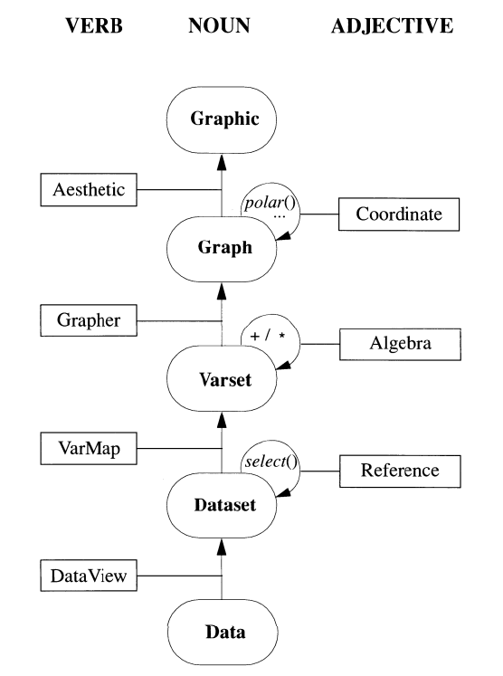

---
output:
  word_document: default
  pdf_document: default
---

```{r include_packages, include = FALSE}
library(knitr)
library(palmerpenguins)
library(tidyverse)
library(nycflights13)
data(flights)

library(ggpcp)
library(ggplot2)
library(dplyr)
data(nasa)

library(scales)
library(datasets)
data("ChickWeight")
library(formatR)

```


<!--
----

\svp{I think it might be most effective to have several sub-sections of the lit review that are somewhat connected.}

First: Outline the general topic - creation of interactive graphics and dashboards to enable end-users to understand their own data. Explain that this is a highly interdisciplinary topic. Conclude this paragraph by explaining that you will explore the major sub-topics sequentially and then outline the interface between them at the end of the literature review.

- Graphics
    - Perceptual principles - cognitive load, working memory, etc.
    - Exploratory Data Analysis
    - Grammar of Graphics - with examples of code!
    - Big Data and graphical solutions - overplotting, binning, interactivity
    - Interactive Graphics

- Human Computer Interaction/UI-UX
    - User analysis - general process, not focused on your projects at all - you'll talk about that later on
    - Protocols for testing design - think aloud, eye tracking, feedback/surveys.
    - General Dashboard stuff

Conclusion: Connections between EDA and dashboards - not all dashboards are designed for EDA, but most dashboards are designed with end-users, not statisticians, in mind. This requires a different set of optimizations than if we designed for experts. 

---
-->

# Introduction
<!-- General purpose of this section: 
Motivate Dashboards and conclude that it is important to understand how graphs are perceived and used by various target audiences. -->

Statisticians use graphs in almost every stage of their work: we create charts when we get new data, to explore what we have and identify potential problems and opportunities. 
We fit models based on relationships between variables which are often identified visually. 
We identify problems with those models based on residual plots and other visual diagnostics. 
When our modeling work has been completed, we present our results to interested parties using visual displays, because non-statisticians often find it easier to understand data and models through an intuitive visual medium rather than through the mathematical formulae which underlie the statistical work.

Given the wide range of uses for graphs and visual data displays in statistical modeling, it is unsurprising that some graphs are more useful for specific applications such as exploratory analysis, and are unsuitable for other applications, such as presentation to an outside group.
In addition, we know that not all visual displays have equal perceptual value [@unwin2003, @aspillaga1996]. 
The best graphics are designed to account for both the features of the dataset and the features of the intended audience.
Some design constraints stem from limitations of the human perceptual system and are common to most potential consumers of the visualization: the sine illusion affects anyone with binocular depth perception, and color recommendations are built around the specific characteristics of the human retina [@vanderplas2015].
Other design constraints are due to the audience's experience level: are they used to working with data? 
Do they understand specialized techniques such as principal component analysis to the point where a plot of factor loadings might be a useful visual display?
When we create visualizations for public consumption we have to consider both perceptual factors and the target audience's domain knowledge.
In this introduction, we explore previous research related to the construction of interactive and static visual displays for different audiences and consider the implications of this research when designing interactive data displays such as dashboards.

Most research in statistical graphics has been done on static graphics; usually, research also strips away all but the most essential contextual information, sacrificing external validity for statistical control. 
As a result, it can be hard to generalize this research to practical applications, where the contextual information surrounding the data is critical and the chart does not just exist in a vacuum.

In the real world, however, conventions and familiarity often win out over best practice validated by perceptual experiments.
For example, in sports, many coaches desire printable diagrams containing all necessary and valuable information on a single page. 
As data in sports becomes more prominent, extensive, and collected, this information must be refined. 
<!-- Other examples needed, profile of pie charts after 100 years of research saying they suck.-->

Thus, in addition to the experimental evidence, we must consider the human element: how to introduce new graphical concepts to stakeholders, and the considerations involved in encouraging stakeholders to adopt these improved graphics.
Let us first consider the audience characteristics that affect the selection of graphics. 
Then, we will engage with considerations based on the data to be displayed. 
Finally, we will consider the interactions between the audience and the data: how graphics are tested, amended, and hopefully eventually adopted into common use.


## Perceptual and Cognitive Process of Graph Perception 

Several factors, including perception, attention, and expertise, can influence our desire and ability to read and engage with data visualization.

Perception and attention are crucial cognitive processes that allow us to interpret and make sense of data visualizations. 
Perception refers to the manner in which we interpret and organize sensory information from our environment, whereas attention refers to the capacity to selectively focus on particular aspects of this information [@attention].

<!--Our ability to perceive and pay attention to pertinent features, such as patterns, trends, and relationships, is essential for comprehending data visualizations. 
This is especially true when working with unfamiliar or complex data sets, as our ability to focus on pertinent information becomes more difficult.-->

In addition to perception and focus, domain-specific knowledge is essential for understanding and interacting with data visualizations. 
Expertise in a particular field can enable individuals to better interpret and comprehend the significance of the presented data, as well as identify potential biases or errors in the visualization.

<!--In conclusion, the ability to perceive and interact with data visualizations requires a combination of perceptual and attentional processes, as well as domain-specific knowledge, in order to interpret and comprehend the presented information.

The term "data visualization" dates back to the 2nd century A.D. drawings and other visual representations were used to investigate the world and record historical events in ancient societies. 
Throughout human history, data visualization has significantly contributed to invention and discovery [@crapo2000].
The introduction of computer technology dramatically changed the visual representation of data. 
Using computer-based graphical data visualization, data analysts have become faster and more precise. 
Data visualization has become an integral component of research in numerous disciplines, such as algorithms, human perception, animation, computer vision, etc

"Data Visualization: a successful design process" defined data visualization as "the representation and presentation of data that exploits our visual perception abilities to amplify cognition," [@kirk2012]. 
This suggests that data visualization involves the misuse of human visual perception in addition to the presentation of data.
Assigning meaning to visualization is not a statistical or computational step but a cognitive one. 
Each step in the data analysis process is part of a more extensive mental process.-->

"Data Visualization: a successful design process" defined data visualization as "the representation and presentation of data that exploits our visual perception abilities to amplify cognition," [@kirk2012]. 
This suggests that data visualization involves the misuse of human visual perception in addition to the presentation of data.
Assigning meaning to visualization is not a statistical or computational step but a cognitive one. 
Each step in the data analysis process is part of a more extensive mental process.

Studying cognitive science, human-computer interaction, and statistical graphics reveals fascinating connections and interdependencies that must be thoroughly investigated. 
The cognitive theory of working memory clarifies the mechanisms underlying our capacity to store and manipulate information temporarily. 
Expertise in long-term memory, on the other hand, sheds light on how our knowledge and experiences shape our cognitive processes. 
Attention concepts such as feature integration theory investigate how attention is directed and how the brain integrates various features into a coherent perceptual experience. 
The Gestalt principles illustrate the fundamental means by which we organize and perceive visual information.
Statistical graphics and dashboard design bring together data visualization techniques, empowering effective communication and decision-making through meaningful visual representations. 
Ultimately, this knowledge paves the way for creating more effective and impactful interactions between humans and technology in our increasingly information-rich world.

### Visual System

Perception can be understood at the biology level through sensory systems and their corresponding neural mechanisms. 
The transduction of sensory stimuli into neural signals is a crucial aspect of perception. 
Each sensory modality, including sight, hearing, and touch, has specialized receptors that convert physical stimuli into electrical signals that the brain can interpret. 
For example, in vision, light enters the eye. It activates photoreceptor cells in the retina, initiating a cascade of neural signals transmitted to the brain's visual cortex via the optical nerve [@hubel2004].

Human perception is an essential component of data visualization that can significantly enhance both the content and quantity of displayed information, [@ware2012]. 
Perception refers to the organization, interpretation, and conscious experience of sensory data.
Perception is also defined as "the process of recognizing (being aware of), organizing (gathering and storing), and interpreting (binding to knowledge) sensory information," [@ward2010].
Ward et al. explain the notion of perception as the following:

> The brain makes assumptions about the world to overcome the inherent ambiguity in all sensory data, and in response to the task at hand. 

Human visual perception is a highly complex and subjective process, and the efficacy of a visualization in communicating objective understanding depends on a vast array of subtle factors, [@reuter1990].
Furthermore, certain situations present unique challenges and lead to systematic errors; can these provide insight into how the brain solves the problem of which objects are represented by which images in general [@gregory1968].

<!--I need to close this section to introduce the principles of Gestalt and eye tracking-->
Examining the Gestalt principles, which describe how our brain organizes and interprets sensory information to form coherent patterns and objects, is one way to gain a deeper understanding of how this particular perception functions.

### Gestalt Principles

Our visual interpretation of the world is a major factor in why humans perceive the world and its objects as organized, regular, and simple shapes, schemas, figures, or forms.
The theory of Gestalt has philosophical and psychological roots that date back to the late 1800s. 
Gestalt therapy is founded on the notion that overall perception is contingent upon the interaction of numerous factors.
These principles include proximity, similarity, closure, continuity, symmetry, and figure-ground relationships formally outlined in "Principles of Gestalt Psychology", [@koffka1935]. 

Gestalt principles include:

- Proximity: Objects close to each other are perceived as related or grouped.
- Similarity: Objects that are similar in some way (e.g., shape, color, size) are perceived as related or grouped.
- Continuation: The human eye follows lines and patterns, so designers can use this principle to guide the viewer's gaze through a display.
- Closure: The human brain tends to complete incomplete figures or patterns, so designers can use this principle to create the illusion of missing information.
- Figure-Ground: The human brain separates the foreground (figure) from the background (ground), so designers can use this principle to create visual hierarchy and emphasis.
- Contrast: The human eye is drawn to high-contrast areas, so designers can use this principle to create emphasis and hierarchy.
- Symmetry and Balance: The human eye finds symmetry and balance visually pleasing, so designers can use this principle to create a sense of harmony and order.

```{r gestalt, echo=FALSE, out.width = "75%", fig.cap='Gestalt Principles with Examples [@gestaltimage]',fig.show='hold',fig.align='center'}

```


### Role of Attention and F.I.T. (Feature Integration Theory)
<!-- Visual attention, gorilla video-->
Visual attention is defined as "the process of allocating cognitive resources to specific regions or features of the visual input based on their relevance and salience," [@treisman1980], [@itti2001].

The famous experiment in optical illusion, "Gorilla in the Midst" or "Invisible Gorilla" video, which was utilized in a well-known 1999 study conducted by Daniel Simons and Christopher Chabris [@gorillavideo1999]. The purpose of the video was to demonstrate a phenomenon known as "inattentional blindness" and highlight some visual attention principles. 

According to the Feature Integration Theory (FIT), STM is composed of two stages: pre-attentive processing and focused attention [@treisman1998]. 
Parallel and independently, the brain processes the physical characteristics of an object, such as its color, shape, and orientation, during pre-attentive processing. 
However, focused attention is required to bind these features into a coherent object representation in STM.
STM can be improved through various strategies, such as rehearsal, chunking, and elaboration [@oberauer2009]. 
For example, by repeating a phone number several times or breaking it down into chunks of two or three digits, we can increase the likelihood of it being stored in STM. 
Similarly, by elaborating on the information we want to remember, such as creating mental associations or visual images, we can enhance its retention in STM [@bui2014].

STM is a dynamic and malleable cognitive system that is crucial to our daily lives. 
Understanding the mechanisms underlying STM and how to improve it can have significant implications for learning, memory, and the treatment of memory disorders.
By analyzing the relationship between attention and working memory, we can gain insight into how we construct meaning from the information in our environment.


### Top-Down vs. Bottom-Up (Construting Meaning)

Gestalt psychology suggests that humans actively construct meaning by organizing information into patterns and wholes [@wertheimer1938].
Both top-down and bottom-up processing are involved in the process of meaning construction. 
Bottom-up processing entails analyzing sensory data from the environment and constructing perceptions based on this data. 
Top-down processing is the influence of prior knowledge, expectations, and context on the perception and interpretation of incoming sensory data.

Together, top-down and bottom-up processing facilitate the encoding and retrieval of information in the context of short-term memory. 
Selective attention, the ability to focus on relevant information while ignoring irrelevant information, is an example of top-down processing that aids in the encoding and retrieval of information in short-term memory [@cowan2010].  
According to the feature integration theory, the perception of objects involves both the bottom-up analysis of individual features and the top-down processing of higher-level features in order to form a complete perception [@treisman1980].

The Gestalt principles of perception emphasize the significance of bottom-up and top-down processing in constructing meaning from sensory data. 
Both types of processing are involved in encoding and retrieving information, which has significant implications for understanding how short-term memory works.

These principles guide how people perceive and make sense of the world around them, and they play a critical role in designing effective visual displays, such as dashboards.
Understanding the Gestalt principles can also cast light on how information is processed and stored in short-term memory and attention's critical role in this process.

### Working Memory (Why can't I remember someone's phone number?)

Baddeley expanded our understanding of working memory by emphasizing its active processing nature, expanding upon the model of Atkinson and Shiffrin's Information Model developed in the 1968, which emphasizes the process of encoding, storage, and retrieval.
Unless actively practiced, short-term memory has a limited capacity and a short duration of retention.
If information is deemed significant or sufficiently rehearsed, it can be encoded and transferred to long-term memory, which has an almost unlimited capacity and long-term storage.
The influential model developed by Baddeley, known as the working memory model, proposed a more complex structure with multiple components, [@baddeley1976].

The Baddeley Memory Model is an updated and influential model of working memory that was developed by Alan Baddeley and his colleagues. 
It includes the phonological loop (maintenance of verbal information), the visuospatial sketchpad (maintenance of visual and spatial information), the central executive (attentional control), and the episodic buffer (integrated storage). 
Together, these components facilitate the active processing and temporary storage of data in working memory.

```{r baddeleymodel, echo=FALSE, out.width = "45%", fig.cap='Working Memory Model created by Baddeley (left) and Information Processing Model created by Atkinson and Shiffrin (right)', fig.show='hold', fig.align='center'}
knitr::include_graphics(rep(c("figure/Baddeley_model.png", "figure/info_model.png"),1))
#
```

Visual and spatial information is processed and temporarily stored in the visuospatial sketchpad when individuals view statistical graphics. 
The central executive component facilitates the interpretation and analysis of the presented data by directing attention to pertinent aspects of the graphic. 
Utilizing working memory resources effectively can aid in comprehending and remembering the statistical information conveyed by the graphics.

Together, Baddeley's model of working memory provided a comprehensive framework for studying memory and cognition. 
They contributed to the understanding of how information is processed, encoded, stored, and retrieved in human memory systems, laying the groundwork for subsequent research and theories in cognitive psychology.

Short-term memory (STM), also known as working memory, is the stage of temporary storage and processing where the majority of memory retention effort is expended. 
According to Alan Baddeley's Working memory: Theories, models, and controversies, STM is a limited-capacity system prone to interference and decay, [@baddeley2012]. 
Selective attention is essential for the maintenance of STM because it allows us to filter out irrelevant information and concentrate on what is essential, [@cowan2001].

Visual aids such as charts and diagrams can improve short-term memory by allowing us to encode and retain information more effectively, [@alvarez2004].
Utilizing visual aids such as charts can enhance our short-term memory by .
Furthermore, annotations can also help aid short-term memory. 
By adding annotations, such as notes or highlights, to information we are trying to remember, we can improve our recall of the information later on, [@alvarez2004].


### Role of Expertise 

However, creating effective graphics is not a simple task, and proficiency in this area is required to create high-quality visualizations. 
This section will discuss the contributions to the field of graphics made by research on psychological processes, automaticity, readily available information, and practice effects.

The first concept - **cognitive processes** in the long-term memory (LTM) process are defined as the way we think about and approach a task.
As we become more proficient in a particular skill, we develop more complex and efficient mental models or schemata, a heuristic technique to encode and retrieve memories, the majority of typical situations do not require much strenuous processing. 
These mental models help us to organize information in a meaningful way, and to quickly identify and solve problems related to the task. 
This process is known as cognitive restructuring and is facilitated by developing domain-specific knowledge [@ericsson1996]. 
For example, a basketball coach is able to quickly recognize patterns and positions on a court that are common in basketball to do so we can  mentally visualizing the arrangement and relationships between teams in a scatter plot, individuals are able to encode the spatial patterns and interpret the data points and relationships later.

The second concept -  **Automaticity** in the LTM process can be defined based on the ability to perform a task without conscious effort or attention.
It occurs when a particular task or piece of information has been repeatedly practiced and encoded to the point where it is readily accessible and automatic [@anderson1992]. 
While the concept of automaticity may not be directly related to statistical graphics, it can have an impact on how individuals interpret and process statistical information presented in graphics.
As our proficiency in a task increases, our performance becomes more automatic, thereby freeing up cognitive resources for other tasks.
The development of procedural knowledge, which is the ability to perform a series of steps or actions in a particular order, facilitates this process [@fitts1967]. 
For example, a well-trained quarterback can throw a ball without looking at the wide receiver because their throwing movements have become automatic.
In this case, the hypothesis testing will be the probability that the wide receiver will always be there 80% of the time when not being defended by a safety or cornerback.  
The degree to which statistical concepts and procedures are automated can affect how individuals interact with statistical graphics. 
Those who have a deep understanding of, say, hypothesis testing or statistical significance may apply these concepts automatically when analyzing data presented in a graph. 
This automated application of statistical principles can influence their perception of the data and guide their decision-making processes.


The third concept - **Information Readily Available** is defined by how we process information related to a task in the LTM process. 
As our proficiency increases, we can recognize and retrieve pertinent information more rapidly and precisely than a novice.
This is made possible by the creation of domain-specific knowledge structures that allow us to retrieve pertinent information from memory quickly [@chase1973]. 
Statistical graphics are often presented in specific contexts, such as scientific research, business reports, or news articles. 
LTM contains a wealth of contextual knowledge that can be drawn upon to better understand and interpret the statistical graphics within their specific domains. 
Contextual knowledge can help individuals connect the presented information to real-world scenarios, evaluate the credibility of the data, and make informed decisions based on the graphics.
For example, a medical expert can quickly identify signs and diagnose a patient using their knowledge of disease symptoms and risk factors.


The fourth concept - **Practice effects** are the performance enhancements that result from repeated practice. 
These gains are frequently most significant at the outset of practice, but gradually diminish as the individual approaches their performance ceiling [@anderson1982].
The development of procedural knowledge and automaticity, which allow for more efficient and accurate task performance, facilitates the effects of the practice.
When statistical graphics are used alongside explanations and discussions of statistical concepts, repeated exposure to these graphics strengthens the retention of the underlying statistical principles. 
Repetitive interaction with statistical graphics aids in the retention of concepts like distributions, central tendencies, variability, and correlations. 
This practice effect in LTM facilitates statistical knowledge integration and its application to data analysis and decision-making.


The contributions of research on psychological processes, automaticity, readily available information, and practice effects to the field of graphics have significant implications. 
Expertise is required to create high-quality graphics, which requires a thorough understanding of design principles and the capacity to work quickly and efficiently. 
The use of automatic processing and domain-specific knowledge can aid designers in processing and deciding on design elements efficiently and quickly. 
The creation of standardized design templates, workflows, and other tools can aid in enhancing the efficiency and effectiveness of the design process. 
Design skills can be improved through deliberate guidelines, and educators must focus on developing skills that can be applied in a variety of contexts.

As the significance of graphics in numerous fields continues to rise, the demand for specialists in this area will only intensify. 
By comprehending the contributions of research on psychological processes, automaticity, readily accessible information, and practice effects, designers, educators, and trainers can develop more effective approaches to graphics design and education. 
This can help ensure that the graphics used to convey complex information are clear, concise, and effective, making it easier for individuals to comprehend and interpret the required information.

### Engagement with the data
<!-- This is a good paragraph -- but I'm not sure it's in the right place.  -->
The goal of data analysis is to extract meaningful insights, patterns, and knowledge from data. 
The process of data analysis involves collecting, cleaning, transforming, and modeling data, followed by the use of statistical and machine learning methods to uncover patterns and relationships within the data. 
The end goal of data analysis is to support decision making and provide a basis for informed action. 
Data analysis can help organizations to better understand their customers, market trends, and operational performance. 
Additionally, data analysis can support scientific research by helping researchers to test hypotheses, develop theories, and gain a deeper understanding of complex phenomena. 
Ultimately, data analysis aims to turn data into actionable insights and information that can inform and improve decision-making.


## Data Considerations

John Tukey was the first to organize the collection and methods associated with philosophy into Exploratory Data Analysis (EDA). 
Previous research by Tukey focused on graphics as a tool for exploratory analysis. 
In "Exploratory Data Analysis," Tukey wrote that graphics and charts often display data with more enhanced understanding than a table, @tukey1966. 
Tukey outlines detailed the types of different graphics and in which situations to utilize these graphics. 
<!--John Tukey, creator of stem-and-leaf plot, boxplot-resistant smooth, and the violin plot (also known as rootgram) who taught us to utilize these methods to organize and demonstrate EDA. -->
He was a strong advocate for the importance of EDA as a crucial first step in the data analysis process and emphasized the need for visualization and interactive techniques to understand patterns and relationships in data.

Tukey's Principles of EDA have become a cornerstone in the field of statistics and have been adopted by data professionals in various industries.
Tukey's principles have enabled data professionals to understand complex data sets better and make more informed decisions by emphasizing the importance of visual exploration, data characterization, and model critique. 
In this way, Tukey's Principles have revolutionized our data analysis approach and become the foundational framework for EDA.

Tukey's Principles in EDA:

1. Graphical exploration, looking for patterns or displaying fit, the method demonstrates things about data that a single numeric metric does not understand. 
This has been useful in graphing the data before you develop summary statistics.

2. Describing the general patterns of the data. 
This step should be insensitive to outliers. 
In general, think about the types of resistant measures (i.e., median or mean). 
This step is making sure to determine data patterns.

3. The natural scale/state that the data are at their best. 
This will be the step at which the scale of data can be helpful for analysis. 
The reexpressing data to a new scale by taking the square root or logarithmic scale.

4. The mostly known parts of EDA but is done in the way of accessing fit of the data. 
This is taught in every statistics 101 class. 
The growth of machine learning and prediction methods have now used residuals more in the toolbox to assessing the best prediction models.

```{r violin_plot, echo=FALSE,out.width='.49\\linewidth', fig.width=3, fig.height=3, fig.show='hold', fig.align='center'}
ggplot(ChickWeight, aes(x = Diet, y = weight)) + 
  geom_violin(aes(fill = Diet), trim = FALSE) +
  geom_boxplot(width = 0.1) +
  theme_classic() +
  theme(legend.position = "none")

p <- ggplot(ChickWeight, aes(x=Diet, y=weight, fill=Diet)) +
  geom_boxplot()
p + scale_fill_brewer(palette="Dark2")
```

Data visualizations are an integral part of the EDA process, enabling analysts to discern patterns and relationships in the data that would otherwise be difficult to discern from tabular data alone.
Through data visualization, analysts can quickly identify trends, outliers, and other patterns that may be missed through numerical analysis alone. 
Moreover, visualizations facilitate the communication of findings to non-technical stakeholders, allowing them to comprehend complex data sets more efficiently. 
Through visualizations, analysts can also identify potential issues or biases in the data, resulting in better decisions and models. 
Thus, visualizations play a crucial role in the EDA process by enabling analysts to more effectively explore, comprehend, and communicate data-derived insights.
During the initial EDA stage, an analyst may find that a variable or a covariate is directly related to the dependent variable when looking at a correlation heatmap or a scatterplot. 
<!--This will be important to know before starting a linear model analysis. 
Much of our general understanding is from introductory statistics courses. -->
The basic understanding can be formalized to visualize the discovery process.

The field of graphical communication, which is directly related to EDA, semiology, and their use in touch, has been a valuable tool and extension of the EDA thoughts that Tukey expressed.
One of the fundamental principles of semiology is the relationship between signifier and signified, in which a visual element (the signifier) represents a particular meaning or concept (the signified), [@barthes1972]. 
Another essential concept in semiology is using syntax and semantics to convey meaning in graphic communication effectively. 
This includes both the syntax and semantics of a graphic's visual elements, [@bertin1983].

Using color to represent data on maps is an example of successful graphical communication utilizing semiology. 
By using different colors to represent different data points, viewers can comprehend patterns and relationships in the data quickly and easily. 
Jacques Bertin  writes in "Semiology of Graphics" that color can be used to "emphasize a point, distinguish one category from another, or establish a relationship between two points", [@bertin1983].
In addition, Bertin explains that the use of color can help overcome language barriers, making it easier for the audience to comprehend the presented information.

The application of semiology in graphical communication is not devoid of obstacles. 
One difficulty is the possibility of misinterpretation, in which viewers may assign a different meaning to a visual element than was intended, [@bertin1983]. 
Another concern is the possibility of cultural differences in interpretation, in which a visual element may have a different meaning in one culture versus another, @norman2013.

Despite these obstacles, semiology in graphical communication remains an indispensable tool for effectively conveying information. 
By understanding semiology principles and syntax and semantics' role in graphical communication, designers can create compelling visual representations that convey information clearly and concisely.

<!--Graphs are another tool that can be used to effectively communicate information via semiology. -->
By utilizing visual elements such as bars and lines to represent data, graphs can make complex information more understandable to viewers. 
For instance, a line graph can be used to illustrate the change in the value of a stock over time, making it easier for investors to identify trends and patterns. Leland Wilkinson writes in his book "The Grammar of Graphics" that "graphical methods are not only superior to other forms of communication, but also superior to numerical or verbal methods for certain types of data and reasoning," [@wilkinson2012].

It proposes that any statistical graphic can be broken down into a set of essential components, or "grammar," that can be combined in different ways to create a wide range of visualizations, following a layered approach to describe and construct visualizations or graphics in a structured manner.

The components of the grammar of graphics include:

- Data: The raw data being visualized represents a set of observations or values.

- Aesthetic Mappings: The mapping of data variables to visual properties such as position, color, shape, and size.

- Scales: The mapping of data values to visual values, such as mapping a numerical value to a bar height. 

- Geometries: The basic shapes representing the data, such as points, lines, bars, and histograms.

- Facets: The plot division into multiple subplots, each representing a different subset of the data.


For example, a bar chart can be created by mapping a categorical variable to the x-axis, mapping a numerical variable to bar heights, and using rectangular bars as the geometry. 
Moreover, mapping two numerical variables can create a scatter plot to the x and y positions and use points as the geometry.
Finally, the "Grammar of Graphics" provides a systematic way of thinking about visualizations, making it easier to choose the appropriate visual representation for a given dataset.

```{r graphics2, echo=FALSE, out.width = "45%",fig.cap='Grammar of Graphics Diagram of Wickham and Wilkinson\'s work',fig.show='hold',fig.align='center'}
#knitr::include_graphics("figure/gglayers.png")
#
knitr::include_graphics(rep(c("figure/gglayers.png","figure/graphic-flowchart.png"),1))
```

Michael Friendly, a leading expert in data visualization, has utilized the principles of the grammar of graphics to develop innovative teaching methods that make complex data visualization concepts more accessible to a broader audience.
Friendly has investigated the origins and development of graphic techniques, tracing their evolution from antiquity to the present.
He used SAS with hands-on experiments to present categorical data analysis visually, @friendly2014.
By emphasizing the role of graphical methods in scientific discovery, Friendly has helped promote his use in various disciplines, from the natural sciences to the social sciences and beyond.
In his book "Milestones in the History of Thematic Cartography, Statistical Graphics, and Data Visualization," Friendly provides a comprehensive overview of the key milestones in the evolution of statistical graphics, including the contributions of pioneers like William Playfair, Charles Minard, and John Tukey, [@friendly2001].

As discussed regarding semiology, Tukey's Exploratory Data Analysis (EDA), and the introduction of the Grammar of Graphics, we should be mindful that a well-constructed graphic can be misleading out of context.
Compelling graphics can be a powerful tool for communicating complex information, making numerical accuracy, engagement, correct decision-making, and accurate predictions crucial. 

In the context of data visualization, numerical accuracy refers to the precision and correctness of the numerical data displayed in graphics. 
Accurate graphics can assist users in comprehending complex numerical data and making more informed decisions, @cardoso2016.

Engagement in the context of data visualization is the extent to which viewers are drawn to and interested in the displayed data. 
Engaging graphics can encourage users to interact with and explore data further, resulting in a more thorough comprehension of the data.

Correct decision making refers to the capacity of data visualization to enable users to make informed and precise decisions based on the presented information. 
Clear, accurate, and well-designed graphics can help users recognize patterns and insights, resulting in more effective decision making.

Correct predictions refers to the capability of graphics to accurately forecast or predict future events or outcomes. 
For accurate predictions, data visualization must include trustworthy data, sound statistical models, and efficient visualization techniques.

"Graphical Tests for Power Comparison of Competing Designs" by Hofmann et al. presents a graphical method for comparing the power of two or more competing designs in an experimental study [@hofmann2012].
The article demonstrates that the graphical method is a useful tool for comparing the effectiveness of various experimental designs. 
It enables researchers to visualize and compare the effectiveness of different designs in an intuitive and straightforward manner.

Two methods for measuring the particle size distribution in a chemical process were compared in one study. 
The study evaluated both designs under various operating conditions and compared their power using a graphical method. 
The results demonstrated that one design was more effective at detecting differences in operating conditions than another.

Static Visualization is commonly used in the communication phase of data science workflows, and data scientists sometimes use them as part of the analysis. 
John Tukey's EDA methods are currently known and well-vetted in the field. 
However, Satyanarayan et al. addressed this by introducing a high-level grammar of graphics called "Vega-Lite," which presents a set of standardized linguistic rules for producing interactive information visualizations using a concise JSON format for data to be represented by the grammar [@satyanarayan2016]. 
Vega-Lite has been directly implemented in R via the `ggvis` package using the same - albeit slightly lower-level.

Understanding cognitive load is crucial for designing compelling data visualizations, as it influences how users perceive, process, and remember the data presented in the visualization.
When designing visuals, it is essential to consider the cognitive load they may place on the viewer.
Cognitive load is the amount of mental effort required to process information, and minimizing it can enhance a graphic's effectiveness.
In addition, displaying as much raw data as possible while minimizing cognitive load can improve the graphic's clarity and precision.
Here are some general guidelines for making better graphics with works from Few [@few2012], Tufte [@tufte1983], and Cairo [@cairo2016]:

1. Keep it simple - Avoid overwhelming the viewer with too much information at once by employing a clear and concise design with minimal distractions.

2. Use visual hierarchy - Utilize size, color, contrast, and placement to highlight important information and direct the viewer's focus.

3. Choose appropriate charts - Choose the chart type that best illustrates the data and facilitates comprehension.

4. Label clearly - Use labels that are clear and concise for axes, legends, and other essential information to avoid confusion.

5. Use data-to-ink ratio - Focus on the data by minimizing the amount of non-data ink, such as decorative elements or excessive grid lines.

6. Avoid distortion - Use appropriate scaling and avoid distortions to ensure that the graphics accurately represent the data.

7. Provide context - Add context to assist the viewer in comprehending the significance of the data and its relevance to the topic.


```{r flights_data_example, echo=FALSE, out.width='.49\\linewidth', fig.width=3, fig.height=3, fig.show='hold',fig.align='center'}
# Stacked Density plot
ggplot(data=flights %>% filter(dest %in% c("ATL", "ORD","MDW") ), aes(x=distance, fill=carrier)) +
geom_density(position="stack")

# Histogram
ggplot(data=flights %>% filter(dest %in% c("ATL", "ORD","MDW") ), aes(x=distance, fill=carrier)) +
geom_histogram(position="stack")

```


<!--On the other hand, Dashboards are interactive interfaces that display data visually to provide insights and support decision-making. 
Dashboards can be used to monitor key performance indicators, track progress over time, and identify patterns and trends in data. 
They often display real-time data and can be customized to show the most relevant data to the user.-->

On the other hand, Interactive graphics provide a more dynamic and engaging way to explore and analyze complex data sets than traditional static visualizations.
By allowing users to manipulate and explore data in real-time, interactive graphics can reveal hidden patterns and relationships that may be difficult to discern in static visualizations, making them a valuable tool for data analysis.

#### Interactive Graphics

As previously mentioned, theories behind visual representation include - graphical comprehension [@cleveland1984], preattentive processing [@ware2012], gestalt theory [@few2009], and graphical excellence [@tufte2001]. 
Interactive graphics offer a number of advantages when analyzing complex data sets, and technological progress has played a crucial role in making these tools more accessible and widely adopted, especially in interactive graphics.
Compared to static visualizations, interactive graphics offer a more engaging and dynamic way to explore and analyze complex data sets.
To gain a deeper understanding of the data, users are able to modify parameters, zoom in on specific regions, and rapidly explore various variables. 
In addition, interactive graphics offer a more intuitive method of communicating findings to non-technical users, making them a valuable asset for data-driven decision making. 
Interactive graphics are excellent for EDA; they are designed for exploring rather than presenting information (and more) and can be obtained by directly querying the graphic, @unwin2003.
Overall, interactive graphics are a potent data analysis tool, allowing analysts to gain a deeper understanding of complex data sets and to make more informed decisions.

The area of interactive graphics is still very much a work in progress despite existing as a field of research since the late 1960s. 
Developments are driven partly by new technology, such as `d3` [@bostock2011]. 
Visualizations are more than just a picture. 
They are now a tool that facilitates analytic activity through different modes of interaction [@yi2007]. 
Visualization is context-free, as it can mean different things to different people depending on the situation [@parsons2014]. 

<!--Interactive graphics are essential to EDA [@unwin1999]. 
Beyond the limitations of static statistical displays, interactive graphics enable visualizations to advance alongside the analysis. 
User interaction and direct manipulation are required for dynamic graphics to reach their full potential (@cook1995; @unwin1999).
The connection between EDA and dashboards is that EDA is the process of preparing and understanding the data, which is the first step for building a dashboard, as the data has to be cleaned, transformed, and analyzed to be used efficiently on the dashboard. 
EDA results can be used to identify the most relevant data and metrics to include in the dashboard and to design the visualizations that will be used to display the data. 
Additionally, the EDA process can identify the outliers, patterns, trends, and insights helpful to show in the dashboard to support decision-making.-->

In recent years, interactive graphics that enable users to manipulate and explore visualizations in real-time have grown in popularity and align with the van Wijk Simple Visualization Model framework.
The van Wijk Simple Visualization Model is a diagrammatic representation that provides a simple and effective way to understand and visualize the flow of information and data through a system. 
van Wiij's simple visualization model shows how insights are generated as the human participates in a feedback loop between reading and interacting with visualization, [@van2005].
It is a commonly used tool in EDA, the initial step in the data analysis. 
The van Wijk model can represent data flow from data sources, through intermediate processing stages, to the final visualization of results. 
This model is also context-free, allowing for the focus to be on the feedback loops between visualization and the user.
The model helps to identify the various steps involved in the visualization process, from the collection and processing of data to the presentation of results. 
By doing so, it supports the design of more effective and user-friendly visualizations, which can enhance the overall user experience.

```{r vanWiijmodel, echo=FALSE, out.width = "45%",fig.cap='van Wiij Simple Visualization Model',fig.show='hold',fig.align='center'}
knitr::include_graphics("figure/vanWiijSimpleModel.png")
```


While the van Wijk Simple Visualization Model provides a valuable framework for designing compelling visualizations, it should not be used in isolation. 
Instead, effective data visualization requires a thorough understanding of human perception, cognition, and Human-Computer Interaction (HCI) principles.
Later in this review, we will explore the fundamental principles of Human-Computer Interaction and how they can be applied to the design of compelling interactive graphics.


Based on the above best practices on the concept of cognitive load in graphics, the theory of manipulation of visualizations provides a set of guidelines and best practices for designing interactive graphics that minimize cognitive load and facilitate practical data analysis.

<!--The theories behind the manipulation of visualizations are deeply involved the following work will be included:

- Visual perceptual approaches - The most effective visual representations for data exploration tasks are those that (1) support the four basic human visual perceptual approaches of association, differentiation, ordered perception, and quantitative perception, (2) have strong Gestalt properties, (3) are consistent with the viewer's stored knowledge, and (4) facilitate analogical reasoning, @baker2009.

 Human information processing - The authors discuss various cognitive processes involved in human-computer interaction, including attention, perception, memory, and problem-solving, and provide guidelines for designing effective computer systems that align with these processes. @card1983 -->

As interactive visualizations play a more significant role in information systems, designers must know what tasks, visual representations, and interaction techniques are available and how they work to facilitate analytical reasoning. 
They must decide on the most effective visual representation without being able to estimate every user's ability to read and interpret the visualization. 

An influential framework developed by Vessey et al refers to the degree to which a person's cognitive abilities match the cognitive demands of a task, [@vessey1991], in the field of cognitive load research has been improved by Heer and Bostock, providing examined how the complexity of interactive visualizations influences users' cognitive load, [@heer2010].
The authors discovered that more intricate visualizations tend to increase cognitive load, especially for users with lower visual literacy. 
They recommended that designers consider the cognitive load of interactive visualizations and strive to reduce complexity whenever possible.

While the direct relationship to traditional mobile devices, such as phone screens, will not be discussed, it is noteworthy to account for the impact of larger screen mobile devices, such as iPads and other portable devices, concerning a user's cognitive abilities. 
Eissele et al investigated the cognitive load of mobile interactive visualizations, [@eissele2009].
The authors discovered that the limited input options and small screen size of mobile devices can increase cognitive load in interactive visualizations. 
To reduce cognitive load on mobile devices, they suggested that designers employ suitable visual encoding techniques and simplify interactions.

Lastly, Toyama et al. investigated the impact of interactive elements on cognitive load in visualizations, [@toyama2015].
Based on the nature of the task and the user's familiarity with the interactive features, the authors discovered that interactive features can both increase and decrease cognitive load. 
They suggested that designers should evaluate the cognitive load caused by the interactive elements they include in visualizations

These studies suggest that designers should carefully consider the cognitive load implications of interactive graphics and strive, whenever possible, to reduce complexity. 
Simplifying interactions and implementing suitable visual encoding techniques can reduce cognitive load, especially on mobile devices. 
In addition, designers should evaluate the cognitive load caused by the interactive features they include in visualizations.

## Audience-Data Interactions

Effective design of interactive graphics necessitates a comprehensive knowledge of Human-Computer Interaction (HCI) and User Experience (UX) design principles to ensure that the visualizations are engaging, informative, intuitive, and user-friendly.

Designing an effective interactive dashboard involves much more than simply selecting a set of visualizations and arranging them on a page.
It requires a comprehensive knowledge of Human-Computer Interaction (HCI) and User Experience (UX) design principles and the ability to apply these principles to data analysis and visualization. 
Before designing an interactive dashboard, it is crucial to have a thorough understanding of the underlying HCI and UX frameworks and the specific needs and preferences of the intended audience. 
By understanding the principles of HCI and UX design, it is possible to create interactive dashboards that facilitate effective data analysis and offer a seamless and engaging user experience. 
This can result in greater engagement with the data, more profound insights, and better-informed decisions.

### Human-Computer Interaction (HCI)

Human-Computer Interaction (HCI) refers to the study of the interaction between humans and computers. It encompasses the design, evaluation, and implementation of computer systems that are intuitive, efficient, and effective to use.


In the 1970s and 1980s, HCI researchers began to concentrate on developing user interface design theories and methodologies. 
The "GOMS" model, created by Card, Moran, and Newell in 1983, was an influential framework that provided a way to model user behavior when interacting with computer systems, [@card1983].
During this time, the field of usability engineering emerged, which involved designing and testing interfaces to ensure that they were user-friendly and efficient.

```{r gomsmodel, echo=FALSE, out.width = "45%",fig.cap='GOMS Model created by Card Moran and Newell', fig.show='hold', fig.align='center'}
knitr::include_graphics("figure/goms_model.png")
```


The 1990s witnessed a significant rise in the popularity and accessibility of personal computers, as well as the emergence of the World Wide Web as the dominant information-sharing platform. 
This resulted in an emphasis on designing interfaces for web-based applications and research into the usability of websites. 
In 1995, Don Norman published his influential book "The Design of Everyday Things," emphasizing the importance of designing intuitive and user-friendly products and interfaces (revisited and revised in 2013, [@norman2013]. 
His influential book examines the principles of user-centered design and the critical role that psychology plays in shaping user experiences. 
It emphasizes the significance of user-friendly and intuitive designs in everyday objects.

In the 2000s, HCI research expanded to include new technologies such as mobile devices, touchscreens, and virtual and augmented reality, @obrien2008. 
There was also an increased focus on designing interfaces for diverse user populations, including people with disabilities and older adults. 

HCI research evolves and adapts to new technologies and user requirements. 
The use of artificial intelligence and machine learning in interface design, designing interfaces for wearable devices, and designing interfaces for social and collaborative systems are some current research areas.


### User Experience (UX)

The history of UX can be traced back to the early days of human-computer interaction (HCI) research, but it has evolved to become a distinct discipline in its own right. User Experience (UX) refers to the overall interaction between a user and a product or service. It includes the interface, functionality, content, and aesthetics.

The origins of user experience research can be traced back to the 1970s and 1980s. 
At this time, researchers were primarily focused on developing efficient and effective user interface design theories and methodologies. 
As computer use became more prevalent in the 1990s, the emphasis shifted to designing interfaces that were not only functional but also enjoyable to use. 
In his influential 1995 book, "The Design of Everyday Things," Donald Norman argued that good design should center on the needs and behaviors of the user.
Jesse James Garrett coined the term "user experience design" in 2000 to describe the process of designing intuitive, efficient, and enjoyable user interfaces, @garrett2003.
The rise of mobile devices in the late 2000s and early 2010s presented UX designers with new challenges and opportunities. 
As users began interacting with devices featuring smaller screens and touch-based interfaces, designers were forced to reevaluate traditional interface design principles and adopt new interaction paradigms, [@hassenzahl2010]. 

Alan Cooper's "The Inmates Are Running the Asylum" - Cooper discusses the significance of user-centered design and the challenges and opportunities in the software design field in this book. 
He advocates placing the needs and objectives of users at the forefront of the design process, [@cooper1999].
"About Face: The Essentials of Interaction Design" - This comprehensive guide covers interaction design principles, methods, and best practices. 
It provides designers with useful insights and real-world examples to assist them in developing effective and engaging user experiences, [@cooper2014].

Dan Saffer's "Designing for Interaction: Creating Smart Applications and Clever Devices" delves into the history and evolution of interaction design and offers practical advice for creating meaningful user experiences. 
The book examines a variety of design strategies and techniques for designing interactive applications and devices, [@saffer2007].

"A Project Guide to UX Design: For User Experience Designers in the Field or in the Making" by Russ Unger and Carolyn Chandler provides step-by-step approaches, techniques, and examples for the entire UX design process. 
It is intended for both seasoned designers and newcomers to the field, [@chandler2012].

"Information Architecture: For the Web and Beyond" by Louis Rosenfeld and Peter Morville focuses on the optimal organization of information for online and offline user experiences. 
It investigates the principles and methods of information architecture as well as its influence on user-centered design, [@morville2015].

Overall, understanding the design principles of UX and HCI and the importance of testing static graphics can significantly inform the design of interactive dashboards, as we will explore in more detail later in this review.

<!--It involves studying the users of a system to understand their needs, goals, and behaviors. 
The purpose of user analysis is to create interfaces that are easy to use, efficient, and effective for the intended audience.
The results of user analysis can be used to inform the design of the interface, including the layout, navigation, and functionality. 
It can also be used to identify areas of the interface that are confusing or difficult to use and to make recommendations for improvements. 
User analysis is an iterative process, and it should be done in multiple stages of the design process to ensure that the final product is tailored to the users' needs.-->

### UX and Cognitive Load

Since 1980s, cognitive load theory (CLT) of Human-Computer Interaction (HCI) was developed by cognitive psychologist John Sweller. 
The primary focus of Sweller's research was on learning and the cognitive processes underlying the acquisition of new knowledge and skills.

The evolution of CLT was influenced by a number of fundamental concepts and theories. 
Information processing theory, which posits that individuals process information sequentially using sensory memory, working memory, and long-term memory, was one of the major influences. 
Sweller's research extended this theory by highlighting the limitations of working memory and its role in cognitive load, [@sweller1994].
In addition, CLT distinguished between intrinsic, extraneous, and relevant cognitive load. 
The intrinsic load of a task is its inherent complexity, which cannot be altered by the interface design. 
On the other hand, the extraneous load is the cognitive load imposed by the design of the learning environment or interface, which can be reduced through practical methods. 
Finally, germane load refers to the cognitive effort required for learning and acquiring knowledge, [@hollender2010].

The original purpose of CLT was to improve instructional design and learning outcomes by minimizing irrelevant cognitive load and optimizing relevant cognitive load. 
However, its principles and concepts have been applied to the field of HCI, recognizing the significance of cognitive load in the design of interactive systems and user interfaces.

The cognitive load theory of HCI illuminates human-computer interaction cognitive processes. 
By comprehending the cognitive load imposed by interfaces and learning environments, designers can create more efficient and user-friendly systems that maximize users' mental resources. 
CLT has continued to evolve and inform interface design over time, improving HCI's usability, user experience, and cognitive support.


Both CLT and HCI were based on the same theories of cognition. 
Both emphasized the reduction of unnecessary cognitive load. 
With the concept of germane cognitive load, CLT incorporated principles to promote germane learning processes, which may result in a rise in cognitive load.

In relation to Cognitive Load Theory (CLT), the split-attention principle addresses the negative effects of dividing a learner's attention between multiple sources of information during learning tasks. 
The split-attention principle focuses specifically on reducing extraneous cognitive load, which refers to cognitive processing that does not contribute directly to learning, [@nielsen1994].

Because the goal of instructional design should be to present information in an integrated and coherent manner to reduce the effect of divided attention. 
This can be accomplished by spatially aligning relevant text and visuals, such as by placing labels near the corresponding elements in a diagram or by employing captions to provide explanations directly alongside visual representations. 
The split-attention principle optimizes cognitive resources for learning tasks by reducing the necessity for learners to mentally integrate distinct sources of information.

### Infomation Search Enviroment

In the article, "Web Designers and web users: Influence of the ergonomic quality of the web site on the information search," written by Aline Chevalier and Maud Kicka outline investigate the difficulties of web designers or compare their respective activities, @chevalier2006. 
The two experimental studies presented in this article compare the strategies developed by professional web designers and (novice versus experienced) web users while searching for information on websites with varying ergonomic qualities. 
The results of the two experiments, that web designers are incapable of predicting the strategies of novice users and do not behave like novices. 
Therefore, techniques for assisting web designers in developing a user-centered activity are required, and a few of these techniques are suggested at the conclusion of this article.

In the article, "Predicting graph reading performance: a cognitive approach, by Huang, Hong, and Eades outlines that performance and preference metrics are frequently employed in evaluating visualization techniques, [@huang2006].
To introduce a cognitive method for assessing the effectiveness and efficiency of visualization. 
Huang et al. propose a model of user performance, mental effort, and cognitive load (memory demand) and incorporate additional mental effort and visualization efficiency measures into our analysis.

Huang et al. build on the understanding that Richard Atkinson and Richard Shiffrin, wrote the information processing model of memory.

Measuring Visualization Efficiency can be calculated using the method proposed in 2004 to measure the relative effectiveness of various instructional conditions, @tuovinen2004.
This method relates mental effort to performance measures within the context of visualization efficiency, which is defined as the ratio of cognitive cost (in this study, mental effort and response time) to response accuracy

```{r viseff, echo=FALSE, out.width = "45%",fig.cap='Multi-dimensional visualization efficiency (a) modified from Tuovinen et al. [2004]; (b) modified from Kalyuga et al. [1999]', fig.show='hold', fig.align='center'}

```


The efficiency (E) is calculated by converting mental effort (ME), response time (RT) and accuracy (RA) into z-scores, and combining them using the following formula:

$$E = \frac{RA - ME - RT}{\sqrt{3}}$$
where E of zero means that cognitive cost and performance accuracy are balanced. 


### Testing static graphics

While understanding HCI and UX design principles helps create compelling interactive graphics, it is equally important to rigorously test and evaluate the usability and efficacy of both interactive and static graphics to ensure they achieve their intended purpose.
Kosara highlighted the significance of user testing in identifying potential problems in static visualizations, [@kosara2007]. 
User testing aids in comprehending the users' behavior and perceptions of the visualization, thereby facilitating the identification of issues that designers may have overlooked.
User testing also identifies the graphic's confusing or ineffective visual aspects, allowing designers to refine the design and increase its effectiveness.

The evolution of testing static graphics has progressed through several chronological moments, each building on the knowledge and techniques of the past, starting with the thoughts of Cleveland and McGill to Hofmann, who explored the statistical testing of categorical data.

Firstly, Cleveland and McGill investigated the effect of various bar chart designs on the accuracy with which viewers perform simple perceptual tasks @cleveland1986. 
People perform significantly worse on stacked bar charts than on simple bar charts, and bar charts with filled bars are generally superior to those with empty ones.

"The cognitive style of PowerPoint: Pitching out corrupts within" examined the effect of static graphics, such as bar charts, line charts, and pie charts, on the comprehension and decision-making of viewers, [@tufte2008]. 
The results indicated that the bar chart was most effective at accurately communicating information, while the pie chart was least effective. 
In addition, the researchers discovered that the ty pe of graphic employed influenced the viewers' perceptions and decision-making, highlighting the significance of selecting the most appropriate graphics when conveying information.

"Using color to code different types of uncertainty in visualization," investigated the effect of color on the communication effectiveness of static graphics @ware2010. 
Researchers discovered that the use of color in static graphics enhanced viewers' comprehension and memory retention of the presented information. 
Specifically, it was determined that the use of color to highlight particular data points or trends in a graph or chart was particularly effective.

"Communicating Uncertainty: A Look at Graphical Representations of Error Bars, Box Plots, and Confidence Intervals" examined the efficacy of static graphics in communicating data uncertainty and variability [@wainer2020]. 
Researchers discovered that static graphics, such as boxplots and error bars, effectively communicated the range and variability of data. 
Furthermore, the use of static graphics enhanced viewers' comprehension and decision-making in uncertain situations.

Overall, these above studies indicate that static graphics effectively convey information to viewers. 
Nonetheless, their effectiveness is influenced by the type of graphic exercised, the use of color, and their capacity to express uncertainty and variability in data. 
It is essential to note that the effectiveness of static graphics can also be affected by audience knowledge and experience, the complexity of the presented information, and the context in which the graphics are used.

### Testing interactive graphics

The significance of testing and evaluating static graphics to ensure their effectiveness and user-friendliness naturally segues into the similar, yet distinct challenge of evaluating interactive graphics

The design space of interactive visualizations, including the use of multiple views and coordinated various perspectives, is discussed in a paper by Heer and Bostock @heer2012. 
The authors argue that interactive visualizations can enhance comprehension and decision-making by enabling users to investigate complex data and the relationships between multiple variables.
It was discovered that interactive graphics are beneficial for investigating data that is difficult to comprehend with static graphics, such as time series data or data with multiple aggregation levels.

Compared to static graphics, interactive graphics can improve users' ability to identify patterns and outliers in data, according to a second study, @wu2017. 
This is because interactive graphics enable users to zero in on particular aspects of the data and adjust the visualization in real-time to reveal hidden patterns.

It has also been discovered that interactive graphics increase user engagement with data and improve their decision-making abilities. 
<!--"Visualizing decision-making: Introducing the analysis, comparison, and exploration system (ACES)" showed that interactive graphics can help users make more informed decisions by allowing them to compare and contrast various scenarios and outcomes, @kornhauser2014. -->
Moreover, interactive graphics can help users identify potential biases or errors in their data analysis by allowing them to rapidly explore various visualizations and test their hypotheses.

In addition to their benefits for data exploration and analysis, interactive graphics have been found to be more engaging and enjoyable for users [@eppler2013]. 
This can increase the motivation of users to explore and analyze data, resulting in better decision-making.

In summary, the studies highlighted indicate that interactive graphics can be an effective data visualization and analysis tool, especially for complex and multidimensional data. 
They can improve users' comprehension, engagement, and decision-making skills, and are ideal for examining data that is difficult to comprehend with static graphics.

## Dashboard Design

Given that the intended audience has limitations, there are design constraints around the data, and the ability of the audience to successfully use the graphical displays of the data, what can we take from this body of research that applies to more complicated sets of graphics? 
How do we maintain user attention, desire to explore, and accurately communicate the data through the medium of an interactive data dashboard?
Solutions to these questions can start with a dashboard.

A dashboard is a visual display of the essential information needed to achieve one or more objectives, consolidated and arranged on a single screen so the data can be monitored at a glance [@few2006]. 
Dashboards have particular characteristics:

- Achieve specific objectives

- Fits on a single computer screen

- Information can be displayed in multiple mediums (web browser or mobile device)

- Can be used to monitor information at a high level


Dashboards can present various statistical data, such as financial performance, website traffic, or customer engagement metrics. 
They allow users to quickly and easily understand complex data sets using visual elements such as charts, graphs, and tables to display the information. 
Additionally, statistics can be used to analyze data presented on a dashboard, providing insights into trends and patterns that can inform decision-making.

While a dashboard can be handy, it may be worth describing that a poorly designed dashboard will not be used. 
A dashboard should be concise, clear, and intuitive when displaying components in combination with a customized list of requirements of users.

Much of the work done within statistical research and dashboard design involves collaboration with other researchers and users. 
While this may be the best for the growth of the discipline, one will find that working with collaborators with non-STEM backgrounds.
Dashboards can help understand and support many data types in essential business objectives. 
There are many different ways to label and utilize dashboards in different kinds.

Dashboards are cognitive tools that should be used to improve understanding of data, which should help people visually find relationships, trends, patterns, and outliers. 
Most importantly, dashboards should leverage people's visual cognitive capabilities.

These principles are based on cognitive psychology and understanding how the human brain processes visual information. 
By applying these principles to dashboard design, designers can create visual arrangements that make it easier for viewers to understand the relationships between data elements. 
For example, proximity can be used to group related elements together, while symmetry can be used to create balance and harmony in the overall layout of the dashboard.
At its most basic, the entire form is perceived (or emerges to our visual pathways) as opposed to its component parts. 

Cowan suggested that the average person can only hold two to six pieces of information in their attention, [@cowan2001]. 
People can develop detailed understandings of reality, which is infinitely complex.

It is important to consider how users construct mental models of the presented data and information.
Researchers have introduced cognitive structures consisting of mental models and their relationships [@rumelhart1976], [@carley1992]; [@jonassen1996].
In cognitive psychology, a schema is a mental model representing a person's general knowledge or expectations regarding a particular concept or situation.
Schemas are organized into semantic networks based on their relationships to other schemas [@wertheimer1938,[@rumelhart1976].
This arrangement helps the brain process its experiences instead of storing every sensory observation; the brain only needs to maintain its schemas, which are good summaries of all previous observations. 
Some "memories" may even be complete recreations built with a schema [@bartlett1932], [@klein2007]

Wixon introduced the concept of "contextual design" as a systems development method in which the researcher partners with the user at the user's place of work to "develop a shared understanding" of the user's activities, and they define contextual inquiry as the first part of the broader process, [@cowan2001]. 
Contextual inquiry is the data collection step of the field research element of the contextual design method, and it emphasizes four essential principles:

1. The context of the activity being performed by the user

2. The partnership between the researcher and the participant

3. The spoken verification that the investigator's interpretation of the activity matches the user's

4. The focus of the study is central to the approach taken by the interviewer

<!--Kandal conducted what might be considered a contextual interview study in that they analyzed data scientists' self-reported work processes, [@kandel2012]. 
They proposes three main archetypes that data scientists may be classed into the following:

- Hackers: who build processes chaining together multiple programming languages of different types (analytical, scripting, and database languages) and use visualization in various environments.

- Scripters perform most of their analysis in an analytical environment (e.g., R or Python) and execute the most complex statistical modeling of the types but do not perform statements in their Extract, Transform, and Load (ETL). 

- Application Users: who performed most or all of their work in an application such as Excel or SPSS and, like scripters, relied on others (namely, their organizations' IT departments) for ETL.-->

<!-- This is where your paragraph about 2 good graphics being suboptimal together should go -->

Combining two compelling graphics does not necessarily result in a successful visualization. 
In certain instances, suboptimal combinations can result in confusion, misinterpretation, and the failure to convey the intended message.
Combining two charts with distinct scales or units is an example of suboptimal graphic design, which can result in misinterpretation and flawed comparisons. 
For example, if a bar chart displaying the number of sales is combined with a line chart showing revenue, meaningful comparisons between the two metrics can be challenging. 
According to a study conducted by Cleveland and McGill, people frequently make inaccurate judgments when comparing graphs with different scales, [@cleveland1984].

In addition, combining two difficult-to-compare graphics with redundant visual cues or unnecessary embellishments such as colors, 3D effects, or patterns can increase cognitive load and reduce the dashboard's effectiveness.
Although adding extra elements to a chart or graph may be tempting, doing so can detract from the primary message and make it more difficult for the audience to focus on the essential information. 
Tufte discovered that adding unnecessary visual cues to a graph decreases its effectiveness because viewers are more likely to focus on the embellishments rather than the data, [@tufte1985].

For instance, if a scatter plot and a bar chart are combined, the resulting visualization may be difficult to interpret due to the two graphics types' incompatibility. 
This issue was highlighted by Hullman et al., who discovered that viewers had difficulty interpreting a visualization that incorporated a scatter plot and a line chart, [@hullman2011].

<!--Using multiple color schemes or palettes in the same chart is another instance of suboptimal graphics. 
While color can be an effective visual communication tool, the use of excessive colors or color schemes can be overwhelming and confusing. 
This can detract from the primary message and make it challenging for the audience to comprehend the key points. 
In a study conducted by Heer and Bostock, participants were required to interpret multiple color schemes (@heer2010). 
Multiple color schemes made it difficult for participants to identify the relationships between different parts of the visualization, according to the study.

Conversely, it can be suboptimal to combine two visually incompatible graphics. -->

## Dissertation Map
This dissertation will be constructed as follows.

Chapter 1 thoroughly reviews the literature regarding graphical and human-computer interaction/UI-UX methods. 
Chapter 2 will explore the process of designing dashboards for public use through parallel coordinate plots as a central component of data exploration to make decisions.
Chapter 3 focuses on graphical methods for multidimensional categorical variables and visualization methods have for growth.
We conclude with a Shiny application that facilitates a better understanding of the possible forms a parallel coordinate plots in exploratory data analysis can take by accommodating a through examination through variables and structural changes to the parallel coordinate plot with a click of a mouse.
Chapter 4 further explores multidimensional categorical data visualizations and develops an approach to using parallel coordinate plots to assess predictive model. 
We identify visual indicators for parameters in different models and extend the connection between parallel coordinate plots of binary tables and odds ratios to include logistic regression models with categorical variables.

## Conclusion

The lack of integration between statistical interactive graphics and Gestalt principles is a research gap in this field. 
Gestalt principles provide a framework for understanding how visual elements are perceived and organized in the human brain, whereas statistical interactive graphics enable the manipulation and exploration of complex data sets. 
This integration can result in more effective and efficient visualization tools that take human perception and cognition into account.

In addition, there is a lack of research on the application of dashboards in visual communication. 
Dashboards are becoming increasingly popular to present data and information in a concise and easily accessible format. 
Still, there is a shortage of research on designing and employing dashboards to communicate complex data effectively.

This research seeks to bridge the gap between statistical interactive graphics, Gestalt principles, and dashboards so that users can more effectively explore complex data. 
This can be accomplished by designing interactive visualizations that adhere to Gestalt principles, enabling users to recognize patterns and trends in the data quickly and easily. 
Incorporating statistical interactive graphics into dashboards can also provide users with a more comprehensive view of the data, enabling them to make more effective data-driven decisions.

