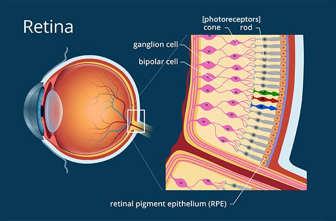

---
output:
  word_document: default
  html_document: default
---
# Dashboard Poetry {#math-sci}

<!-- Required to number equations in HTML files -->
<script type="text/x-mathjax-config">
MathJax.Hub.Config({
  TeX: { equationNumbers: { autoNumber: "AMS" } }
});
</script>

<!--## Abstract

Interactive dashboards are frequently employed for data visualization and serve as a means of providing context for exploratory data tools.
In this paper, we will explore the scope of how dashboards are a collection of charts in data visualization to present a straightforward piece of information and visually represent data to facilitate comprehension.
The research objective of this study is to investigate how changes in real-time data displayed on a dashboard affect ensemble perception and the user's ability to make accurate and rapid decisions based on summary statistics in a dynamic environment. -->

## Introduction

Statisticians use graphs in almost every stage of their work. 
They create charts to summarize and explore new data and identify potential problems and opportunities. 
Models are fit based on relationships between variables which are often identified visually. 
We identify problems with those models based on residual plots and other visual diagnostics. 
When our modeling work has been completed, we present our results to interested parties using visual displays, because non-statisticians often find it easier to understand data and models through an intuitive visual medium rather than through the mathematical formulae which underlie the statistical work.

Given the wide range of uses for graphs and visual data displays in statistical modeling, it is unsurprising that some graphs are more useful for specific applications, such as exploratory analysis, and are unsuitable for other applications, such as presenting to an outside group. 
In addition, not all visual displays have equal perceptual value [@unwin2003] and [@aspillaga1996]. 
The best graphics are designed to account for both the dataset and the intended audience's features.
Some design constraints stem from limitations of the human perceptual system and are common to most potential consumers of the visualization. 
For example, the sine illusion affects anyone with binocular depth perception, and color recommendations are built around the specific characteristics of the human retina [@vanderplas2015].
Other design constraints are due to the audience’s experience level and if they are used to working with data and understand specialized techniques (e.g., enough familiarity with principal component analysis such that a plot of factor loadings might be useful). 
Do they understand specialized techniques such as principal component analysis to the point where a plot of factor loadings might be a useful visual display?
When we create visualizations for public consumption, we have to consider both perceptual factors and the target audience’s domain knowledge.

Most research in statistical graphics has been done on static graphics; usually, research also strips away all but the most essential contextual information, sacrificing external validity for statistical control. 
As a result, it can be hard to generalize this research to practical applications, where the contextual information surrounding the data is critical and the chart does not just exist in a vacuum.

In the real world, however, conventions and familiarity often win out over best practice validated by perceptual experiments.
For example, in sports, many coaches desire printable diagrams containing all necessary and valuable information on a single page. 
As data in sports becomes more prominent, extensive, and collected, this information must be refined. 
<!-- Other examples needed, profile of pie charts after 100 years of research saying they suck.-->

Dashboards have seen a significant increase in day-to-day usage as a potent data visualization and decision-making tool. 
The proliferation of dashboards can be attributed to several factors, including the growing availability of data from various sources and the increasing need for organizations to extract actionable insights. 
Steven Few found that the widespread use of dashboards is attributable to their capacity to present key performance indicators and relevant metrics in a visually appealing and easily digestible format, [@few2006]. 
Moreover, technological advancements and the development of user-friendly dashboard platforms have facilitated the creation and effective utilization of dashboards by individuals from diverse fields. 
Dashboards have revolutionized data analysis and presentation, allowing users to gain valuable insights and make data-driven decisions more effectively.

Thus, in addition to the experimental evidence, we must consider the human element: how to introduce new graphical concepts to stakeholders, and the considerations involved in encouraging stakeholders to adopt these improved graphics.
Let us first consider the audience characteristics that affect the selection of graphics. 
Then, we will engage with considerations based on the data to be displayed. 
Finally, we will consider the interactions between the audience and the data: how graphics are tested, amended, and hopefully eventually adopted into common use.

Interactive data dashboards are frequently employed to present many pertinent qualities and performance measures that carry significance for stakeholders. 
Each chart on the dashboard contributes to the overall comprehension of the situation, similar to how each sentence in a paragraph contributes to the larger concept. 
A chart is similar to a sentence in that it presents a straightforward piece of information and visually represents data to facilitate comprehension.
For example, a chart could be a bar graph depicting sales over a year, a pie chart illustrating the percentage distribution of a budget, or a scatter plot illustrating the correlation between two variables.
A dashboard may combine multiple graphs, tables, and metrics to provide an all-encompassing view of a company's performance, a project's development, or market trends.
<!-- Insert the JHSPH Dashboard for COVID -->

However, a counterexample to this analogy could be a poorly designed dashboard presenting overwhelming information without clear organization or hierarchy. 
In such a case, the charts may compete for attention and confuse the reader, similar to how a paragraph with too many disjointed sentences can lead to confusion and a lack of coherence. 
This counterexample highlights the importance of thoughtful design and effective communication in creating an informative and comprehensible dashboard. 
The research objective of this study is to investigate how changes in real-time data displayed on a dashboard affect ensemble perception and the user's ability to make accurate and rapid decisions based on summary statistics in a dynamic environment.

John Tukey was the first to organize the collection and methods associated with philosophy into exploratory data analysis (EDA). 
Previous research by Tukey focused on graphics as a tool for exploratory analysis. 
In "Exploratory Data Analysis," Tukey wrote that graphics and charts often display data with more enhanced understanding than a table [@tukey1966]. 
Tukey outlines in detail the types of different graphics and in which situations to utilize them.
He was a strong advocate for the importance of EDA as a crucial first step in the data analysis process and emphasized the need for visualization and interactive techniques to understand patterns and relationships in data.

Tukey's Principles of EDA have become a cornerstone in the field of statistics and have been adopted by data professionals in various industries. 
Tukey's principles have enabled data professionals to understand complex data sets better and make more informed decisions by emphasizing the importance of visual exploration, data characterization, and model critique. 
In this way, Tukey's Principles have revolutionized our data analysis approach and become the foundational framework for EDA.

Tukey's Principles in EDA:

1. Through graphic exploration (looking for patterns or displaying fit), the method demonstrates things about data that a single numeric metric does not understand. 
This has been useful in graphing the data before you develop summary statistics.

2. Describing the general patterns of the data This step should be insensitive to outliers. 
In general, think about the types of resistant measures (i.e., median or mean). 
This step makes sure to determine data patterns.

3. The natural scale or state in which the data are at their best. 
This will be the step at which the scale of the data can be helpful for analysis. 
Reexpressing data on a new scale by taking the square root or logarithmic scale.

4. The most known part of EDA is done by accessing the fit of the data. 
This is taught in every statistics 101 class. 
With the growth of machine learning and prediction methods, residuals are now more widely used in the toolbox for assessing the best prediction models.

```{r, echo=FALSE,out.width='.49\\linewidth', fig.width=3, fig.height=3, fig.show='asis', fig.align='center'}
ggplot(ChickWeight, aes(x = Diet, y = weight)) + 
  geom_violin(aes(fill = Diet), trim = FALSE) +
  geom_boxplot(width = 0.1) +
  theme_classic() +
  theme(legend.position = "none")

p <- ggplot(ChickWeight, aes(x=Diet, y=weight, fill=Diet)) +
  geom_boxplot()
p + scale_fill_brewer(palette="Dark2")
```

Data visualizations are an integral part of the EDA process, enabling analysts to discern patterns and relationships in the data that would otherwise be difficult to discern from tabular data alone. 
Through data visualization, analysts can quickly identify trends, outliers, and other patterns that may be missed through numerical analysis alone. 
Moreover, visualizations facilitate the communication of findings to non-technical stakeholders, allowing them to comprehend complex data sets more efficiently. 
Also, analysts can use visualizations to identify potential issues or biases in the data, resulting in better decisions and models. 
Thus, visualizations play a crucial role in the EDA process by enabling analysts to more effectively explore, comprehend, and communicate data-derived insights. 
During the initial EDA stage, an analyst may find that a variable or a covariate is directly related to the dependent variable when looking at a correlation heatmap or a scatterplot.

Using color to represent data on maps is an example of successful graphical communication utilizing semiology. 
By using different colors to represent different data points, viewers can comprehend patterns and relationships in the data quickly and easily. 
Jacques Bertin writes in "Semiology of Graphics" that color can be used to "emphasize a point, distinguish one category from another, or establish a relationship between two points", [@bertin1983]. 
In addition, Bertin explains that the use of color can help overcome language barriers, making it easier for the audience to comprehend the presented information.

By utilizing visual elements such as bars and lines to represent data, graphs can make complex information more understandable to viewers. 
For instance, a line graph can be used to illustrate the change in the value of a stock over time, making it easier for investors to identify trends and patterns. 
Leland Wilkinson writes in his book "The Grammar of Graphics" that "graphical methods are not only superior to other forms of communication but also superior to numerical or verbal methods for certain types of data and reasoning" [@wilkinson2012].

It proposes that any statistical graphic can be broken down into a set of essential components, or "grammar," that can be combined in different ways to create a wide range of visualizations, following a layered approach to describe and construct visualizations or graphics in a structured manner.

The components of the grammar of graphics include:

- Data: The raw data being visualized represents a set of observations or values.

- Aesthetic Mappings: The mapping of data variables to visual properties such as position, color, shape, and size.

- Scales: The mapping of data values to visual values, such as mapping a numerical value to a bar height. 

- Geometries: The basic shapes representing the data, such as points, lines, bars, and histograms.

- Facets: The plot division into multiple subplots, each representing a different subset of the data.


For example, a bar chart can be created by mapping a categorical variable to the x-axis, mapping a numerical variable to bar heights, and using rectangular bars as the geometry. 
Moreover, mapping two numerical variables can create a scatter plot to the x and y positions and use points as the geometry.
Finally, the "Grammar of Graphics" provides a systematic way of thinking about visualizations, making it easier to choose the appropriate visual representation for a given dataset.

```{r, echo=FALSE, out.width = "45%",fig.cap='Grammar of Graphics Diagram of Wickham and Wilkinson\'s work',fig.show='asis',fig.align='center'}
#knitr::include_graphics("figure/gglayers.png")
#knitr::include_graphics("figure/graphic-flowchart.png")
knitr::include_graphics(rep(c("figure/gglayers.png","figure/graphic-flowchart.png"),1))
```


A dashboard is a visual display of the essential information needed to achieve one or more objectives, consolidated and arranged on a single screen so the data can be monitored at a glance [@few2006]. 
Dashboard design creates visually informative and interactive interfaces that present data and key performance indicators (KPIs) in a consolidated and simple-to-understand format.  
The objective is to provide users with insights and enable them to make intelligent decisions based on the presented data.  
As organizations increasingly rely on data-driven decision-making, well-designed dashboards become pivotal.  
The literature on dashboard design provides a comprehensive roadmap for understanding and implementing effective dashboards, focusing on critical frameworks such as evaluation criteria in healthcare, learning dashboards in educational settings, design patterns and trade-offs, academic literature reviews, and practical tips for implementation.  
Each of these frameworks offers unique perspectives and actionable insights. 
These frameworks serve as pillars for the subsequent discussion on creating functional and impactful dashboards.  
However, it is essential to note that even with a comprehensive roadmap, the success of dashboards heavily relies on the quality and accuracy of the presented data. 
If the data used in the design and implementation of dashboards is flawed or incomplete, it can lead to misleading insights and ineffective decision-making. 
Additionally, different user groups' specific needs and preferences may not always align with the frameworks provided, requiring customization and adaptation that may not be adequately addressed in the comprehensive roadmap.

A systematic literature review by [@schwendimann2016] discusses the state-of-the-art in learning dashboards. 
The paper identifies critical design features, dividing them into functional and visual features.  
This study is particularly useful for educational institutions implementing learning analytics dashboards. 
Conducted as a systematic literature review, the study categorizes critical design features into functional and visual aspects, providing a comprehensive understanding of what makes a learning dashboard effective.  
The research is especially relevant for educational institutions implementing or optimizing learning analytics dashboards.  
By identifying key design elements and their impact on student performance, the paper is a foundational resource for educators and administrators looking to leverage dashboards to enhance educational outcomes.  

## Dashbaord Construction
<!-- How do charts fit within larger DB Framework>? Reference of other views on the topic -->

Given that the intended audience has limitations, there are design constraints around the data, and the audience has the ability to successfully use the graphical displays of the data, what can we take from this body of research that applies to more complicated sets of graphics?
How do we maintain user attention, create a desire to explore, and accurately communicate the data through the medium of an interactive data dashboard? 
Solutions to these questions can start with a dashboard.

A dashboard is a visual display of the essential information needed to achieve one or more objectives, consolidated and arranged on a single screen so the data can be monitored at a glance [@few2006]. 
Dashboards have particular characteristics:

- Achieve specific objectives

- Fits on a single computer screen

- Information can be displayed in multiple mediums (web browser or mobile device)

- Can be used to monitor information at a high level

Dashboards can present various statistical data, such as financial performance, website traffic, or customer engagement metrics.
They allow users to quickly and easily understand complex data sets by using visual elements such as charts, graphs, and tables to display the information.
Additionally, statistics can be used to analyze data presented on a dashboard, providing insights into trends and patterns that can inform decision-making.

While a dashboard can be handy, it may be worth mentioning that a poorly designed dashboard will not be used.
A dashboard should be concise, clear, and intuitive when displaying components in combination with a customized list of user requirements.

Much of the work done in statistical research and dashboard design involves collaboration with other researchers and users.
While this may be the best for the growth of the discipline, one will find that working with collaborators with non-STEM backgrounds Dashboards can help understand and support many data types for essential business objectives.
There are many different ways to label and utilize dashboards of different kinds.

Combining two compelling graphics does not necessarily result in a successful visualization.
In certain instances, suboptimal combinations can result in confusion, misinterpretation, and the failure to convey the intended message. Combining two charts with distinct scales or units is an example of suboptimal graphic design, which can result in misinterpretation and flawed comparisons.  
For example, if a bar chart displaying the number of sales is combined with a line chart showing revenue, meaningful comparisons between the two metrics can be challenging.
According to a study conducted by Cleveland and McGill, people frequently make inaccurate judgments when comparing graphs with different scales [@cleveland1984]. 

In addition, combining two difficult-to-compare graphics with redundant visual cues or unnecessary embellishments such as colors, 3D effects, or patterns can increase cognitive load and reduce the dashboard's effectiveness. 
Although adding extra elements to a chart or graph may be tempting, doing so can detract from the primary message and make it more difficult for the audience to focus on the essential information.
Tufte discovered that adding unnecessary visual cues to a graph decreases its effectiveness because viewers are more likely to focus on the embellishments rather than the data [@tufte1985]. 
Dashboards are cognitive tools that should be used to improve understanding of data and help people visually find relationships, trends, patterns, and outliers.  
Most importantly, dashboards should leverage people's visual and cognitive capabilities.

These principles are based on cognitive psychology and understanding how the human brain processes visual information. 
Cowan suggested that the average person can only hold two to six pieces of information at a time [@cowan2001]. 
By applying these principles to dashboard design, designers can create visual arrangements that make it easier for viewers to understand the relationships between data elements.
For example, proximity can be used to group related elements together, while symmetry can be used to create balance and harmony in the overall layout of the dashboard. 
At its most basic, the entire form is perceived (or emerges from our visual pathways) as opposed to its component parts.
For instance, if a scatter plot and a bar chart are combined, the resulting visualization may be difficult to interpret due to the two graphics types' incompatibility.
Hullman et al. [@hullman2011] discovered that viewers had trouble understanding a visualization that included a scatter plot and a line chart, which brought attention to this issue. 
Moving forward, designers must navigate the delicate balance of complexity and comprehension to ensure that dashboards serve as a potent tool for conveying information succinctly and effectively, enhancing the viewer's ability to grasp and analyze the presented data seamlessly.

## Cognitive Principles

<!-- Quick Overview of Visual Perception: Scene scanning, Gestalt Grouping -->
Perception is a biological process involving sensory systems and neural mechanisms. 
The retina, a multi-layered tissue, lines the back of the eye and converts photons into electrical impulses that travel along the optic nerve to the brain. 
This process is crucial for understanding perception. 
Sensory modality, such as sight, hearing, and touch, has specialized receptors that convert physical stimuli into electrical signals that the brain can interpret. 
For instance, light enters the eye and activates photoreceptor cells in the retina, [@hubel2004].


```{r, echo=FALSE, out.width = "55%", fig.cap='An example of how the retina signals the visual cortex',fig.show='asis', fig.align='center'}

```


Human perception is an essential component of data visualization that can significantly enhance both the content and quantity of displayed information [@ware2012].
Perception refers to the organization, interpretation, and conscious experience of sensory data.
Perception is also defined as "the process of recognizing (being aware of), organizing (gathering and storing), and interpreting (binding to knowledge) sensory information" [@ward2010].
Ward et al. explain the notion of perception as follows: "The brain makes assumptions about the world to overcome the inherent ambiguity in all sensory data and in response to the task at hand."   

The principles of eye-tracking involve the investigation of eye movements and fixations during visual perception.
Eye-tracking technology permits researchers to monitor and record where individuals look and how their gaze traverses a visual scene.
This data can be utilized to analyze patterns of attention, gaze behavior, and the sequence of fixations. 
The principles of eye-tracking provide valuable information regarding how individuals allocate their attention, which elements attract their gaze, and how they visually explore and process information.

Gestalt principles, on the other hand, examine how humans perceive and organize visual elements into meaningful patterns and wholes.
These principles originated in the field of Gestalt psychology, which emphasized that perception is influenced by the arrangement and grouping of its constituent parts. 
The Gestalt principles of proximity, similarity, closure, and continuity describe how our brains organize visual stimuli to form coherent and meaningful perceptions.

Perceptual grouping is a fundamental process in visual perception that involves organizing individual graphical elements into coherent perceptual units based on their inherent properties and spatial relationships. 
It helps us make sense of the complex visual world by grouping elements that belong to the same object or structure and separating elements that belong to different entities. Gestalt psychologists have extensively studied the concept of perceptual grouping, proposing principles such as proximity, similarity, closure, and continuity as grouping's underlying mechanisms.  
These principles govern our perception of objects, edges, contours, and patterns, enabling us to perceive organized and meaningful visual information [@wertheimer1938], [@wagemans2012] and [@palmer2002]. 

The Gestalt principles play a crucial role in directing eye movements and cognitive processes involved in scanning scenes.
The integration of scene scanning with Gestalt grouping concepts synergistically contributes to the facilitation of visual scene perception and comprehension. 
In the course of scene scanning, individuals frequently employ Gestalt grouping principles, such as proximity and similarity, in an unconscious manner to arrange diverse visual elements into cohesive groups. 
This process facilitates the rapid and efficient interpretation of intricate scenes [@wertheimer1923] and [@wertheimer1938]. 
They facilitate the efficient assimilation and processing of visual information by emphasizing specific clusters or patterns in the visual field.

Scene scanning is the cognitive process of visually examining a given scene in order to acquire relevant information pertaining to the surrounding environment. 
The aforementioned procedure encompasses the utilization of both ocular motions and cognitive mechanisms to comprehend and analyze the visual data inherent in a given scenario. 
The subject matter is frequently examined within the framework of disciplines such as psychology, neuroscience, and computer vision.

The process of exploring visual scenes involves an intricate interaction of cognitive processes that influence an individual's perception and interaction with their surroundings. 
The saliency-driven focus is a key mechanism that guides scene scanning. 
This process involves both overt and covert shifts of visual attention, which are directed towards specific characteristics in the environment. 
Itti and Koch have extensively studied and explained this phenomena. 
Furthermore, the cognitive processes involved in perceiving scenes frequently involve a higher-level comprehension that entails a synergistic equilibrium between bottom-up processes driven by stimuli and top-down strategies driven by information [@itti2000]. 
This theoretical perspective is supported by the work of Henderson and Hollingworth [@henderson1999]. 
The aforementioned phenomena are applicable to various cognitive processes such as reading, visual searches, and scene perception, as demonstrated by [@rayner2009]. 
In this study, it was found that eye movements during these activities are notably impacted by individual cognitive processes, including linguistic comprehension and visual interpretation. 
Moreover, the interpretation and allocation of attention during scene scanning are influenced by the context in which visual items are encountered, as emphasized by [@bar2004]. 
The significance of global features in the search for objects in real-world settings is crucial for guiding eye movements and attention within a contextual framework, [@torrablba2006]. 

By examining the complexities of scene scanning, it becomes evident that attention plays a crucial role in directing the eyes systematically as they analyze and comprehend the visual narratives present in each gaze. 
This process contributes to a complex cognitive framework that integrates perception and interpretation through an interactive and dynamic relationship.

<!-- Attention-->
Starting with Wertheimer's experiments on the perception of motion, he examined the phenomenon of apparent motion, which refers to the perception of motion when successive stationary stimuli are presented. 
Wertheimer investigated the principles underlying the perception of motion and provided insights into the Gestalt principles of visual perception by conducting a series of perceptual experiments. 

[@wertheimer1912] investigated the phi motion, a type of motion in which the rapid presentation of two stationary stimuli creates the perception of movement.
By manipulating the temporal and spatial arrangement of stimuli systematically, Wertheimer was able to identify critical factors that influenced the perception of motion.
His experiments revealed that motion perception results from the interaction between sensory input and perceptual organization processes. 

The work of Wertheimer emphasized the significance of perceptual grouping principles, such as proximity and similarity, in the perception of motion.
He hypothesized that the visual system tends to group stimuli that are close in space or have similar properties, resulting in the perception of a continuous and smooth motion between them. 
The results of Wertheimer's experiments on the perception of motion were instrumental in developing Gestalt psychology, which emphasized the significance of holistic and organized perceptual experiences. 
Wertheimer's work influenced our understanding of how the brain processes visual information to create motion perception by laying the groundwork for subsequent studies on motion perception. 

According to [@goldstein2021], preattentive processing automatically extracts and analyzes basic features such as color, shape, orientation, and motion.
These features are processed in parallel across the visual field, allowing for the rapid detection and identification of salient environmental stimuli. 
Preattentive processing occurs effortlessly and outside conscious awareness, laying the foundation for subsequent attentional selection and more elaborate perceptual processing. 

The theories of Goldstein emphasize the significance of preattentive processes in various perceptual domains.
For instance, he discusses the preattentive analysis of visual features such as color and orientation, which contribute to the visual perception of objects, scenes, and graphic patterns.
In the auditory domain, preattentive processes automatically extract basic acoustic features like pitch and loudness. 
This makes it easier to find the source of sounds and tell them apart.

By examining preattentive processing, Goldstein's theories provide a framework for comprehending the initial stages of sensory processing and the automatic extraction of fundamental perceptual features.
These theories have significant implications for understanding how automatic and controlled processes shape perception. 

Perception and attention are crucial cognitive processes that allow users to interpret and make sense of data visualizations. 
Perception refers to the manner in which we interpret and organize sensory information from our environment, whereas attention refers to the capacity to selectively focus on particular aspects of this information [@attention].
Expectations of perception and attention are important in data visualization interactions, however expertise is the in-depth knowledge and skills that come from having a lot of experience and learning over a long period of time. 

In addition to perception and focus, domain-specific knowledge is essential for understanding and interacting with data visualizations. 
Expertise in a particular field can enable individuals to better interpret and comprehend the significance of the presented data, as well as identify potential biases or errors in the visualization.
Thus, the ability to perceive and interact with data visualizations requires a combination of perceptual and attentional processes, as well as domain-specific knowledge, to interpret and comprehend the presented information.
This suggests that data visualization involves the misuse of human visual perception in the visual presentation of data.
Assigning meaning to visualization is not a statistical or computational step but a cognitive one.
Each step in the data analysis process is part of a more extensive mental process of constructing meaning with important cognitive-based concepts.

<!-- Memory -->
Short-term memory (STM), which is often referred to as working memory, represents a cognitive stage characterized by the brief storage and processing of information, requiring significant cognitive resources for memory preservation. 
In the publication titled "Working memory: Theories, models, and controversies" authored by Alan Baddeley, it is asserted that short-term memory (STM) is a system with restricted capacity that is susceptible to both interference and decay [@baddeley2012]. 
Selective attention plays a crucial role in the preservation of short-term memory (STM) since it enables individuals to effectively filter out extraneous information and focus on pertinent stimuli [@cowan2001].
According to [@alvarez2004], the utilization of visual aids, such as charts and diagrams, has the potential to enhance short-term memory by facilitating more efficient encoding and retention of information.
The utilization of visual aids, such as charts, has the potential to increase our short-term memory.
Moreover, annotations can also serve to facilitate short-term memory.
According to [@alvarez2004], the act of incorporating annotations, such as notes or highlights, to the information we aim to retain can enhance our ability to recall the information at a later time.

According to the Feature Integration Theory (FIT), STM is composed of two stages: pre-attentive processing and focused attention [@treisman1998]. 
Parallel and independently, the brain processes the physical characteristics of an object, such as its color, shape, and orientation, during pre-attentive processing. 
However, focused attention is required to bind these features into a coherent object representation in STM.
STM can be improved through various strategies, such as rehearsal, chunking, and elaboration [@oberauer2009]. 
For example, by repeating a phone number several times or breaking it down into chunks of two or three digits, we can increase the likelihood of it being stored in STM. 
Similarly, by elaborating on the information we want to remember, such as creating mental associations or visual images, we can enhance its retention in STM [@bui2014].

STM is a dynamic and malleable cognitive system that is crucial to our daily lives. 
Understanding the mechanisms underlying STM and how to improve it can have significant implications for learning, memory, and the treatment of memory disorders.
By analyzing the relationship between attention and working memory, we can gain insight into how we construct meaning from the information in our environment.

Gestalt psychology indicates that humans actively construct meaning by organizing information into patterns and wholes [@wertheimer1938].
Both top-down and bottom-up processing are involved in the process of meaning construction. 
Bottom-up processing entails analyzing sensory data from the environment and constructing perceptions based on this data. 
Top-down processing reflects the influence of prior knowledge, expectations, and context on the perception and interpretation of incoming sensory data.

Together, top-down and bottom-up processing facilitate the encoding and retrieval of information from STM. 
Selective attention, which is the ability to focus on relevant information while ignoring irrelevant information, is an example of top-down processing that aids in the encoding and retrieval of information in STM  [@cowan2010].  
According to FIT, perceiving objects involves both the bottom-up analysis of individual features and the top-down processing of higher-level features in order to form a complete perception [@treisman1980].

The Gestalt principles of perception address how humans construct meaning from sensory data through both bottom-up and top-down processing. 
Both types of processing are involved in encoding and retrieving information, which has significant implications for understanding the mechanisms of STM.

Baddeley expanded our understanding of working memory by emphasizing its active processing nature, expanding upon the model of Atkinson and Shiffrin's Information Model developed in the 1968, which emphasizes the process of encoding, storage, and retrieval.
Unless actively practiced, short-term memory has a limited capacity and a short duration of retention.
If information is deemed significant or sufficiently rehearsed, it can be encoded and transferred to long-term memory, which has an almost unlimited capacity and long-term storage.
The influential model developed by Baddeley, known as the working memory model, proposed a more complex structure with multiple components, [@baddeley1976].

The Baddeley Memory Model is an updated and influential model of working memory. 
It includes the phonological loop (maintenance of verbal information), the visuospatial sketchpad (maintenance of visual and spatial information), the central executive (attentional control), and the episodic buffer (integrated storage). 
Together, these components facilitate the active processing and temporary storage of data in working memory.

```{r, echo=FALSE, out.width = "45%", fig.cap='Working Memory Model created by Baddeley (left) and Information Processing Model created by Atkinson and Shiffrin (right)', fig.show='asis', fig.align='center'}
knitr::include_graphics(rep(c("figure/Baddeley_model.png", "figure/info_model.png"),1))
#knitr::include_graphics("figure/Baddeley_model.png")
```

Visual and spatial information is processed and temporarily stored in the visuospatial sketchpad when individuals view statistical graphics. 
The central executive component facilitates the interpretation and analysis of the presented data by directing attention to pertinent aspects of the graphic. 
Utilizing working memory resources effectively can aid in comprehending and remembering the statistical information conveyed by the graphics.

Together, Baddeley's model of working memory provided a comprehensive framework for studying memory and cognition. 
They contributed to the understanding of how information is processed, encoded, stored, and retrieved in human memory systems, laying the groundwork for subsequent research and theories in cognitive psychology.

## Ensemble Perception

Ensemble perception is the cognitive ability to quickly derive summary statistics from sets of similar items [@chong2003].
This component of visual cognition enables the visual system to summarize and describe collections of comparable objects or features effectively. 
This capability is often activated at a glance and is crucial for making sense of complex visual scenes.  

David Whitney's fundamental review outlines the core principles of ensemble perception, emphasizing the extraction of summary statistical information from groups of similar objects [@whitney2014] and [@dakin1997].
Ensemble perception pertains to the capacity of the human visual system to efficiently and swiftly extract statistical data from a collection of items or objects, as opposed to separately processing each item.
The application of ensemble perception can be observed through the utilization of Gestalt principles of visual perception, including proximity (referring to the nearness of objects), similarity (pertaining to similar appearance), and closure (denoting the completion of shapes). 
These concepts facilitate the perception of patterns and groups in visual scenes without necessitating a detailed examination of each individual piece.

Huberman et al. further discussed that individual differences exist in ensemble perception capabilities, indicating the presence of multiple, independent levels of ensemble representation [@haberman2015].  
Recent studies have expanded on these principles.  
Khayat et al.'s work explores how ensemble perception can create a unified perception from groups of similar objects and also delves into the implicit perception and memory of set statistics [@khayat2023] and [@khayat2021].
Examples of perception and memory of set statistics in visual information can best be described when you look at a field of flowers with various colors. 
Your perception quickly summarizes the set statistics of color, such as the overall color distribution, or in a crowd of people, your perception helps you group individuals into categories based on shared characteristics like clothing color, height, or age.
In brief, the cognitive processes of perceiving and remembering statistical information in visual stimuli are crucial for efficiently comprehending and retaining the statistical characteristics of visual scenes and objects. 
These mechanisms play a significant role in enhancing our comprehension and analysis of the visual environment.

The study "Perceptual History Biases in Serial Ensemble Representation" by Khayat et al. focuses on ensemble perception, explicitly examining how past visual experiences influence the perception of current visual ensembles.  
The study investigates the serial dependence of ensemble perception when each ensemble set is presented simultaneously but spatially distributed over the screen.  
<!-- Create a diagram here -->
This suggests that the objects and our prior experiences with similar ensembles impact how we perceive groups of similar objects [@khayat2023]. 

This adds a layer of complexity to the understanding of ensemble perception, which is generally considered the visual system's ability to summarize groups of similar objects into a unified perception efficiently.  

The study "Perceiving ensemble statistics of novel image sets" by Khayat et al. focuses on how the human visual system perceives summary statistics of sets of stimulus elements.  
The study is particularly interested in how we perceive novel image sets and hypothesizes that our capacity to summarize statistical data from these sets affects how well we can comprehend and interpret new visual information [@khayat2021]. 
This research contributes to the broader field of ensemble perception, which explores how the visual system can efficiently represent groups of similar objects as a unified perception.  
The study implies that not only can the visual system quickly grasp the "gist" or essence of familiar visual ensembles, but it can also do so for novel sets of images.  
This ability to quickly summarize statistical information from new visual stimuli could be a fundamental feature of human perception [@khayat2018].  
Other research has investigated the role of ensemble perception in both high- and low-level visual information, such as emotion and brightness, and how it can even operate when scene information is incomplete [@chakrabarty2020] and [@haberman2019].

Furthermore, ensemble perception is not just a specialized function but a pervasive aspect of visual perception.  
It has been discussed holistically to engage a general audience and has been shown to condense redundant information into summary statistical representations [@corbett2023] and [@whitney2022].  
Stable ensemble representations have been found to facilitate visual search, even when they are not predictive of a target location [@utochkin2023]. 
The study focuses on a coding model that emphasizes the crucial role of the "pooling layer" in ensemble perception.
  
### Ensemble Visualization

Ensemble visualization refers to the graphical representation of ensemble data, which typically consists of multiple related datasets. 
It aims to provide a comprehensive view that allows for rapidly extracting visual statistics and insights about distributed information.  
Ensemble visualization techniques can vary, including Ensemble Surface Slicing (ESS) to visualize regions of similarity and difference among surfaces and statistical visualization techniques to identify areas of interest quickly [@alabi2012] and [@potter2009].  
The aim is to provide a comprehensive view that allows for the rapid extraction of visual statistics and insights about distributed information.  
By combining various statistical visualization techniques, Potter presents the Ensemble-Vis framework in his paper as a way for scientists to identify areas of interest quickly, [@potter2009]. 
The paper's thorough methodology, which combines various statistical visualization techniques to build a more helpful ensemble visualization framework, makes it noteworthy. 
This framework has been referenced by many other studies, leading to the development of new visualization methods.  

By exploring the effects of ensemble and summary displays on data interpretation, Padilla's research adds valuable insights to the field, [@padilla2017]. 
Padilla investigates how ensemble displays, which plot multiple data points on the same Cartesian coordinate plane, affect the viewer's understanding and interpretation of the data. 
The paper contributes to the theory by examining the cognitive aspects of ensemble visualization. 
However, a counterexample to the effectiveness of ensemble displays can be observed when the data points are highly overlapping and densely packed, leading to visual clutter and difficulty distinguishing individual data points. 
In such cases, ensemble displays may hinder the viewer's understanding and interpretation of the data rather than enhance it. 
This highlights the importance of considering the specific characteristics of the presented data when deciding whether to use ensemble displays.
Additionally, summary displays, which provide an overview of the data, can be a helpful alternative in situations where ensemble displays may be less effective. 
Summary displays condense the data into crucial statistics or visual representations, allowing for more straightforward interpretation and analysis, especially when dealing with complex or dense datasets. 
Further research is needed to explore the optimal conditions for ensemble and summary displays to maximize their effectiveness in data interpretation.


### Multidimensional Ensembles

Initial research on ensemble perception primarily focused on one-dimensional ensembles, where summary statistics are extracted from a single feature or dimension [@haberman2015]. 
For example, in a study on facial expression perception, participants were presented with an ensemble of faces displaying different emotions. 
In this case, the pooling layer would analyze the overall emotional expression of the ensemble, summarizing the various individual facial expressions into one general emotion perception. 
This model allows researchers to understand how humans perceive and interpret complex emotional expressions more systematically. 
However, as Maule and Franklin note, real-world scenes often consist of complex, multidimensional attributes, and research has gradually shifted towards understanding how the human visual system processes these more intricate ensembles [@maule2015]. 
Research on multidimensional ensembles has explored how people simultaneously perceive summary statistics across multiple attributes, such as size and color.  

Darkin and Watt were among the first to explore how orientation statistics are computed from visual textures, extending the concept of ensemble perception into a multidimensional setting, [@dakin1997].
Haberman et al. expanded this research by showing that individual differences exist in ensemble perception capabilities, suggesting multiple, independent levels of ensemble representation exist, [@haberman2015].
The existing literature on multidimensional ensembles in visual information covers various topics, from neuroscience to data visualization.  
For instance, studies have explored the role of neuronal ensembles in controlling visually guided behavior and their influence on visual working memory [@carrillo2019]. 
Research has also delved into the use of aggregated plots for multidimensional visual analysis, although these don't explicitly mention ensembles [@fofonov2018].  
Fast ensemble representations have been investigated to understand high-level perceptual impressions based on visual information [@leib2016].

Additionally, the aesthetic complexity of visual information has been quantified using information theory, offering a potential framework for ensemble-based representations [@karjus2023]. 
But a detailed example of why you shouldn't use aggregated plots for multidimensional visual analysis is when the individual data points in the ensemble show significant differences. Data aggregation may obscure important patterns in such scenarios and lead to misleading interpretations.
Further, ensembles may fail to capture the fine-grained details and nuances present in the individual plots, compromising the overall accuracy and precision of the analysis. 
The long-term stability of neuronal ensembles in the visual cortex has been studied, shedding light on their potential role in visual perception [@perez2021]. 
Ensemble visualization techniques, particularly in computer simulations, have also been reviewed [@afzal2019]. 
Lastly, the structure of neural networks has been shown to affect working memory, which could have implications for visual ensembles [@leavitt2017].  
