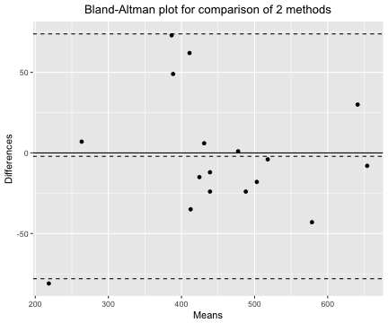
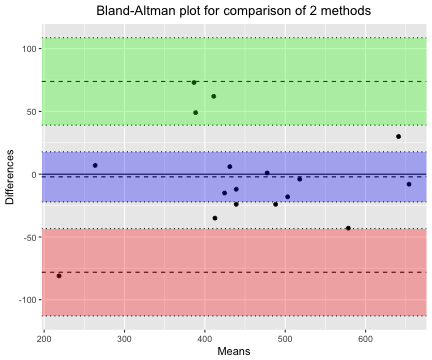

---
output:
  word_document: default
  html_document: default
---
# Does Color Help?: Utilizing Variability Ensemble Coding for Enhanced Interpretation of Bland-Altman Plots {#ref-labels}

## Abstract:

This article presents a novel method for interpreting Bland-Altman plots based on the principles of variability ensemble coding. 
The purpose of this study is to evaluate the efficacy of this method, with the hypothesis that employing color coding to represent variability could facilitate intuitive comprehension of data dispersion, thereby enhancing the practical utility of Bland-Altman plots.

## Introduction:

The Bland-Altman plot is a powerful statistical tool for comparing and assessing agreement between two distinct measurement techniques [@bland1986]. 
Due to the density and distribution of data points, understanding and interpreting these plots can be difficult despite their effectiveness. 
Ensemble coding, a perceptual mechanism that provides a statistical summary of a visual scene [@alvarez2011] offers a promising solution to this issue by facilitating the rapid extraction of variability information.

## Methods:

In this fictitious study, we propose utilizing color coding to represent varying levels of variability in Bland-Altman plots. 
To ensure the universal interpretability of the plots [@ware2012], the color palette will be selected with care, taking into account potential issues such as color blindness.

For this study, two Bland-Altman plots will be generated. 
A traditional plot without color-coding and a plot using the color-coding technique we propose. 
Both plots will be presented to a group of participants that includes both experts and non-experts in data interpretation and statistics. 
The participants will be required to interpret the plots and complete a questionnaire to assess their comprehension and speed of interpretation.

## Discussion: 

We anticipate that the application of ensemble coding for variability will aid in the comprehension of Bland-Altman plots. 
Based on ensemble coding principles, the color-coded plot should enable faster and more accurate interpretation of data variability [@haberman2012]. 
This method has the potential to enhance the interpretability and utility of these graphs, making them accessible to a broader audience and facilitating more efficient data communication.


```{r baplot, echo=FALSE, out.width = "45%", fig.cap='Examples of Bland-Altman Plot with and without color and annotations',fig.show='asis', fig.align='center', eval=FALSE}
knitr::include_graphics(rep(c("figure/baplot.png", "figure/baplot1.png"),1))
#
```


```{r baplot1, echo=FALSE, out.width = "45%", fig.cap='Example 2 Bland-Altman Plot with color and no annotations',fig.show='asis', fig.align='center', eval=FALSE}

```

