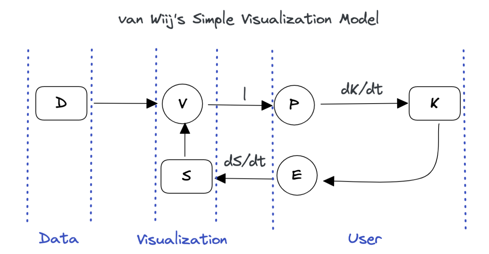
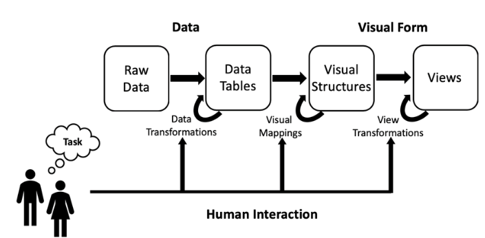

---
# UNL thesis fields
title: "DATA SCIENCE, DASHBOARDS, AND THE WAY IT WORKS WITH STATISTICS"
author: "Denise Renee Bradford"
month: "Month"
year: "Year"
location: "Lincoln, Nebraska"
major: "Statistics"
adviser: "Susan R. VanderPlas, Ph.D"
abstract: |
  Here is my abstract. *(350 word limit)*
acknowledgments: |
  Thank you to all my people!
dedication: |
  Dedicated to...
# End of UNL thesis fields
knit: "bookdown::render_book"
site: bookdown::bookdown_site
output: 
  bookdown::pdf_book:
    pandoc_args: --top-level-division=chapter
    keep_tex: yes
    latex_engine: xelatex
    template: template.tex
  bookdown::gitbook:
    config:
      toc:
        collapse: subsection
        scroll_highlight: true
        before: null
        after: null
      toolbar:
        position: fixed
      edit : null
      download: null
      search:
        engine: lunr # or fuse
        # options to control/tune search engine behavior (for
        # fuse.js, refer to https://fusejs.io/api/options.html)
        options: null
      fontsettings:
        theme: white
        family: sans
        size: 2
      info: true
bibliography: bib/thesis.bib
# Download your specific bibliography database file and refer to it in the line above.
csl: bib/apa.csl
# Download your specific csl file and refer to it in the line above.
lot: true
lof: true
---

<!--
Above is the YAML (YAML Ain't Markup Language) header that includes a lot of metadata used to produce the document.  Be careful with spacing in this header!

If you'd like to include a comment that won't be produced in your resulting file enclose it in a block like this.
-->

<!--
If you receive a duplicate label error after knitting, make sure to delete the index.Rmd file and then knit again.
-->

```{r setup, include = F}
options(width = 60)
knitr::opts_chunk$set(
  fig.width = 6, fig.height = 4, 
  out.width = "\\linewidth", dpi = 300, 
  tidy = T, tidy.opts = list(width.cutoff = 45)
)
library(tidyverse)
```

<!--chapter:end:index.Rmd-->

---
output:
  pdf_document: default
---

```{r include_packages, include = FALSE}
library(knitr)
library(palmerpenguins)
library(tidyverse)
library(nycflights13)
data(flights)

library(ggpcp)
library(ggplot2)
library(dplyr)
data(nasa)

library(scales)
library(datasets)
data("ChickWeight")
library(formatR)

```


<!--
----

\svp{I think it might be most effective to have several sub-sections of the lit review that are somewhat connected.}

First: Outline the general topic - creation of interactive graphics and dashboards to enable end-users to understand their own data. Explain that this is a highly interdisciplinary topic. Conclude this paragraph by explaining that you will explore the major sub-topics sequentially and then outline the interface between them at the end of the literature review.

- Graphics
    - Perceptual principles - cognitive load, working memory, etc.
    - Exploratory Data Analysis
    - Grammar of Graphics - with examples of code!
    - Big Data and graphical solutions - overplotting, binning, interactivity
    - Interactive Graphics

- Human Computer Interaction/UI-UX
    - User analysis - general process, not focused on your projects at all - you'll talk about that later on
    - Protocols for testing design - think aloud, eye tracking, feedback/surveys.
    - General Dashboard stuff

Conclusion: Connections between EDA and dashboards - not all dashboards are designed for EDA, but most dashboards are designed with end-users, not statisticians, in mind. This requires a different set of optimizations than if we designed for experts. 

---
-->

# Introduction
<!-- General purpose of this section: 
Motivate Dashboards and conclude that it is important to understand how graphs are perceived and used by various target audiences. -->

Statisticians use graphs in almost every stage of their work: we create charts when we get new data, to explore what we have and identify potential problems and opportunities. 
We fit models based on relationships between variables which are often identified visually. 
We identify problems with those models based on residual plots and other visual diagnostics. 
When our modeling work has been completed, we present our results to interested parties using visual displays, because non-statisticians often find it easier to understand data and models through an intuitive visual medium rather than through the mathematical formulae which underlie the statistical work.

Given the wide range of uses for graphs and visual data displays in statistical modeling, it is unsurprising that some graphs are more useful for specific applications such as exploratory analysis, and are unsuitable for other applications, such as presentation to an outside group.
In addition, we know that not all visual displays have equal perceptual value [@aspillaga1996]. 
The best graphics are designed to account for both the features of the dataset and the features of the intended audience.
Some design constraints stem from limitations of the human perceptual system and are common to most potential consumers of the visualization: the sine illusion [@vanderplas2015] affects anyone with binocular depth perception, and color recommendations are built around the specific characteristics of the human retina.
Other design constraints are due to the audience's experience level: are they used to working with data? 
Do they understand specialized techniques such as principal component analysis to the point where a plot of factor loadings might be \svp{a} useful \svp{visual display}?
When we create visualizations for public consumption we have to consider both perceptual factors and the target audience's domain knowledge.
In this introduction, we explore previous research related to the construction of interactive and static visual displays for different audiences and consider the implications of this research when designing interactive data displays such as dashboards.

\svp{Most research in statistical graphics has been done on static graphics; usually, research also strips away all but the most essential contextual information. 
As a result, it can be hard to generalize this research to practical applications, where the contextual information surrounding the data is critical and the chart does not just exist in a vacuum.}

\svp{In the "real world", however, conventions and familiarity often win out over best practice validated by perceptual experiments.}
For example, in sports, many coaches desire printable diagrams containing all necessary and valuable information on a single page. 
As data in sports becomes more prominent, extensive, and collected, this information must be refined. 

\svp{Thus, in addition to the experimental evidence, we must consider the human element: how to introduce new graphical concepts to stakeholders, and the considerations involved in encouraging stakeholders to adopt these improved graphics.}
\svp{Let us first consider the audience characteristics that affect the selection of graphics. 
Then, we will engage with considerations based on the data to be displayed. 
Finally, we will consider the interactions between the audience and the data: how graphics are tested, amended, and hopefully eventually adopted into common use.}


## Audience Considerations

Several factors, including perception, attention, and expertise, can influence our desire and ability to read and engage with data visualization.

Perception and attention are crucial cognitive processes that allow us to interpret and make sense of data visualizations. 
Perception refers to the manner in which we interpret and organize sensory information from our environment, whereas attention refers to the capacity to selectively focus on particular aspects of this information.

Our ability to perceive and pay attention to pertinent features, such as patterns, trends, and relationships, is essential for comprehending data visualizations. 
This is especially true when working with unfamiliar or complex data sets, as our ability to focus on pertinent information becomes more difficult.

In addition to perception and focus, domain-specific knowledge is essential for understanding and interacting with data visualizations. 
Expertise in a particular field can enable individuals to better interpret and comprehend the significance of the presented data, as well as identify potential biases or errors in the visualization.

In conclusion, the ability to perceive and interact with data visualizations requires a combination of perceptual and attentional processes, as well as domain-specific knowledge, in order to interpret and comprehend the presented information.

The term "data visualization" dates back to the 2nd century A.D. drawings and other visual representations were used to investigate the world and record historical events in ancient societies. 
Throughout human history, data visualization has significantly contributed to invention and discovery @Crapo2000.
The introduction of computer technology dramatically changed the visual representation of data. 
Using computer-based graphical data visualization, data analysts have become faster and more precise. 
Data visualization has become an integral component of research in numerous disciplines, such as algorithms, human perception, animation, computer vision, etc.
The origin of data visualization being a sub-category, it is regarded as "the science of the visual representation of data," @friendly2009.
"Data Visualization: a successful design process" defined data visualization as "the representation and presentation of data that exploits our visual perception abilities to amplify cognition," @kirk2012. 
This suggests that data visualization involves the exploitation of human visual perception in addition to the presentation of data.
Assigning meaning to visualization is not a statistical or computational step but a cognitive one. 
Each step in the data analysis process is part of a more extensive mental process.


### Perception

Human perception is an essential component of data visualization. 
Colin Ware suggests that perception can significantly enhance both the content and quantity of displayed information, @ware2012. 
Perception refers to the organization, interpretation, and conscious experience of sensory data.
Perception is also defined as "the process of recognizing (being aware of), organizing (gathering and storing), and interpreting (binding to knowledge) sensory information," @ward2010.
Ward et al. explain the notion of perception as the following:
> Simply put, perception is the process by which we interpret the world around us, forming a mental representation of the environment. This representation is not isomorphic to the world, but it’s subject to many correspondence differences and errors. The brain makes assumptions about the world to overcome the inherent ambiguity in all sensory data, and in response to the task at hand. 

Human visual perception is a highly complex and subjective process, and the efficacy of a visualization in communicating objective understanding depends on a vast array of subtle factors, @reuter1990.
Furthermore, certain situations present unique challenges and lead to systematic errors; can these provide insight into how the brain solves the problem of which objects are represented by which images in general @gregory1968.
Additional to the general process of human visual perception process and efficacy of a visualization in communicating, short-term memory is crucial to the effectiveness of statistical graphics. 
Research indicates that our short-term memory can only store a limited amount of information at any given time. 
Therefore, designers must present data in a manner that is simple to comprehend and remember. 

Untrained analysts can and do "analyze" data with only their natural mental abilities - The mind performs its data analysis-like process to create detailed understandings of reality from bits of sensory input. 
In a later chapter, we will show how a utilizing parallel coordinate plot is one method for achieving a simple design to comprehend. 
These plots enable viewers to compare multiple variables concurrently, thereby reducing cognitive load and making it easier to identify patterns and trends.

<!--I need to close this section to introduce the principles of Gestalt and eye tracking-->
Examining the Gestalt principles, which describe how our brain organizes and interprets sensory information to form coherent patterns and objects, is one way to gain a deeper understanding of how perception functions.

### Gestalt Principles

Our visual interpretation of the world is a major factor in why humans perceive the world and its objects as organized, regular, and simple shapes, schemas, figures, or forms.
The theory of Gestalt has philosophical and psychological roots that date back to the late 1800s. 
Gestalt therapy is founded on the notion that overall perception is contingent upon the interaction of numerous factors.
These principles include proximity, similarity, closure, continuity, symmetry, and figure-ground relationships formally outlined in "Principles of Gestalt Psychology", @koffka1935. 

Gestalt principles include:

- Proximity: Objects close to each other are perceived as related or grouped.
- Similarity: Objects that are similar in some way (e.g., shape, color, size) are perceived as related or grouped.
- Continuation: The human eye follows lines and patterns, so designers can use this principle to guide the viewer's gaze through a display.
- Closure: The human brain tends to complete incomplete figures or patterns, so designers can use this principle to create the illusion of missing information.
- Figure-Ground: The human brain separates the foreground (figure) from the background (ground), so designers can use this principle to create visual hierarchy and emphasis.
- Contrast: The human eye is drawn to high-contrast areas, so designers can use this principle to create emphasis and hierarchy.
- Symmetry and Balance: The human eye finds symmetry and balance visually pleasing, so designers can use this principle to create a sense of harmony and order.

```{r gestalt, echo=FALSE, out.width = "75%", fig.cap='Gestalt Principles with Examples',fig.show='hold',fig.align='center'}
knitr::include_graphics("figure/gestalt_principles.png")
```


These principles are based on cognitive psychology and understanding how the human brain processes visual information. 
By applying these principles to dashboard design, designers can create visual arrangements that make it easier for viewers to understand the relationships between data elements. 
For example, proximity can be used to group related elements together, while symmetry can be used to create balance and harmony in the overall layout of the dashboard.
At its most basic, the entire form is perceived (or emerges to our visual pathways) as opposed to its component parts. 

All of this suggests that our brain frequently perceives things differently than what is actually present. 
If you are familiar with optical illusions or the famous "gorilla in the crowd" experiment, you are aware that we do not always process everything in our visual field. 
There is simply too much information for our brains to process, and if we tried to interpret it all, we would be rendered paralyzed.
We organize the world according to Gestalt principles and pre-attentive attributes so that it is familiar, makes sense, and is easy to process.
These principles guide how people perceive and make sense of the world around them, and they play a critical role in designing effective visual displays, such as dashboards.
Understanding the Gestalt principles can also cast light on how information is processed and stored in short-term memory and attention's critical role in this process.


### Attention and Memory

The Gestalt principles describe how humans perceive and organize visual information into meaningful patterns and structures to help the brain to effectively process and organize incoming visual information, making it easier to attend to and remember.
It's worth exploring the efficacy of short-term memory when developing effective dashboards.

Short-term memory (STM), also known as working memory, is the stage of temporary storage and processing where the majority of memory retention effort is expended. 
According to Alan Baddeley's Working memory: Theories, models, and controversies, STM is a limited-capacity system prone to interference and decay, @baddeley2012. 
Selective attention is essential for the maintenance of STM because it allows us to filter out irrelevant information and concentrate on what is essential, @cowan2001.

Visual aids such as charts and diagrams can improve short-term memory by allowing us to encode and retain information more effectively, according to research, @alvarez2004.
Consequently, utilizing visual aids such as charts can be advantageous for enhancing our short-term memory.
Furthermore, annotations can also help aid short-term memory. 
By adding annotations, such as notes or highlights, to information we are trying to remember, we can improve our recall of the information later on, @alvarez2004.

<!-- Feature Integration Theory -->
According to the Feature Integration Theory (FIT), STM is composed of two stages: pre-attentive processing and focused attention @treisman1998. 
Parallel and independently, the brain processes the physical characteristics of an object, such as its color, shape, and orientation, during pre-attentive processing. 
However, focused attention is required to bind these features into a coherent object representation in STM.
STM can be improved through various strategies, such as rehearsal, chunking, and elaboration @oberauer2009. 
For example, by repeating a phone number several times or breaking it down into chunks of two or three digits, we can increase the likelihood of it being stored in STM. 
Similarly, by elaborating on the information we want to remember, such as creating mental associations or visual images, we can enhance its retention in STM @bui2014.

STM is a dynamic and malleable cognitive system that is crucial to our daily lives. 
Understanding the mechanisms underlying STM and how to improve it can have significant implications for learning, memory, and the treatment of memory disorders.
By analyzing the relationship between attention and working memory, we can gain insight into how we construct meaning from the information in our environment.

### Constructing Meaning

Gestalt psychology suggests that humans actively construct meaning by organizing information into patterns and wholes @wertheimer1938.
Both top-down and bottom-up processing are involved in the process of meaning construction. 
Bottom-up processing entails analyzing sensory data from the environment and constructing perceptions based on this data. 
Top-down processing is the influence of prior knowledge, expectations, and context on the perception and interpretation of incoming sensory data.

Together, top-down and bottom-up processing facilitate the encoding and retrieval of information in the context of short-term memory. 
Selective attention, the ability to focus on relevant information while ignoring irrelevant information, is an example of top-down processing that aids in the encoding and retrieval of information in short-term memory @cowan2010.  
According to the feature integration theory, the perception of objects involves both the bottom-up analysis of individual features and the top-down processing of higher-level features in order to form a complete perception @treisman1980.

The Gestalt principles of perception emphasize the significance of bottom-up and top-down processing in constructing meaning from sensory data. 
Both types of processing are involved in encoding and retrieving information, which has significant implications for understanding how short-term memory works.

### Expertise

However, creating effective graphics is not a simple task, and proficiency in this area is required to create high-quality visualizations. 
This essay will discuss the contributions to the field of graphics made by research on psychological processes, automaticity, readily available information, and practice effects.


**Cognitive Processes - the way we think about and approach a task.**

As we become more proficient in a particular skill, we develop more complex and efficient mental models or schemata, a heuristic technique to encode and retrieve memories, the majority of typical situations do not require much strenuous processing. 
These mental models help us to organize information in a meaningful way, and to quickly identify and solve problems related to the task. 
This process is known as cognitive restructuring and is facilitated by developing domain-specific knowledge @ericsson1996. 
For example, a basketball coach is able to quickly recognize patterns and positions on a court that are common in basketball, which allows them to make decisions more quickly and accurately than a novice coach or player.


**Automaticity - the ability to perform a task without conscious effort or attention**

As our proficiency in a task increases, our performance becomes more automatic, thereby freeing up cognitive resources for other tasks.
The development of procedural knowledge, which is the ability to perform a series of steps or actions in a particular order, facilitates this process @fitts1967. 
For example, a well-trained quarterback can throw a ball without looking at the wide receiver because their throwing movements have become automatic.


**Information Readily Available - the way we process information related to a task**

As our proficiency increases, we can recognize and retrieve pertinent information more rapidly and precisely than a novice. 
This is made possible by the creation of domain-specific knowledge structures that allow us to retrieve pertinent information from memory quickly @chase1973. 
For example, a medical expert can quickly identify signs and diagnose a patient using their knowledge of disease symptoms and risk factors.


**Practice Effects - extensive practice and experience**

Practice effects are the performance enhancements that result from repeated practice. 
These gains are frequently most significant at the outset of practice, but gradually diminish as the individual approaches their performance ceiling @anderson1982. 
The development of procedural knowledge and automaticity, which allow for more efficient and accurate task performance, facilitates the effects of the practice.

The contributions of research on psychological processes, automaticity, readily available information, and practice effects to the field of graphics have significant implications. 
Expertise is required to create high-quality graphics, which requires a thorough understanding of design principles and the capacity to work quickly and efficiently. 
The use of automatic processing and domain-specific knowledge can aid designers in processing and deciding on design elements efficiently and quickly. 
The creation of standardized design templates, workflows, and other tools can aid in enhancing the efficiency and effectiveness of the design process. 
Design skills can be improved through deliberate guidelines, and educators must focus on developing skills that can be applied in a variety of contexts.

As the significance of graphics in numerous fields continues to rise, the demand for specialists in this area will only intensify. 
By comprehending the contributions of research on psychological processes, automaticity, readily accessible information, and practice effects, designers, educators, and trainers can develop more effective approaches to graphics design and education. 
This can help ensure that the graphics used to convey complex information are clear, concise, and effective, making it easier for individuals to comprehend and interpret the required information.

### Engagement with the data
<!-- This is a good paragraph -- but I'm not sure it's in the right place.  -->
The goal of data analysis is to extract meaningful insights, patterns, and knowledge from data. 
The process of data analysis involves collecting, cleaning, transforming, and modeling data, followed by the use of statistical and machine learning methods to uncover patterns and relationships within the data. 
The end goal of data analysis is to support decision making and provide a basis for informed action. 
Data analysis can help organizations to better understand their customers, market trends, and operational performance. 
Additionally, data analysis can support scientific research by helping researchers to test hypotheses, develop theories, and gain a deeper understanding of complex phenomena. 
Ultimately, data analysis aims to turn data into actionable insights and information that can inform and improve decision-making.


## Data Considerations

John Tukey was the first to organize the collection and methods associated with philosophy into Exploratory Data Analysis (EDA). 
Previous research by Tukey focused on graphics as a tool for exploratory analysis. 
In "Exploratory Data Analysis," Tukey wrote that graphics and charts often display data with more enhanced understanding than a table, @tukey1966. 
Tukey outlines detailed the types of different graphics and in which situations to utilize these graphics. 
<!--John Tukey, creator of stem-and-leaf plot, boxplot-resistant smooth, and the violin plot (also known as rootgram) who taught us to utilize these methods to organize and demonstrate EDA. -->
He was a strong advocate for the importance of EDA as a crucial first step in the data analysis process and emphasized the need for visualization and interactive techniques to understand patterns and relationships in data.

Tukey's Principles of EDA have become a cornerstone in the field of statistics and have been adopted by data professionals in various industries.
Tukey's principles have enabled data professionals to understand complex data sets better and make more informed decisions by emphasizing the importance of visual exploration, data characterization, and model critique. 
In this way, Tukey's Principles have revolutionized our data analysis approach and become the foundational framework for EDA.

Tukey's Principles in EDA:

1. Graphical exploration, looking for patterns or displaying fit, the method demonstrates things about data that a single numeric metric does not understand. 
This has been useful in graphing the data before you develop summary statistics.

2. Describing the general patterns of the data. 
This step should be insensitive to outliers. 
In general, think about the types of resistant measures (i.e., median or mean). 
This step is making sure to determine data patterns.

3. The natural scale/state that the data are at their best. 
This will be the step at which the scale of data can be helpful for analysis. 
The reexpressing data to a new scale by taking the square root or logarithmic scale.

4. The mostly known parts of EDA but is done in the way of accessing fit of the data. 
This is taught in every statistics 101 class. 
The growth of machine learning and prediction methods have now used residuals more in the toolbox to assessing the best prediction models.

```{r violin_plot, echo=FALSE,out.width='.49\\linewidth', fig.width=3, fig.height=3, fig.show='hold', fig.align='center'}
ggplot(ChickWeight, aes(x = Diet, y = weight)) + 
  geom_violin(aes(fill = Diet), trim = FALSE) +
  geom_boxplot(width = 0.1) +
  theme_classic() +
  theme(legend.position = "none")

p <- ggplot(ChickWeight, aes(x=Diet, y=weight, fill=Diet)) +
  geom_boxplot()
p + scale_fill_brewer(palette="Dark2")
```

Data visualizations are an integral part of the EDA process, enabling analysts to discern patterns and relationships in the data that would otherwise be difficult to discern from tabular data alone.
Through data visualization, analysts can quickly identify trends, outliers, and other patterns that may be missed through numerical analysis alone. 
Moreover, visualizations facilitate the communication of findings to non-technical stakeholders, allowing them to comprehend complex data sets more efficiently. 
Through visualizations, analysts can also identify potential issues or biases in the data, resulting in better decisions and models. 
Thus, visualizations play a crucial role in the EDA process by enabling analysts to more effectively explore, comprehend, and communicate data-derived insights.
During the initial EDA stage, an analyst may find that a variable or a covariate is directly related to the dependent variable when looking at a correlation heatmap or a scatterplot. 
<!--This will be important to know before starting a linear model analysis. 
Much of our general understanding is from introductory statistics courses. -->
The basic understanding can be formalized to visualize the discovery process.

The field of graphical communication, which is directly related to EDA, semiology, and their use in touch, has been a valuable tool and extension of the EDA thoughts that Tukey expressed.
One of the fundamental principles of semiology is the relationship between signifier and signified, in which a visual element (the signifier) represents a particular meaning or concept (the signified), @barthes1972. 
Another essential concept in semiology is using syntax and semantics to convey meaning in graphic communication effectively. 
This includes both the syntax and semantics of a graphic's visual elements, @bertin1983.

Using color to represent data on maps is an example of successful graphical communication utilizing semiology. 
By using different colors to represent different data points, viewers can comprehend patterns and relationships in the data quickly and easily. 
Jacques Bertin  writes in "Semiology of Graphics" that color can be used to "emphasize a point, distinguish one category from another, or establish a relationship between two points", @bertin1983.
In addition, Bertin explains that the use of color can help overcome language barriers, making it easier for the audience to comprehend the presented information.

The application of semiology in graphical communication is not devoid of obstacles. 
One difficulty is the possibility of misinterpretation, in which viewers may assign a different meaning to a visual element than was intended, @bertin1983. 
Another concern is the possibility of cultural differences in interpretation, in which a visual element may have a different meaning in one culture versus another, @norman2013.

Despite these obstacles, semiology in graphical communication remains an indispensable tool for effectively conveying information. 
By understanding semiology principles and syntax and semantics' role in graphical communication, designers can create compelling visual representations that convey information clearly and concisely.

<!--Graphs are another tool that can be used to effectively communicate information via semiology. -->
By utilizing visual elements such as bars and lines to represent data, graphs can make complex information more understandable to viewers. 
For instance, a line graph can be used to illustrate the change in the value of a stock over time, making it easier for investors to identify trends and patterns. Leland Wilkinson writes in his book "The Grammar of Graphics" that "graphical methods are not only superior to other forms of communication, but also superior to numerical or verbal methods for certain types of data and reasoning," @wilkinson2012.

It proposes that any statistical graphic can be broken down into a set of essential components, or "grammar," that can be combined in different ways to create a wide range of visualizations, following a layered approach to describe and construct visualizations or graphics in a structured manner.

The components of the grammar of graphics include:

- Data: The raw data being visualized represents a set of observations or values.

- Aesthetic Mappings: The mapping of data variables to visual properties such as position, color, shape, and size.

- Scales: The mapping of data values to visual values, such as mapping a numerical value to a bar height. 

- Geometries: The basic shapes representing the data, such as points, lines, bars, and histograms.

- Facets: The plot division into multiple subplots, each representing a different subset of the data.


For example, a bar chart can be created by mapping a categorical variable to the x-axis, mapping a numerical variable to bar heights, and using rectangular bars as the geometry. 
Moreover, mapping two numerical variables can create a scatter plot to the x and y positions and use points as the geometry.
Finally, the "Grammar of Graphics" provides a systematic way of thinking about visualizations, making it easier to choose the appropriate visual representation for a given dataset.

```{r graphics2, echo=FALSE, out.width = "45%",fig.cap='Grammar of Graphics Diagram of Wickham and Wilkinson\'s work',fig.show='hold',fig.align='center'}
#knitr::include_graphics("figure/gglayers.png")
#knitr::include_graphics("figure/graphic-flowchart.png")
knitr::include_graphics(rep(c("figure/gglayers.png","figure/graphic-flowchart.png"),1))
```

Michael Friendly, a leading expert in data visualization, has utilized the principles of the grammar of graphics to develop innovative teaching methods that make complex data visualization concepts more accessible to a broader audience.
Friendly has investigated the origins and development of graphic techniques, tracing their evolution from antiquity to the present.
He used SAS with hands-on experiments to present categorical data analysis visually, @friendly2014.
By emphasizing the role of graphical methods in scientific discovery, Friendly has helped promote his use in various disciplines, from the natural sciences to the social sciences and beyond.
In his book "Milestones in the History of Thematic Cartography, Statistical Graphics, and Data Visualization," Friendly provides a comprehensive overview of the key milestones in the evolution of statistical graphics, including the contributions of pioneers like William Playfair, Charles Minard, and John Tukey, @friendly2001.

As discussed regarding semiology, Tukey's Exploratory Data Analysis (EDA), and the introduction of the Grammar of Graphics, we should be mindful that a well-constructed graphic can be misleading out of context.
Compelling graphics can be a powerful tool for communicating complex information, making numerical accuracy, engagement, correct decision-making, and accurate predictions crucial. 

In the context of data visualization, numerical accuracy refers to the precision and correctness of the numerical data displayed in graphics. 
Accurate graphics can assist users in comprehending complex numerical data and making more informed decisions, @cardoso2016.

Engagement in the context of data visualization is the extent to which viewers are drawn to and interested in the displayed data. 
Engaging graphics can encourage users to interact with and explore data further, resulting in a more thorough comprehension of the data.

Correct decision making refers to the capacity of data visualization to enable users to make informed and precise decisions based on the presented information. 
Clear, accurate, and well-designed graphics can help users recognize patterns and insights, resulting in more effective decision making.

Correct predictions refers to the capability of graphics to accurately forecast or predict future events or outcomes. 
For accurate predictions, data visualization must include trustworthy data, sound statistical models, and efficient visualization techniques.

"Graphical Tests for Power Comparison of Competing Designs" by Hofmann et al. presents a graphical method for comparing the power of two or more competing designs in an experimental study @hofmann2012.
The article demonstrates that the graphical method is a useful tool for comparing the effectiveness of various experimental designs. 
It enables researchers to visualize and compare the effectiveness of different designs in an intuitive and straightforward manner.

Two methods for measuring the particle size distribution in a chemical process were compared in one study. 
The study evaluated both designs under various operating conditions and compared their power using a graphical method. 
The results demonstrated that one design was more effective at detecting differences in operating conditions than another.

Static Visualization is commonly used in the communication phase of data science workflows, and data scientists sometimes use them as part of the analysis. 
John Tukey's EDA methods are currently known and well-vetted in the field. 
However, Satyanarayan et al. addressed this by introducing a high-level grammar of graphics called "Vega-Lite," which presents a set of standardized linguistic rules for producing interactive information visualizations using a concise JSON format for data to be represented by the grammar @satyanarayan2016. 
Vega-Lite has been directly implemented in R via the `ggvis` package using the same - albeit slightly lower-level.

Understanding cognitive load is crucial for designing compelling data visualizations, as it influences how users perceive, process, and remember the data presented in the visualization.
When designing visuals, it is essential to consider the cognitive load they may place on the viewer.
Cognitive load is the amount of mental effort required to process information, and minimizing it can enhance a graphic's effectiveness.
In addition, displaying as much raw data as possible while minimizing cognitive load can improve the graphic's clarity and precision.
Here are some general guidelines for making better graphics with works from Few (@few2012), Tufte (@tufte1983), and Cairo (@cairo2016):

1. Keep it simple - Avoid overwhelming the viewer with too much information at once by employing a clear and concise design with minimal distractions.

2. Use visual hierarchy - Utilize size, color, contrast, and placement to highlight important information and direct the viewer's focus.

3. Choose appropriate charts - Choose the chart type that best illustrates the data and facilitates comprehension.

4. Label clearly - Use labels that are clear and concise for axes, legends, and other essential information to avoid confusion.

5. Use data-to-ink ratio - Focus on the data by minimizing the amount of non-data ink, such as decorative elements or excessive grid lines.

6. Avoid distortion - Use appropriate scaling and avoid distortions to ensure that the graphics accurately represent the data.

7. Provide context - Add context to assist the viewer in comprehending the significance of the data and its relevance to the topic.


```{r flights_data_example, echo=FALSE, out.width='.49\\linewidth', fig.width=3, fig.height=3, fig.show='hold',fig.align='center'}
# Stacked Density plot
ggplot(data=flights %>% filter(dest %in% c("ATL", "ORD","MDW") ), aes(x=distance, fill=carrier)) +
geom_density(position="stack")

# Histogram
ggplot(data=flights %>% filter(dest %in% c("ATL", "ORD","MDW") ), aes(x=distance, fill=carrier)) +
geom_histogram(position="stack")

```


<!--On the other hand, Dashboards are interactive interfaces that display data visually to provide insights and support decision-making. 
Dashboards can be used to monitor key performance indicators, track progress over time, and identify patterns and trends in data. 
They often display real-time data and can be customized to show the most relevant data to the user.-->

On the other hand, Interactive graphics provide a more dynamic and engaging way to explore and analyze complex data sets than traditional static visualizations.
By allowing users to manipulate and explore data in real-time, interactive graphics can reveal hidden patterns and relationships that may be difficult to discern in static visualizations, making them a valuable tool for data analysis.

#### Interactive Graphics

As previously mentioned, theories behind visual representation include - graphical comprehension (@cleveland1984), preattentive processing (@ware2012), gestalt theory (@few2009), and graphical excellence (@tufte2001). 
Interactive graphics offer a number of advantages when analyzing complex data sets, and technological progress has played a crucial role in making these tools more accessible and widely adopted, especially in interactive graphics.
Compared to static visualizations, interactive graphics offer a more engaging and dynamic way to explore and analyze complex data sets.
To gain a deeper understanding of the data, users are able to modify parameters, zoom in on specific regions, and rapidly explore various variables. 
In addition, interactive graphics offer a more intuitive method of communicating findings to non-technical users, making them a valuable asset for data-driven decision making. 
Interactive graphics are excellent for EDA; they are designed for exploring rather than presenting information (and more) and can be obtained by directly querying the graphic, @unwin2003.
Overall, interactive graphics are a potent data analysis tool, allowing analysts to gain a deeper understanding of complex data sets and to make more informed decisions.

The area of interactive graphics is still very much a work in progress despite existing as a field of research since the late 1960s. 
Developments are driven partly by new technology, such as `d3` [@bostock2011]. 
Visualizations are more than just a picture. 
They are now a tool that facilitates analytic activity through different modes of interaction [@yi2007]. 
Visualization is context-free, as it can mean different things to different people depending on the situation [@parsons2014]. 

<!--Interactive graphics are essential to EDA [@unwin1999]. 
Beyond the limitations of static statistical displays, interactive graphics enable visualizations to advance alongside the analysis. 
User interaction and direct manipulation are required for dynamic graphics to reach their full potential (@cook1995; @unwin1999).
The connection between EDA and dashboards is that EDA is the process of preparing and understanding the data, which is the first step for building a dashboard, as the data has to be cleaned, transformed, and analyzed to be used efficiently on the dashboard. 
EDA results can be used to identify the most relevant data and metrics to include in the dashboard and to design the visualizations that will be used to display the data. 
Additionally, the EDA process can identify the outliers, patterns, trends, and insights helpful to show in the dashboard to support decision-making.-->

In recent years, interactive graphics that enable users to manipulate and explore visualizations in real-time have grown in popularity and align with the van Wijk Simple Visualization Model framework.
The van Wijk Simple Visualization Model is a diagrammatic representation that provides a simple and effective way to understand and visualize the flow of information and data through a system. 
van Wiij's simple visualization model shows how insights are generated as the human participates in a feedback loop between reading and interacting with visualization, @van2005.
It is a commonly used tool in EDA, the initial step in the data analysis. 
The van Wijk model can represent data flow from data sources, through intermediate processing stages, to the final visualization of results. 
This model is also context-free, allowing for the focus to be on the feedback loops between visualization and the user.
The model helps to identify the various steps involved in the visualization process, from the collection and processing of data to the presentation of results. 
By doing so, it supports the design of more effective and user-friendly visualizations, which can enhance the overall user experience.

```{r vanWiijmodel, echo=FALSE, out.width = "45%",fig.cap='van Wiij Simple Visualization Model',fig.show='hold',fig.align='center'}

```


While the van Wijk Simple Visualization Model provides a valuable framework for designing compelling visualizations, it should not be used in isolation. 
Instead, effective data visualization requires a thorough understanding of human perception, cognition, and Human-Computer Interaction (HCI) principles.
Later in this review, we will explore the fundamental principles of Human-Computer Interaction and how they can be applied to the design of compelling interactive graphics.


Based on the above best practices on the concept of cognitive load in graphics, the theory of manipulation of visualizations provides a set of guidelines and best practices for designing interactive graphics that minimize cognitive load and facilitate practical data analysis.

<!--The theories behind the manipulation of visualizations are deeply involved the following work will be included:

- Visual perceptual approaches - The most effective visual representations for data exploration tasks are those that (1) support the four basic human visual perceptual approaches of association, differentiation, ordered perception, and quantitative perception, (2) have strong Gestalt properties, (3) are consistent with the viewer's stored knowledge, and (4) facilitate analogical reasoning, @baker2009.

 Human information processing - The authors discuss various cognitive processes involved in human-computer interaction, including attention, perception, memory, and problem-solving, and provide guidelines for designing effective computer systems that align with these processes. @card1983 -->

As interactive visualizations play a more significant role in information systems, designers must know what tasks, visual representations, and interaction techniques are available and how they work to facilitate analytical reasoning. 
They must decide on the most effective visual representation without being able to estimate every user's ability to read and interpret the visualization. 

An influential framework developed by Vessey et al refers to the degree to which a person's cognitive abilities match the cognitive demands of a task, @vessey1991, in the field of cognitive load research has been improved by Heer and Bostock, providing examined how the complexity of interactive visualizations influences users' cognitive load, @heer2010.
The authors discovered that more intricate visualizations tend to increase cognitive load, especially for users with lower visual literacy. 
They recommended that designers consider the cognitive load of interactive visualizations and strive to reduce complexity whenever possible.

While the direct relationship to traditional mobile devices, such as phone screens, will not be discussed, it is noteworthy to account for the impact of larger screen mobile devices, such as iPads and other portable devices, concerning a user's cognitive abilities. 
Eissele et al investigated the cognitive load of mobile interactive visualizations, @eissele2009.
The authors discovered that the limited input options and small screen size of mobile devices can increase cognitive load in interactive visualizations. 
To reduce cognitive load on mobile devices, they suggested that designers employ suitable visual encoding techniques and simplify interactions.

Lastly, Toyama et al. investigated the impact of interactive elements on cognitive load in visualizations, @toyama2015.
Based on the nature of the task and the user's familiarity with the interactive features, the authors discovered that interactive features can both increase and decrease cognitive load. 
They suggested that designers should evaluate the cognitive load caused by the interactive elements they include in visualizations

These studies suggest that designers should carefully consider the cognitive load implications of interactive graphics and strive, whenever possible, to reduce complexity. 
Simplifying interactions and implementing suitable visual encoding techniques can reduce cognitive load, especially on mobile devices. 
In addition, designers should evaluate the cognitive load caused by the interactive features they include in visualizations.

## Audience-Data Interactions

Effective design of interactive graphics necessitates a comprehensive knowledge of Human-Computer Interaction (HCI) and User Experience (UX) design principles to ensure that the visualizations are engaging, informative, intuitive, and user-friendly.

Designing an effective interactive dashboard involves much more than simply selecting a set of visualizations and arranging them on a page.
It requires a comprehensive knowledge of Human-Computer Interaction (HCI) and User Experience (UX) design principles and the ability to apply these principles to data analysis and visualization. 
Before designing an interactive dashboard, it is crucial to have a thorough understanding of the underlying HCI and UX frameworks and the specific needs and preferences of the intended audience. 
By understanding the principles of HCI and UX design, it is possible to create interactive dashboards that facilitate effective data analysis and offer a seamless and engaging user experience. 
This can result in greater engagement with the data, more profound insights, and better-informed decisions.

#### Human-Computer Interaction (HCI)

Human-Computer Interaction (HCI) refers to the study of the interaction between humans and computers. It encompasses the design, evaluation, and implementation of computer systems that are intuitive, efficient, and effective to use.

In the 1970s and 1980s, HCI researchers began to concentrate on developing user interface design theories and methodologies. 
The "GOMS" model, created by Card, Moran, and Newell in 1983, was an influential framework that provided a way to model user behavior when interacting with computer systems, @card1983.
During this time, the field of usability engineering emerged, which involved designing and testing interfaces to ensure that they were user-friendly and efficient.

```{r goms_model, echo=FALSE, out.width = "45%",fig.cap='GOMS Model created by Card, Moran and Newell', fig.show='hold', fig.align='center'}
knitr::include_graphics("figure/goms_model.png")
```


The 1990s witnessed a significant rise in the popularity and accessibility of personal computers, as well as the emergence of the World Wide Web as the dominant information-sharing platform. 
This resulted in an emphasis on designing interfaces for web-based applications and research into the usability of websites. 
In 1995, Don Norman published his influential book "The Design of Everyday Things," emphasizing the importance of designing intuitive and user-friendly products and interfaces (revisited and revised in 2013, @norman2013).

In the 2000s, HCI research expanded to include new technologies such as mobile devices, touchscreens, and virtual and augmented reality, @obrien2008. 
There was also an increased focus on designing interfaces for diverse user populations, including people with disabilities and older adults. 

HCI research evolves and adapts to new technologies and user requirements. The use of artificial intelligence and machine learning in interface design, designing interfaces for wearable devices, and designing interfaces for social and collaborative systems are some current research areas.


#### User Experience (UX)

The history of UX can be traced back to the early days of human-computer interaction (HCI) research, but it has evolved to become a distinct discipline in its own right. User Experience (UX) refers to the overall interaction between a user and a product or service. It includes the interface, functionality, content, and aesthetics.

The origins of user experience research can be traced back to the 1970s and 1980s. 
At this time, researchers were primarily focused on developing efficient and effective user interface design theories and methodologies. 
As computer use became more prevalent in the 1990s, the emphasis shifted to designing interfaces that were not only functional but also enjoyable to use. 
In his influential 1995 book, "The Design of Everyday Things," Donald Norman argued that good design should center on the needs and behaviors of the user.
Jesse James Garrett coined the term "user experience design" in 2000 to describe the process of designing intuitive, efficient, and enjoyable user interfaces, @garrett2003.
The rise of mobile devices in the late 2000s and early 2010s presented UX designers with new challenges and opportunities. 
As users began interacting with devices featuring smaller screens and touch-based interfaces, designers were forced to reevaluate traditional interface design principles and adopt new interaction paradigms, @hassenzahl2010. 


<!--It involves studying the users of a system to understand their needs, goals, and behaviors. 
The purpose of user analysis is to create interfaces that are easy to use, efficient, and effective for the intended audience.
The results of user analysis can be used to inform the design of the interface, including the layout, navigation, and functionality. 
It can also be used to identify areas of the interface that are confusing or difficult to use and to make recommendations for improvements. 
User analysis is an iterative process, and it should be done in multiple stages of the design process to ensure that the final product is tailored to the users' needs.-->


### Testing static graphics

While understanding HCI and UX design principles helps create compelling interactive graphics, it is equally important to rigorously test and evaluate the usability and efficacy of both interactive and static graphics to ensure they achieve their intended purpose.

Cleveland and McGill investigated the effect of various bar chart designs on the accuracy with which viewers perform simple perceptual tasks @cleveland1986. 
People perform significantly worse on stacked bar charts than on simple bar charts, and bar charts with filled bars are generally superior to those with empty ones

Jiao et al. examine the use of unit charts to represent large-scale data @jiao. 
The study discovered that unit charts are more precise and easier to read than traditional bar graphs for representing values across multiple orders of magnitude.

"The cognitive style of PowerPoint: Pitching out corrupts within" examined the effect of static graphics, such as bar charts, line charts, and pie charts, on the comprehension and decision-making of viewers @tufte2008. 
The results indicated that the bar chart was most effective at accurately communicating information, while the pie chart was least effective. 
In addition, the researchers discovered that the type of graphic employed influenced the viewers' perceptions and decision-making, highlighting the significance of selecting the most appropriate graphics when conveying information.

"Using color to code different types of uncertainty in visualization" investigated the effect of color on the communication effectiveness of static graphics @ware2010. 
Researchers discovered that the use of color in static graphics enhanced viewers' comprehension and memory retention of the presented information. 
Specifically, it was determined that the use of color to highlight particular data points or trends in a graph or chart was particularly effective.

"Communicating Uncertainty: A Look at Graphical Representations of Error Bars, Box Plots, and Confidence Intervals" examined the efficacy of static graphics in communicating data uncertainty and variability @wainer2020. 
Researchers discovered that static graphics, such as boxplots and error bars, effectively communicated the range and variability of data. 
Furthermore, the use of static graphics enhanced viewers' comprehension and decision-making in uncertain situations.

Overall, these above studies indicate that static graphics are effective at conveying information to viewers, with their effectiveness being influenced by the type of graphic exercised, the use of color, and their capacity to convey uncertainty and variability in data. 
However, it is important to note that the effectiveness of static graphics can also be affected by audience knowledge and experience, the complexity of the information being presented, and the context in which the graphics are used.

### Testing interactive graphics

The design space of interactive visualizations, including the use of multiple views and coordinated multiple views, is discussed in a paper by Heer and Bostock @heer2012. 
The authors argue that interactive visualizations can enhance comprehension and decision-making by enabling users to investigate complex data and the relationships between multiple variables.
It was discovered that interactive graphics are particularly useful for investigating data that is difficult to comprehend with static graphics, such as time series data or data with multiple aggregation levels.

Compared to static graphics, interactive graphics can improve users' ability to identify patterns and outliers in data, according to a second study @wu2017. 
This is due to the fact that interactive graphics enable users to zero in on particular aspects of the data and adjust the visualization in real time to reveal hidden patterns.

It has also been discovered that interactive graphics increase user engagement with data and improve their decision-making abilities. 
"Visualizing decision-making: Introducing the analysis, comparison, and exploration system (ACES)" showed that interactive graphics can help users make more informed decisions by allowing them to compare and contrast various scenarios and outcomes @kornhauser2014. 
Moreover, interactive graphics can help users identify potential biases or errors in their data analysis by allowing them to rapidly explore various visualizations and test their hypotheses.

In addition to their benefits for data exploration and analysis, interactive graphics have been found to be more engaging and enjoyable for users @eppler2013. 
This can increase the motivation of users to explore and analyze data, resulting in better decision-making.

In summary, the studies highlighted indicate that interactive graphics can be an effective data visualization and analysis tool, especially for complex and multidimensional data. 
They can improve users' comprehension, engagement, and decision-making skills, and are ideal for examining data that is difficult to comprehend with static graphics.

## Dashboard Design

Given that the audience has limitations, there are design constraints around the data, and the ability of the audience to successfully use the graphical displays of the data, what can we take from this body of research that applies to more complicated sets of graphics? 

How do we maintain user attention, desire to explore, and accurately communicate the data through the medium of an interactive data dashboard?

A dashboard is a visual display of the essential information needed to achieve one or more objectives, consolidated and arranged on a single screen so the information can be monitored at a glance [@few2006]. 
Dashboards have particular characteristics:

- Achieve specific objectives
- Fits on a single computer screen
- Information can be displayed in multiple mediums (web browser or mobile device)
- Can be used to monitor information at a high level

Dashboards can present various statistical data, such as financial performance, website traffic, or customer engagement metrics. 
They allow users to quickly and easily understand complex data sets using visual elements such as charts, graphs, and tables to display the information. 
Additionally, statistics can be used to analyze data presented on a dashboard, providing insights into trends and patterns that can inform decision-making.

While a dashboard can be handy, it may be worth describing that a poorly designed dashboard will not be used. 
A dashboard should be concise, clear, and intuitive when displaying components in combination with a customized list of requirements of users.

Much of the work done within statistical research and dashboard design involves collaboration with other researchers and users. 
While this may be the best for the growth of the discipline, one will find that working with collaborators with non-STEM backgrounds.
Dashboards can help understand and support many data types in essential business objectives. 
There are many different ways to label and utilize dashboards in different kinds.

Dashboards are cognitive tools that should be used to improve understanding of data, which should help people visually find relationships, trends, patterns, and outliers. 
Most importantly, dashboards should leverage people's visual cognitive capabilities.

Cowan suggested that the average person can only hold two to six pieces of information in their attention @cowan2001. 
People can develop detailed understandings of reality, which is infinitely complex.

Cognitive structures consist of mental models and their relationships (@rumelhart1976; @carley1992; @jonassen1996).
A schema is a mental model containing a breadth of information about a specific object or concept. 
Schemas are organized into semantic networks based on their relationships to other schemas (@wertheimer1938; @rumelhart1976).
This arrangement helps the brain process its experiences instead of storing every sensory observation; the brain only needs to maintain its schemas, which are good summaries of all previous observations. 
Some "memories" may even be complete recreations built with a schema (@bartlett1932; @klein2007)

Wixon introduce "contextual design" as a systems development method in which the researcher partners with the user at the user's place of work to "develop a shared understanding" of the user's activities, and they define contextual inquiry as the first part of the broader process [@cowan2001]. 
Contextual inquiry is the data collection step of the field research element of the contextual design method, and it emphasizes four essential principles:

1. The context of the activity being performed by the user 
2. The partnership between the researcher and the participant
3. The spoken verification that the investigator's interpretation of the activity matches the user's
4. The focus of the study is central to the approach taken by the interviewer

Kandal conducted what might be considered a contextual interview study similar to ours in that they analyzed data scientists' self-reported work processes [@kandel2012]. 
They proposes three main archetypes that data scientists may be classed into the following:

- Hackers: who build processes chaining together multiple programming languages of different types (analytical, scripting, and database languages) and use visualization in various environments.
- Scripters: who perform most of their analysis in an analytical environment (e.g., R or Python) and execute the most complex statistical modeling of the types but who do not perform statements their ETL
- Application Users: who performed most or all of their work in an application such as Excel or SPSS and, like scripters, relied on others (namely, their organizations' IT departments) for ETL.

<!-- This is where your paragraph about 2 good graphics being suboptimal together should go -->

Combining two effective graphics does not necessarily result in a successful visualization. 
In certain instances, suboptimal combinations can result in confusion, misinterpretation, and the failure to convey the intended message.
Combining two charts with distinct scales or units is an example of suboptimal graphic design, which can result in misinterpretation and flawed comparisons. 
For example, if a bar chart displaying the number of sales is combined with a line chart displaying revenue, meaningful comparisons between the two metrics can be challenging. 
People frequently make inaccurate judgments when comparing graphs with different scales, according to a study conducted by Cleveland and McGill (@cleveland1984).

Utilizing redundant visual cues or unnecessary embellishments is another example of suboptimal graphics. 
Although it may be tempting to add extra elements to a chart or graph, doing so can detract from the primary message and make it more difficult for the audience to focus on the essential information. 
Tufte discovered that adding unnecessary visual cues to a graph decreases its effectiveness because viewers are more likely to focus on the embellishments rather than the data (@tufte1985).

Using multiple color schemes or palettes in the same chart is another instance of suboptimal graphics. 
While color can be an effective visual communication tool, the use of excessive colors or color schemes can be overwhelming and confusing. 
This can detract from the primary message and make it challenging for the audience to comprehend the key points. 
In a study conducted by Heer and Bostock, participants were required to interpret multiple color schemes (@heer2010). 
Multiple color schemes made it difficult for participants to identify the relationships between different parts of the visualization, according to the study.

Conversely, it can be suboptimal to combine two visually incompatible graphics. 
For instance, if a scatter plot and a bar chart are combined, the resulting visualization may be difficult to interpret due to the incompatibility of the two types of graphics. 
This issue was highlighted by Hullman et al., who discovered that viewers had difficulty interpreting a visualization that incorporated a scatter plot and a line chart (@hullman2011).


## Conclusion

In this dissertation, I address this question of design for dashboards, as well as tools which can be used to support the display of multivariate data in an interactive context.
Chapter 1 presents a thorough review of the literature regarding graphical and human computer interaction/UI-UX methods. 
Chapter 2 will explore the process of designing dashboards for public use thorough parallel coordinate plots as a central component to data exploration to make decisions.
Chapter 3 focuses on graphical methods for multidimensional categorical variables and visualization methods have for growth.
We conclude with a Shiny application that facilitates a better understanding of the possible forms a parallel coordinate plots in exploratory data analysis can take by accommodating a through examination through variables and structural changes to the parallel coordinate plot with a click of a mouse.
Chapter 4 further explores multidimensional categorical data visualizations and develops an approach to using parallel coordinate plots to assess predictive model. 
We identify visual indicators for parameters in different models and extend the connection between parallel coordinate plots of binary tables and odds ratios to include logistic regression models with categorical variables.


<!--chapter:end:01-lit-review.Rmd-->

<!--
The {#rmd-basics} text after the chapter declaration will allow us to link throughout the document back to the beginning of Chapter 1.  These labels will automatically be generated (if not specified) by changing the spaces to hyphens and capital letters to lowercase.  Look for the reference to this label at the beginning of Chapter 2.
-->

# Chapter Paper on Rural Shrink Smart Manuscript submitted to Journal of Data Science Special Issue {#rmd-basics}

## Abstract

Many small and rural places are shrinking. Interactive dashboards are the most common use cases for data visualization and context for exploratory data tools. In our paper, we will explore the specific scope of how dashboards are used in small and rural area to empower novice analysts to make data-driven decisions. Our framework will suggest a number of research directions to better support small and rural places from shrinking using an interactive dashboard design, implementation and use for the every day analyst. 

## Introduction 
As the amount of data has increased in nearly every facet of life, the need to make sense of that data in an approachable, accessible form has become ever more important. 
As a result, many companies and organizations use interactive dashboards to present these data in a more useful and visually appealing form [@fisher].

In many cases, dashboards support viewers' information processing, helping to make sense of complex data, navigate through a dataset, and supporting decision making based on the data.

Dashboards are often used, as with the car display of the same name, to provide summary information about many separate attributes of a common entity. One glance at a car's dashboard will tell you the speed, RPM, engine temperature, amount of gas in the tank; more importantly, however, the goal is not for the user to remember all of these characteristics, but to assess whether any of these quantities is outside of the expected range. 
Similarly, interactive dashboards for data are often used to display many different attributes and performance metrics which are of importance for stakeholders.

In this paper, we discuss the process of designing a dashboard to present publicly available government data to stakeholders in small Iowa towns to facilitate decision making and objective comparison with other similarly-situated towns.

Some communities continue to thrive as they lose population because they adapt, maintaining quality of life and community services for residents while investing in the future. This process, \emph{smart shrinkage}, is important for rural areas who have experienced shrinking populations for decades. As small rural towns do not have access to data scientists or even the ability to easily leverage data collected locally to support decisions, our research team will provide communities with data about services in small town Iowa in order to assist with developing strategies to improve quality of life for their residents amid shrinking populations [@scc]. We hope to allow towns to explore their own data and compare to other similar towns, centering decision-making on data in the context of small-town Iowa life. 

## Data Description

The Smart and Connected Community (SCC) dashboard data are primarily assembled from  \url{data.iowa.gov} [@iowa_gov], with some additional datasets assembled from federal and private sources. Most of these data sets are collected at a town/city or county spatial resolution, requiring us to carefully join data to ensure that these differences are respected while collating relevant information at the city level. In addition to the more commonly available statistics derived from e.g. the census and American Community Survey, \url{data.iowa.gov} contains several unique data sets, including local liquor sales, school building locations, town budgets and expenditures, hospital beds, Medicaid reimbursements, and other details that may provide information about local quality of life.

Data available on Iowa's data portal were augmented in some cases with higher-quality data sets in cases where the Iowa data were out of date or insufficiently accurate.
Data collected from ELSI [@elsi] from \url{https://nces.ed.gov} were used to show the distance to any private or public school. The National Center for Education Statistics (NCES) is the primary federal entity for collecting and analyzing data related to education [@zarecor2021rural].

Data collected from the Index of Relative Rurality (IRR) [@Rural_classification]  were used in the SCC dashboard to help classify the towns. The Index of Relative Rurality (IRR) is a continuous, threshold-free, and unit-free measure of rurality. It is an alternative to the traditional discrete threshold-based classifications.The IRR ranges between 0 (low level of rurality, i.e., urban) and 1 (most rural). Four steps are involved in its design:
\begin{enumerate}
\item Identifying the dimensions of rurality: population size, density, remoteness, and built-up area.
\item Selecting measurable variables to adequately represent each dimension:
    \begin{itemize}
        \item Size: logarithm of population size
        \item Density: logarithm of population density.
        \item Remoteness: network distance.
        \item Built-up area: urban area (as defined by the US Census Bureau) as a percentage of total land area.
    \end{itemize}
\item Re-scaling the variables onto bounded scales that range from 0 to 1.
\item Selecting a link function: unweighted average of the four re-scaled variable.
\end{enumerate}

Data collected from Rural Urban Commuting Area Codes [@usda] were used to help identify towns with commuting behaviors in our rural areas. The rural-urban commuting area (RUCA) codes classify U.S. census tracts using measures of population density, urbanization, and daily commuting. This data is on a zip code-level that will help identify those communities that commute to more urban areas. The most recent RUCA codes are based on data from the 2010 decennial census and the 2006-10 American Community Survey. The classification contains two levels. Whole numbers (1-10) delineate metropolitan, micropolitan, small town, and rural commuting areas based on the size and direction of the primary (largest) commuting flows.

One of the interesting features of this assembled data set is that missing data can be missing for multiple reasons: not all state data is complete, but data about certain services may also be missing because towns do not offer that service.
Thus, in addition to the usual challenges of working with real-world data that is "messy" in a variety of ways, we also have to contend with missing data that is missing due to the size of the community or the lack of services. This makes both visualization and statistical analysis more complicated (and more interesting).


## Dashboard Design Considerations

{#fig:metrics}

One problem we identified early in the process of assessing smart-shrinkage strategies in small towns is that these towns do not have the resources to make data-driven decisions. Typically, small towns in Iowa are managed by at most a few part-time employees or volunteers. In some cases, essential management functions of the town are paid, but the municipalities we are interested in do not have sufficient funding to hire professionals to gather and analyze data.

As part of a wider project investigating the strategies towns use to maintain quality of life amid shrinking population, our research team provides communities with data about their own town, but also comparable towns across the state which may have a different approach to city services. In combination with other engagement strategies that are more qualitative, we hope to use this interactive dashboard approach to assist small Iowa cities with generalizing and developing strategies to improve or maintain quality of life amid shrinking populations.

One factor at the forefront of our visualization design is the importance of reducing the cognitive demands on viewers: we have assembled an incredible amount of data, and it is easy for even statisticians who deal with much larger datasets to get lost in the details of this data. At the same time, we want to invite viewers to engage with the data - to imagine, to draw comparisons, to generalize across towns, and to integrate outside information into the conclusions drawn based on the data we present.
This invitation to engage with the data is similar to the approach advocated in Guided Discovery Learning, a framework leverages hints, feedback, and other helpful information to guide users in interactive exploration [@dedonno].

We expect that users will be interested in "sets" of variables from the wider dataset, which we assembled based on quality of life factors in the Iowa Small Town Poll [@petersCommunityResiliencyDeclining2019]. For instance, users might be interested in medical and social services available to residents, such as a local primary care clinic, nursing homes which are within driving distance, and the distance to the nearest emergency room; these factors might be explored separately from variables describing the services provided directly by city government, such as parks and recreation expenditures, snow removal services, and the distance to the closest fire station.

As a consequence of this massively multivariate structure, we very quickly focused on the use of parallel coordinate plots; other alternatives, such as tours [@tourr], require much more sustained attention to interactive plots as well as a deeper understanding of projections in multidimensional space which we cannot assume our users will have. Introduced in the 1880s [@dOcagne:1885], parallel coordinate or parallel set plots feature a series of vertical axes representing different variables arranged horizontally, with lines connecting each observation. When representing categorical data, parallel set plots may show "blocks" of data instead of individual lines, and are useful for representing conditional relationships between adjacent variables [@Bendix:2005]; modifications of this design, such as common-angle plots [@Hofmann:2013], address the issues which arise due to line-width illusions [@sine, @sineillusion]. Parallel coordinate plots have been generalized to allow for continuous data and additional summaries beyond individual data points, such as densities [@density-pcp]. In this paper, we use the \texttt{ggpcp} package, which leverages the grammar-of-graphics framework introduced in @ggplot2, allowing us to use not only parallel coordinate plots, but also to overlay other statistical summaries, such as boxplots or violin plots, to provide additional context about the marginal distributions of each variable in addition to allowing for exploration of the multivariate space.

We also anticipate that users will be interested in comparing their town to other, similar towns. We will discuss the different ways that this comparison strategy was implemented in each dashboard in the next section, which describes the evolution of the dashboard over time and accounting for feedback from users and other researchers on the wider project.

One final component of this project is that our dashboard is part of a wider effort to work with towns to understand the different strategies used to maintain resident quality of life amid shrinking populations. Thus, while the town leaders are our primary audience, we also are creating this applet for use in parallel with a team of other researchers: sociologists, economists, city planning specialists, and artists. These researchers opinions and feedback about the dashboard are also useful and important, as they regularly work with town leaders in different capacities and have an understanding of what factors are most important to them and what types of questions these leaders may have when faced with data and unfamiliar statistical visualizations.

Throughout the design process, we will assess our visualizations to determine which strategies for user interface and interactive graphics design are most useful to empower town leaders to make discoveries in publicly available data assembled with a focus on items that impact rural quality of life.

## Guiding Design Principles

Research on dashboard creation and interactive visualization tends to be very task-specific and hard to apply to more generalized settings. That is, it is relatively easy to create a dashboard that works for a particular task, but it is hard to generalize from that process what will work for the next dashboard. With this in mind, we set out to clearly document our intentions at each stage of the design and evaluation process, with the goal of gathering some useful information about general dashboard design from the process of creating this specific dashboard.

Thus, our initial set of dashboard design principles is as follows: 
\begin{itemize}
\item The town leaders are the focus audience; thus, the town itself should be the central focus of the app.
\item We should facilitate comparisons with other towns in order to allow the user to explore other potential solutions to offering services that enhance resident quality of life.
\item We will present the user with peer comparisons in order to widen the scope of exploration beyond the initial set of obvious peers in the local region.
\item We will implement feedback mechanisms that allow us to provide more detailed data and respond to feature requests to improve the dashboard design over time.
\end{itemize}

As with many dashboards, this project is under continuous development; while it makes for an unsatisfactory conclusion, we do not have a "final" dashboard design because the application will continue to evolve. However, we have some useful insights into the process of creating an application designed to invite users to explore a large and complex dataset that we believe to be a useful contribution to work in this area.

## Dashboard Design Process

### Dashboard Components 

In this section, we discuss the philosophy behind the basic "building blocks" of the dashboard. This philosophy is present in all of the iterations of the dashboard that we present in this discussion, and we will evaluate the overall philosophy's effectiveness in the conclusion.


The large set of publicly available data (primarily from \url{data.iowa.gov}) we have assembled is useful, but we must be careful with how we present this data because it would be easy to overwhelm the user with small details that mask the bigger picture. We select a small subset of towns (out of the 999 towns in Iowa) and a small subset of variables of interest to start with, and then allow the user to increase the complexity of the display in accordance with their interest. This avoids some of the pitfalls of dashboard design that can easily lead to user overload [@few].

Our primary objective is to provide users with a town-centric approach: their town is at the center of our application, and comparisons to other, similar towns are secondary. As a result, the next component of the dashboard is intended to provide a brief overview of the information we have about a specific town of interest. This design is based on research into visualization sensemaking [@lee], in that we allow users to explore outward from the familiar to the unknown. The map visuals were built using Open Source Routing Machine (OSRM) route functions [@luxen-vetter-2011] in R [@r] to amplify the accuracy of the distances from necessary services in town-centric point. OSRM allows for finding the "As the Crow Flies" distance and time on the road for our vital services map, since OSRM technology is similar to Google maps.


When faced with the next component, a parallel coordinate plot (PCP), a novice user will be able to determine two basic components: Visual Object (textual objects and non-textual objects) and Frame (frame of content and frame of visual encoding). 

Taken together, the app is a single page; the initial "solid ground" which the user explores from consists of maps showing the route from the center of town to necessary services, including the fire department, schools, post offices, and hospitals. In version 2, as shown in \autoref{fig:v2}, the map portion is condensed, and more space is given to value boxes that show vital statistics about the town's QoL and financial metrics. This relatively straightforward display is followed by a parallel coordinate plot that allows the user to see similar towns along dimensions such as economic indicators or population size.  


### Initial Draft

The initial design sketch and implementation are shown in \autoref{fig:v1}.

Users' towns are at the center of our application, and comparisons to other, similar towns are secondary. As it can be extremely difficult to predict which towns are optimal for comparison purposes (similar may involve population, region, economic indicators, sports rivalries, and any number of other variables), we allow users to modify a set of suggested comparison towns to indicate other towns of interest. 

\begin{figure}
\centering
\includegraphics[width=\textwidth]{figure/Version1.png}

\includegraphics[width=.7\textwidth]{figure/Version2.png}
\caption{Initial dashboard design sketch (top) and implementation (bottom).}\label{fig:v1}
\end{figure}

We implemented some suggested town comparisons using unsupervised clustering methods to help our towns make decisions that are informed in comparison to similar towns, for budget size, population size and location. We initially focused on determining the next five to ten similar towns, based on distances to services. This feature became an important diagnostic for our data quality, as it became clear that towns which were grouped with big cities but which did not have a large population were so grouped because of missing data. Unfortunately, this clustering feature was not as useful to the application users, as they came to the dashboard with a pre-existing set of towns to compare to; our suggested comparisons were in the way.

The initial dashboard design featured several responsive maps showing the distance to the nearest hospital, fire department, post office, and school. These maps were ineffective for several reasons:

- Town residents already know this information (though it was useful for us as the dashboard designers, because we aren't nearly as familiar with the 900+ small towns in Iowa)
- We computed distance from services relative to the center of town - coordinates provided in the data from \url{data.iowa.gov}. Generally speaking, the post office is at the center of town and the fire department is usually very close to the center of town; these two maps were useless. The school and hospital maps were less useless, but still did not provide particularly useful information to people already familiar with the town.
- It became clear that it might be more useful to show the comparison towns on a map (relative to the town of interest) so that users could compare geographical ratings for unfamiliar data to familiar data. 

In addition, we received feedback on the parallel coordinate plot at the bottom of the app which was surprising: the viewers (in this case, other researchers on the team) were not as intimidated by the parallel coordinate plot as we had expected. They did need some explanation of how to read the plot, and these hints need to be included in the dashboard, but they grasped the fundamental idea of the plot very quickly.

Our conclusion, based on this initial dashboard draft, was that we needed to restructure the application. Our attempt to show familiar information first to "build up" to the more unfamiliar structure of a parallel coordinate plot was not effective; there was too much clutter and not enough new information to draw users in.

### Redesign 

\begin{figure}
\includegraphics[width=.8\textwidth]{figure/Version3.png}

\includegraphics[width=\textwidth]{figure/Version4.png}
\caption{A second iteration of the sketched design (top) and the implementation (bottom).}\label{fig:v2}
\end{figure}


In the initial design, we included a map for each vital service, this initially created a lag for the users' experience. As a result, we cached map directions from OSRM for each service in our database, which drastically reduced the response time for the user. Our initial design did not naturally focus the user's eye on the most important parts of the dashboard; the redesign allowed for a cleaner flow from the top to the bottom. 

In addition to the timing due to the map loading slowly, we added the vital statistics at the county level to allow for a more robust understanding of the town and it's surroundings. The rurality index provided a better classification and the USDA sources allowed for the town to understand the impact of the closest major city due to commuting for work and shopping at larger stores not available within the town.

We also modified the parallel coordinate plots in several ways:

- Our x-axis had a large number of variables that we as researchers believed to be the most strongly associated with quality of life. However, there were still too many variables for users to successfully parse. We reduced the number of variables, focusing on variables that had the highest data quality, and we grouped these variables by quality of life factor [@petersCommunityResiliencyDeclining2019]. 
- Originally, parallel coordinate bands were scaled based on the selected comparison towns. This had the effect of truncating the range of variables and over-emphasizing differences between selected towns relative to the overall range of each variable over all towns in our data set. We chose to show all towns in the data set in a very light $\alpha$ grey color to provide some information about the overall range of each variable. Unfortunately, even with the low-$\alpha$ value, this increased the visual complexity of the plot and confused users. Future iterations will likely make use of another aesthetic, such as boxplots or violin plots, to show the range of values for all towns, and then use lines only for towns that are selected by the user. This should strike a balance between visual complexity and representing the data accurately.
- We noticed that users did not make use of our suggested comparison towns, and so we removed that option in favor of allowing users to enter their own comparison towns directly. Users already had pre-determined towns they wanted to compare to, and our suggestions were just in the way. 


While not all of these modifications were well received in our second round of user testing, the changes did incrementally move the dashboard display towards our goal of allowing users to explore the data and engage with it. We continued to be surprised with how well users reacted to the parallel coordinate plots, which we initially thought might be too abstract for users unfamiliar with multivariate data displays, but the ability to compare towns across multiple dimensions and examine the similarities and differences between their approaches to different services seemed to be intuitive for users once they understood that each vertical axis was a different variable.

## Discussion
Our dashboard design philosophy worked primarily to promote a town-centric approach application with comparisons to other similar towns being secondary. This approach created a way for the user to see their town information at the top of the page and to explore the PCP after reviewing their own town's essential statistics. The PCP in the lower part of the dashboard allowed for the user to see the plot and adjust to the fact that they could add more towns to the plot, providing an opportunity to explore the wider dataset from a base of familiar knowledge. 

While we initially framed the design around guided discovery learning, the approach did not seem to suffice for our user base; instead, we found that users were more drawn to the unfamiliar from the start. We will likely leverage this in future iterations by using visual forms such as flower plots to draw the users in; even though these plots are not ideal for numerical display of data, the visual novelty and aesthetic appeal will provide some motivation to continue exploring and thinking about the data.

One factor that we have briefly considered and have seen hints of in our user feedback is that towns may not want to be compared negatively with other towns. While users have very definite ideas about which towns they would like to compare to, we can always mask the town names and move back to comparisons based on town size and other factors (for instance, whether or not a town is the county seat is a factor that is important outside of population). Using this approach, we would label each town as "Town 1", "Town 2", and so on, which would eliminate some of the fears about negative comparisons, but would also remove some of the novelty of the data dashboard for our users and would prevent users from drawing on their own outside knowledge about each of the comparison towns. 

We also recognize that we need to leverage the expertise of others in our research team: we are working with artists, researchers in architecture, economists, and sociologists; these researchers provide outside knowledge that we do not have and may be able to help us create insightful use-cases to showcase the app and teach towns how to use it. We can also leverage the app to connect users with our research team, providing additional value to those who use the applet and facilitating development of strategies for maintaining quality of life amid shrinking populations.

## Future Work 
One avenue we will explore in future iterations of the dashboard is to incorporate other dashboards generated by different groups within this project. This will create a wider field of information to explore: for instance, some of the additional work will focus on the 99 towns featured in the Iowa Small Town Poll; this will allow us to showcase survey-based measures of quality of life alongside the more objective measurements assembled in the dataset discussed in this paper. While at least one tab of this omni-dashboard will still focus on wider EDA and discovery, we hope to incorporate other information as well to provide a more well-rounded data display encompassing most of the facets of this complex project. 

We are also mindful of a distinction between "eye candy" and purpose-driven data visualization. While we have typically focused on the latter, there is certainly a place in our dashboard for the former as well. "Eye candy" visualization is intended to draw the viewer in and motivate them to explore; while these visualizations may not be particularly effective at communicating quantitative information, if they motivate the user to engage with the rest of the dashboard, they still serve a purpose. It is with this mindset that we intend to explore the use of flower plots - the artistic opportunities combined with the display of quantitative information (even in a form that isn't optimal for quantitative comparisons) may be useful to engage viewers before transitioning to more useful data visualizations intended to provide accurate quantitative comparisons.

EDA can be a difficult for a variety of groups of people, novice users and experienced researchers. One of the more difficult components of this project has been clearly articulating the purposes of EDA to a diverse group of researchers unfamiliar with the concept. One of the most useful parts of this dashboard iteration process has been as an aid to data discovery: that is, the dashboard motivated us to find additional data sources and incorporate them into the project. Having conversations with other researchers about the EDA process helped to facilitate these conversations, as each discussion seemed to uncover additional data sources that someone remembered after looking at the dashboard. While this facet of the dashboard process may be difficult to study formally, it would be an interesting avenue for investigation.

## Conclusions

In this paper, we have documented the process of designing a dashboard for exploration and visualization of a large and complex data set assembled from many different sources. Our primary audience was leaders of small towns in Iowa, with a secondary audience of researchers in fields other than statistics collaborating on this project with us. Through the process of revising our dashboard, we found that the idea of guided discovery learning as implemented in our first version did not work as well as we had anticipated. It was more important to focus on allowing users to explore their questions about the dataset by facilitating user-driven comparisons and exploration, rather than attempting to anticipate user desires by providing comparison towns. In addition, we found that it would be more effective to draw users in with novel visual displays, as these seemed to attract more interest than providing known facts and an opportunity to explore outwards from an initial area of familiarity.

While it is hard to apply the findings from one fairly specific visualization project more widely, there is a lack of resources in this area that provide both design philosophies and actual analysis of user feedback in a qualitative sense. We have attempted to address this dearth of information by providing the design strategies, user feedback, and our planned and executed modifications, in the hopes that others facing the daunting challenge of designing a dashboard for EDA may learn something from our experiences.


<!--chapter:end:02-chap1.Rmd-->

# Chapter 2 Stuff {#math-sci}

<!-- Required to number equations in HTML files -->
<script type="text/x-mathjax-config">
MathJax.Hub.Config({
  TeX: { equationNumbers: { autoNumber: "AMS" } }
});
</script>


## Many useful visualizations don't have easy interactivity

<!--chapter:end:03-chap2.Rmd-->

# Tables, Graphics, References, and Labels {#ref-labels}

## Dashboard EDA

<!--chapter:end:04-chap3.Rmd-->

# Conclusion {-}

If we don't want Conclusion to have a chapter number next to it, we can add the `{-}` attribute.

**More info**

And here's some other random info: the first paragraph after a chapter title or section head _shouldn't be_ indented, because indents are to tell the reader that you're starting a new paragraph. Since that's obvious after a chapter or section title, proper typesetting doesn't add an indent there.


<!--chapter:end:05-conclusion.Rmd-->

`r if(knitr:::is_latex_output()) '\\appendix'`

`r if(!knitr:::is_latex_output()) '# (APPENDIX) Appendix {-}'` 

<!--
If you feel it necessary to include an appendix, it goes here.
-->


# The First Appendix

This first appendix includes all of the R chunks of code that were hidden throughout the document (using the `include = FALSE` chunk tag) to help with readibility and/or setup.

**In the main Rmd file**

```{r ref.label='include_packages', results='hide', echo = TRUE}
```

**In Chapter \@ref(ref-labels):**

```{r ref.label='include_packages_2', results='hide', echo = TRUE}
```

# The Second Appendix, for Fun

<!--chapter:end:06-appendix.Rmd-->

# Colophon {-}

This document is set in [EB Garamond](https://github.com/georgd/EB-Garamond), [Source Code Pro](https://github.com/adobe-fonts/source-code-pro/) and [Lato](http://www.latofonts.com/lato-free-fonts/). The body text is set at 11pt with $\familydefault$. 

It was written in R Markdown and $\LaTeX$, and rendered into PDF using [huskydown](https://github.com/benmarwick/huskydown) and [bookdown](https://github.com/rstudio/bookdown). 

This document was typeset using the XeTeX typesetting system, and the [University of Washington Thesis class](http://staff.washington.edu/fox/tex/) class created by Jim Fox. Under the hood, the [University of Washington Thesis LaTeX template](https://github.com/UWIT-IAM/UWThesis) is used to ensure that documents conform precisely to submission standards. Other elements of the document formatting source code have been taken from the [Latex, Knitr, and RMarkdown templates for UC Berkeley's graduate thesis](https://github.com/stevenpollack/ucbthesis), and [Dissertate: a LaTeX dissertation template to support the production and typesetting of a PhD dissertation at Harvard, Princeton, and NYU](https://github.com/suchow/Dissertate)

The source files for this thesis, along with all the data files, have been organised into an R package, xxx, which is available at https://github.com/xxx/xxx. A hard copy of the thesis can be found in the University of Washington library.

This version of the thesis was generated on `r Sys.time()`. The repository is currently at this commit:

```{r echo = FALSE, eval = FALSE}
# I've set eval=FALSE to ensure Travis-CI can run
# if you're not using Travis-CI, then eval=TRUE will be fine
library(git2r)
if ( in_repository() ) {
       summary(commits()[[1]]) 
} else { 
       message("We are not in a git repository") 
}
```

The computational environment that was used to generate this version is as follows:

```{r echo = FALSE}
devtools::session_info()
```


<!--chapter:end:98-colophon.Rmd-->

<!--
The bib chunk below must go last in this document according to how R Markdown renders.  More info is at http://rmarkdown.rstudio.com/authoring_bibliographies_and_citations.html
-->

\backmatter

<!-- 
If you'd like to change the name of the bibliography to something else,
delete "References" and replace it.
-->

# References {-}
<!--
This manually sets the header for this unnumbered chapter.
-->
<!-- \markboth{References}{References} -->
<!--
To remove the indentation of the first entry.
-->
\noindent

<!--
To create a hanging indent and spacing between entries.  These three lines may need to be removed for styles that don't require the hanging indent.
-->

\setlength{\parindent}{-0.20in}
\setlength{\leftskip}{0.20in}
\setlength{\parskip}{8pt}


<!--
This is just for testing with more citations for the bibliography at the end.  Add other entries into the list here if you'd like them to appear in the bibliography even if they weren't explicitly cited in the document.
-->

---
nocite: | 
  @angel2000, @angel2001, @angel2002a
...


<!--chapter:end:99-references.Rmd-->

<!-- Stopped here - SVP -->
<!-- We wish to discuss and analyze the exploration of using density plots or categorical plots as "best" plots in the field. --> <!-- Wait, what? Density plots or categorical plots are the best plots?? -->
<!-- We will analyze statistical data and graphics alongside dashboard design, starting with Steven Few's principles.  --><!-- This is said in the prev paragraph, minus Few, which we can cite later -->
<!-- It would be worthwhile to investigate the development of dashboards from static graphical representations in a practical setting to dynamic representations in an application setting.  -->

<!-- We would like to see the application of research to practice. -->


<!-- Consider a novel concept in research can be less practical or useful in the field more often than not.  -->

<!-- We will adopt the concept of dynamically introducing the application to stakeholders with a static representation and migrating them into an active application.  -->
<!-- Once this dynamic application is utilized or migrated to that space, it is necessary to comprehend why categorical representations are more critical than density representations in the field.  -->
<!-- In regards to speaking about the same data being represented, most of the data is then categorized.  -->
<!-- Is it because categorical shot charts in tables are perceived to be digestible or because density plots become cluttered and difficult to comprehend?  -->
<!-- Where do we draw the line between what is viewed as an impediment to the development of applicable graphics methodology? -->
\db{In general, density plots represent the distribution of continuous variables, while categorical plots represent the distribution of categorical or discrete variables.
The interpretation of density plots typically involves understanding the shape of the distribution and the presence of any outliers or skewness. 
On the other hand, categorical plots aim to show the frequency or count of observations in each category.}

\db{When comparing density plots and categorical plots, it's essential to consider the data analysis type. 
For continuous data, a density plot may provide a more informative representation of the distribution. 
A categorical plot may provide a more intuitive representation of the distribution of categorical data.}

\db{However, for various reasons, some people may prefer one type of plot over the other. 
For example, some may find density plots more visually appealing, while others may prefer categorical plots for their simplicity and ease of interpretation. 
Ultimately, the choice between the two types of plots will depend on the context and purpose of the analysis and the preferences of the individual interpreting the data.}

\db{Do we comprehend why we utilize the graphics we do? 
Is there a reason we adopt the perception of a previously used graphic? 
How do we determine whether there are superior graphical representations when the human brain has determined that this is what I comprehend? 
How do we develop statistical methodologies based on effective testing of statistical graphics on human perceptions of excellent and good? 
How do we determine the line distinguishing a density plot from a categorical plot? 
Consequently, how is this decision made outside of academia and research? 
In one way, research has been conducted on the visual or human perception of categorical plots.}

\db{In addition to graphical elements alongside numerical values and plots such as Parallel Coordinate Plots (PCPs). 
We wish to discuss and analyze the exploration of using didn't report plots or categorical plots as density plots in the field. 
We will analyze statistical data and graphics alongside dashboard design, starting with Steven Few's whites. 
It would be worthwhile to investigate the development of dashboards from static graphical representations in a practical setting to dynamic representations in an application setting. 
This is the application of research to practice.}

\db{What may be considered an exciting thought process in research that is less practical or useful in the field? 
For example, in sports, many coaches desire printable diagrams containing all necessary and valuable information on a single page. 
As data in sports becomes more prominent, extensive, and collected, this information must be refined. 
We will adopt the concept of dynamically introducing the application to stakeholders with a static representation and migrating them into an active application. 
Once this dynamic application is utilized or migrated to that space, it is necessary to comprehend why categorical representations are more critical than density representations in the field. 
We're speaking about the same data being represented. 
However, most of the data is then categorized. 
Is it because categorical shot charts in tables are perceived to be digestible or because density plots become cluttered and difficult to comprehend? 
Where do we draw the line between what is viewed as an impediment to the development of applicable graphics methodology?}

<!-- This section is for the what the uncertainty claims based in the Louendousie (sp?) papers; Weather map studies -->
\db{Subject matter graphics are visual representations of information and data that help communicate complex concepts, ideas, and information to audiences.
This expertise is related to knowledge of the topic or subject being presented in the graphic.
A subject matter expert is someone who has a deep understanding of how people perceive and interpret visual information. 
Subject matter experts (SMEs) have deep knowledge and experience in a specific field, such as science, finance, or medicine. 
SMEs provide the necessary information and insights to form the graphic's basis. 
They ensure that the content presented is accurate, relevant, and informative. 
They use their human perception and cognition knowledge to design graphics that effectively communicate information to the intended audience. 
Perception experts in graphics consider a range of factors, including color, shape, size, texture, and spatial relationships, to create graphics that are visually appealing and easy to understand.}

\db{Perception experts in graphics may use different theories and principles to inform their design decisions. 
For example, they may use Gestalt principles to create visually harmonious and organized graphics. 
They may also use the principles of visual hierarchy to guide the audience's attention to the essential information in the graphic.}

\db{Perception experts in graphics may also conduct user research to understand how different audiences perceive and interpret visual information. 
They may use eye-tracking and user testing techniques to evaluate the effectiveness of different graphic designs.}

\db{A perception expert plays a crucial role in designing graphics that effectively communicate information to the intended audience. 
Their knowledge of human perception and cognition, as well as their expertise in graphic design, allows them to create visually appealing and easily understood graphics.}

\db{Visualizing Complex Data is representing complex, multi-dimensional data in a graphical or pictorial form to make it easier to understand and interpret. 
The goal is to turn large, intricate data sets into visually appealing and intuitive representations, such as charts, graphs, maps, and other types of visualizations, to help identify patterns, trends, and relationships that may not be immediately apparent from raw data. 
This process can help to communicate complex information effectively and make data-driven decisions.}


William Cleveland's subcycle plots:

- glyph maps and binned graphics emerging from big data visualization efforts.
- glyphs and other plots have been embedded in maps 

<!-- How do we classify charts? -->
<!-- I like this but not sure if we need this, if we focus on the gestalt principle that may help more in the explanations for the brain to understand the dashboard.

Eye tracking regression is a method used in eye tracking studies to analyze eye movement data and identify the factors that influence a participant's gaze behavior. 
In eye tracking regression, the eye movement data is regressed on a set of predictor variables, such as visual features of the stimulus or task instructions, to determine the degree of influence each variable has on eye movements.
On the other hand, statistical regression is a technique used in statistics to identify the relationship between a dependent variable and one or more independent variables. 


Statistical regression is used to make predictions or to explain the relationship between variables. 
It is used in various fields, such as economics, psychology, and biology, to analyze and understand complex data.
While both techniques involve regression analysis, they are used for different purposes and with different types of data. 
Eye-tracking regression is specific to eye-tracking data and is used to understand visual attention and perception. 
Statistical regression, however, is a more general technique that can be applied to any type of data and is used for modeling relationships between variables.-->
Bertin's Semiologic of Graphics is a seminal work in the academic study of visualization. 
[@schulz2013] define two abstractions for the design of visualizations:
\begin{center}
\begin{align*}
  Data + Task = Visualization \\
  Data + Visualization = Task
\end{align*}
\end{center}

\db{These abstractions demonstrate dependence between the data, visual representation, and the task. 
The more the user interacts with the visualization, they gain knowledge. 
The interactions allow the user to control their understanding by providing the flexibility to create new views that help them go beyond just the visual representation [@kiem2008]. 
The field of information visualization is continually adapting to changes with the big data revolution.}

\db{Data Scientists and Statisticians have produced more graphics since the pandemic's start. 
The reasons someone will create a graphic or dashboard may include but are not limited to understanding raw data structures to analyze model assumptions and present predictions, along with displaying key performance metrics of business logic. 
These goals help work to navigate and are best served by quick-and-dirty representations of the data, while highly polished graphics may be more useful in other situations. 
It is valuable and essential to convey data correctly, meaning that we need to understand how graphics are perceived on a dashboard on a general level. Previous research by Tukey focused on graphics as a tool for exploratory analysis. 
Tukey describes in Exploratory Data Analysis [@tukey1966] that pictures are often used to display data in a more enhanced version than a table. 
Tukey outlines detailed the types of different graphics and in which situations to utilize these graphics. 
The article - "External cognition: how do graphical representations work?" by Scaife and Rogers [@scaife1996] critique the disparate literature on graphical representations, focusing on four representative studies. 
In general, this will help in the psychology of the perceptual experience.}


\db{The visual reference model developed by Card et al. [@Card] describes and identifies the three phases of the visualization process.}

```{r graphics, echo=FALSE, out.width = "75%",fig.cap='Visual Reference model by Card',fig.show='hold',fig.align='center'}

```

\db{While External Cognition describes the advances in graphical technology and how little had been done in the work of the cognitive framework of the discipline, the following citations by Ware attempt to develop the necessary guidelines that are useful for the work done by the perceptual experience.}

Colin Ware "Information Visualization: Perception for Design" [@Ware2004] there are four stages of visualization

- The collection and storage of data itself
- The preprocessing design to transform the data into something we can understand
- The display hardware and the graphics algorithms produce the image on the screen.
- The human perceptual and cognitive system


\db{The overlapping understanding in the field, while Ware takes the process one step further not just to allow the end user to understand the outcomes but to curate the outcomes with a visual perception of the data that makes the cognitive load easier for the end-user.}

\db{A dashboard has much information related to tabular data from multiple sources. 
Design should be recorded a produced with content that will allow for reproducibility. 
A dashboard should have some content related to interaction with the user. 
This interaction can be in multiple forms: toggling through the selection of variables to display uniformly to the use of interaction on the graph and allowing a user to understand best what is being shown in the diagram.}

\db{The entire dashboard/Interface should have a human perception piece that is useful for the user to comprehend and use. 
For example, the dashboard/interface could be more practical if the user is visually overwhelmed.}

- Identified the highly relevant from a dashboard design perspective [@odonnell2000]
1. Information systems give interaction and feedback
2. Type of presentation format to be used
3. Differences in the amount of information load.

Information load is essential, as dashboards must provide the right decision cues without overwhelming the user with excess information.

\db{"A decision cue is a feature of something perceived that is used in the interpretation of perception" [@choo2009],  where perception is an inferential process as objects in the environment can only be perceived indirectly through available information that has been sensed by the individual [@brunswik1952].}

\db{Visual complexity and information utility are required. 
Visual complexity refers to the "degree of difficulty in providing a verbal description of an image ([@heaps1999], [@olivia2004]).}

- Graphs are more suitable for spatial tasks (ex., for comparing a set of values) [@vessey1991];[@umanath1994];[@vessey1994]
- Graphs reduced the negative influence of information overload
- Graphs produced better correlation estimates and decreased time on a task [@schulzand];[@booth2006]
- Self-organizing maps and multidimensional scaling did not significantly outperform tabular representations [@huang2006]

The purposes of a dashboard:

1. Consistency
2. Monitoring
3. Planning
4. Communication

\db{Card stated "Use interactive visual representations of abstract, non-physically based data to amplify cognition." [@card1999]}

\db{Visual perception involves two elements - the perceptual and conceptual gist. 
The perceptual gist refers to the process of the brain when it determines the image properties that provide the structural representation of a scene, like color and texture. 
The conceptual gist refers to the scene's meaning, which is improved after the perceptual information is received ([@friedman1979]; [@olivia2004]).}

\db{Visual complexity might increase with the quality and range of objects and with varying material and surface styles [@heylighen1997].}

\db{Repetitive and uniform patterns and existing knowledge of the objects in the scene reduce visual complexity [@olivia2004].}

\db{If the guidelines on our visual information load can be related to statistical terminology, we can consider this the fisher information of visual information load. 
This load can be used as a metric for balancing the amount of information rather than overloading the consumer.}

Visual Data Mining

\db{For data mining to be effective, it is important to include humans in the data exploration process and combine the flexibility, creativity, and general knowledge of the computational power of today's computers. 
Visual data exploration aims at integrating humans in the data exploration process, applying their perceptual abilities to the large data sets available in today's computer systems [@kiem2002].}

The visual data exploration process can be seen as a hypothesis generation process:

- The visualizations of the data allow the user to gain insight into the data and come up with new hypotheses
- Along with verification of the hypotheses

The main advantages of visual data exploration over automatic data mining techniques from statistics or machine learning are:

- visual data exploration can efficiently deal with highly inhomogeneous and noisy data.
- visual data exploration is intuitive and requires no understanding of complex mathematical or statistical algorithms or parameters.

\db{Visual Exploration Paradigm, also known as MGV (Massive Graph Visualizer), is an integrated visualization and exploration system for massive multidigraph navigation [@abello2002]. 
MGV usually follows a three-step process:}

- overview first
- zoom and filter
- details-on-demand

\db{The user identifies interesting patterns and focuses on one or more of them. Note that visualization technology does not only provide the base visualization techniques for all three steps but also bridges the gap between the steps.}

Visualization Technique Classification:

- Standard 2D/3D displays such as bar charts and x-y plots
- Geometrically transformed displays, such as landscapes and parallel coordinates, as used in a scalable framework
- Icon-based displays such as needle icons and star icons as used in MGV
- Dense pixel displays such as the recursive pattern and circle segments techniques and the graph sketches as used in MGV
- Stacked displays, such as treemaps or dimensional stacking

Interaction and distortion techniques allow users to interact directly with the visualizations.

- Projection as used in the Grand Tour System
- Filtering as used in Polaris
- Zooming as used in MGV and scalable framework
- Linking and Brushing as used in Polaris and the scalable framework

Design Theory in Information System

The knowledge is distinguished as the fifth of five types of theory:

1. Analyzing & describing
2. Understanding
3. Predicting
4. Explaining and predicting 
5. Design and action

\db{A definition of information systems that are suitable for our purposes concerns: "the effective design delivery use and impact of information technology in organizations and society [@avison1995]. }

The two paradigms characterize much of the research in the Information systems discipline:

 - *Behavioral Science Paradigm* - seeks to develop and verify theories that explain or predict human or organizational behavior (roots in natural science research methods).
 - *Data Science Paradigm* - seeks to extend the boundaries of human and organizational capabilities by creating new and innovative artifacts (roots in engineering and the sciences of the artificial) [@simon1996].
 
\db{Technology and behavior are not dichotomous in an information system. They are inseparable [@lee2000]. Information technology (IT) artifacts are broadly defined as:}
 
 - constructs (vocabulary & symbols)
 - models (abstractions & representations)
 - methods (algorithms & practices)
 - instantiations  (implemented & prototype systems)
 
\db{These are concrete prescriptions that enable IT researchers and practitioners to understand and address the problems inherent in developing and successfully implementing information systems within organizations ([@march1995]; [@nunamaker1991]). }


Researchers have used PCPs to visualize categorical data. 
Beygelzimer, Perng, Ma and Hellerstien created a fast ordering categorical data analysis algorithm that helped visualization, where their algorithms helped organize the original parallel coordinate plots clearer ([@beygelzimer2001]; [@ma2001]). 
Hammock plots are modified versions of similar coordinate plots invented by Schonlau to visualize categorical data [@schonlau2003]. 
His design replaces coordinate polygons with rectangles to present the number. 
Treemaps are modified to support categorical data visualization.


\db{Exploratory Data Analysis (EDA) analyzes and summarizes a dataset to discover patterns, trends, and insights. 
It is a crucial step in the data analysis process and is often used to identify which variables are essential, what the data looks like, and what the underlying structure of the data is. 
EDA is typically done using various techniques, such as visualizations, statistical summaries, and data transformations.}

<!-- \svp{You don't have to motivate your other papers here - that will come later. Focus on the essentials - describe the main pieces of work in the area you're trying to expound upon.} -->

<!-- Since we don't completely understand the way that basic statistical graphics are -->

<!-- When effectively adding advanced graphical representations to a naive user, what have we done to create a proper understanding of an engaging idea of what's going on? -->

<!--  
\svp{Start with a definition of what dashboards are. Maybe reference/quote Few? Key components - visualization, interactivity, update frequency, simplicity? (the last one is arguable). Transition to Exploratory Data Analysis by saying that one of the key ways dashboards are used is to allow people to explore the data, and that dashboards are particularly useful for non-experts, as they do not require writing code or understanding how to work with the underlying data. Reference Figure \ref{fig-design-map} in this paragraph.}

\begin{figure}
\includegraphics[width=\textwidth]{figure/DashboardDesignMap.png}
\caption{Dashboard Design Mind Map\label{fig-design-map}. \svp{Dashboard design includes components of exploratory data analysis, interactive graphics, big data analytics, human-computer interaction, and human cognition. XXX For the record, I think UI/UX design and HCI are the same, but that's me.}}
\end{figure}
-->

Mallows and Walley list psychology as one of four areas likely to support a theory of analysis @mallows1980. 
Data analyses rely on the mind's ability to learn, analyze, and understand. 

Visual inference uses our ability to detect graphical anomalies. 
However, the idea of formal testing remains the same in visual inference – with one exception: The test statistic is now a graphical display compared to a “reference distribution” of plots showing the null.

Data Scientists and other analytic professionals often use interactive visualization in the dissemination phase at the end of a workflow, during which findings are communicated to a wider audience. 
Digital tools are critical to data science and analytics workflows, and current practice spans the following:

- *Data Analysis Tools* - R, Pandas and SAS
- *Data Warehousing Services* - MySQL, MongoDB, or Amazon Redshift
- *Machine Learning Libraries* - scikit-learn o Apache MLlib

A typical process typically consists of the following general stages:

1. *Discovery*: Formulating an exciting question and determining the data necessary to answer it.
2. *Acquisition*: Locating, organizing, and preparing data to be accessible to the chosen analysis environment.
3. *Exploration*: Investigating and analyzing the data set to collect insights and understand the data
4. *Modeling*: Building fitting and validating a model that can explain the data set and the observed phenomena
5. *Communication*: Disseminating the results to stakeholders in reports, presentations, and charts.

### Variable Types

Not all variables should be used to create all types of charts - variable type informs chart structure
\db{
Categorical Data Visualization is the process of visualizing data that can be divided into distinct categories or groups. Categorical data are non-numeric and often represented by words, labels, or symbols, such as gender, product type, color, etc.}

\db{Visualizing categorical data helps uncover patterns and relationships between categories and can provide insights into the data distribution. 
Categorical data visualization techniques include bar charts, pie charts, histograms, stacked bar charts, and others. 
The choice of visual representation will depend on the data's nature and the insights being sought. 
The goal of categorical data visualization is to communicate the information effectively and make it easier to understand and interpret.}

\db{CatTree gives a hierarchical categorical data visualization with interaction [@kolatch2001]. 
Fernstad developed an interactive system combining parallel coordinates, tables, and scatterplot matrices for an overview explorative analysis. 
Thoroughly research categorical data visualization to support algorithm understanding. 
The novel contingency wheel presented by [@alsallakh2011] supports visual analytics in categorical data, and he measured association based on Pearson's residuals and used visual abstraction based on elements frequency.}

\db{High-Dimensional Data Visualization represents complex data sets with many variables or features (also known as high-dimensional data). 
The goal is to find effective ways to express such data in a form that allows easy understanding, analysis, and interpretation.
This is typically achieved by reducing the dimensionality of the data, for example, by projecting the data onto a lower-dimensional space or by aggregating the data in some way. 
The resulting visualizations can then reveal patterns, relationships, and other insights that would otherwise be difficult to detect from the raw data. 
For example, high-dimensional data visualization techniques include scatter plots, parallel coordinate plots, heat maps, and many others.}

\db{A popular research area in visualization since high-dimensional data is always fuzzy to mining. 
Direct visualization includes geometric visualizations:}

- scatterplots: use dots in coordinate to present data points.
- parallel coordinates: present each dimension as axes, and every data item intersects dimensions as a polygon line at a particular position
- RadViz/ PolyViz
- GridViz

\db{Besides these traditional geometric visualization methods, iconographic displays like human faces and star glyphs used funny ways to present multivariate data. 
Hierarchical methods are used widely in parallel coordinates, which give analysts an intuitive view of clustering information [@fua1999]; [@johansson2005]. 
Rearrange the dimensions by dimension similarity on parallel coordinates, circle segments, and recursive patterns [@ankerst1998]. 
Guo used an interactive feature selection method to help users identify interesting subspaces from high-dimensional data sets [@guo2003].}

\db{Visualizations have become more effective in recent years due to the pandemic and the Johns Hopkins University COVID-19 Dashboard [@JHPHDashboard] [Dashboard](https://coronavirus.jhu.edu/map.html).
We were glued to our computers, TVs, and phones for most of the world. 
As a result, we watched the dashboard change in real-time to adapt to the users' needs. 
In part to data growth and changing, the dashboard, as well as the visualizations, were needed in a condensed platform. 
The need to be concise and vastly informative is a struggle regarding data visualizations. }

\db{Interactive visualization is a commonly used tool in Exploratory Data Analysis (EDA), which is the initial step in the data analysis process. 
The goal of EDA is to gain a high-level understanding of the data and to identify patterns, relationships, and anomalies in the data. }

The space of infographics has been a much better way of looking at data on a creative scale.[@stat\_graph\_hist] 
While this may be a way of seeing the data in a friendly way, infographics need to include an interactive piece of data that many people would like to explore.

### Multivariate Data Displays

- Difficulty of visualizing multivariate data
- Different approaches - briefly mention 
    - encoding with shape/color/etc.
    - tours
    - pcps
    - linked graphics (interactivity)

This section doesn't need to solve the problem - it just introduces it


```{r ggpcp_example, echo=FALSE, fig.width=3, fig.height=3,fig.show='hold',fig.align='center', eval = FALSE}
oranges <- c("#FDBF6F", "#F89D38", "#F37A00")
purples <- c("#CAB2D6", "#9A78B8", "#6A3D9A")
greens <- c("#b2df8a", "#73C05B", "#33a02c")

cols <-  c(oranges[2], greens[2], purples[2])

flights %>%
  filter(origin == "LGA") %>%
  pcp_select(dest:distance) %>%
  pcp_scale() %>%
  ggplot(aes_pcp()) +
  geom_pcp(alpha = 0.1) +
  theme_bw()


df_pcp %>%
  ggplot(aes_pcp())  +
  geom_pcp_axes() +
  geom_pcp(aes(colour = Observation), size=1,
           data = df_pcp %>% filter(pcp_id %in% c(1,275))) +
  geom_point(aes(shape=Observation, colour = Observation), size=5,
             data = df_pcp %>% filter(pcp_id %in% c(1,275))) +
  theme_bw() +
  xlab("") +
#  scale_shape_discrete("Observation") +
  scale_colour_manual("Observation", values=c("darkorange", "purple4")) +
  ylab("") +
  theme(axis.title.y = NULL, axis.text.y = NULL, axis.ticks.y = NULL) +
  scale_y_continuous(labels=c("low", "", "medium", "", "high"),
                     breaks=c(0,0.25, .5,.75, 1)) +
  scale_x_discrete(expand = expansion(add=0.2),
                   labels = c("Bill Length (mm)", "Bill Depth (mm)",
                              "Flipper Length (mm)", "Body Mass (g)"))


```


Several methods can be used to conduct user analysis:

- Interviews: This involves conducting in-depth interviews with users to understand their needs, goals, and workflows.
- Surveys involve sending out surveys to users to gather data on their needs and preferences.
- Observations: This involves observing users as they complete tasks with the interface to understand their behaviors and workflows.
- Personas: This is a method of creating fictional characters that represent the different types of users; it helps to understand the users' needs and goals.
- Scenarios: This is a method of creating stories that describe how a user might interact with a system; it helps to understand the context and the user's needs.
- Focus groups: This is a method of gathering a small group of users and facilitating a discussion to understand the users' needs and goals.
- Contextual inquiry: This is a method of visiting the users in their work environment and observing them while they work; it helps to understand the context and the user's needs.


Several protocols and methods can be used to test the design of a dashboard or other visual display. 
Some of these include:

- Usability testing: This involves having users interact with the dashboard and providing feedback on its usability, including how easy it is to navigate, understand, and use.
- Cognitive walkthrough: This involves having experts in human-computer interaction evaluate the dashboard, focusing on the cognitive processes required to use it effectively.
- Eye-tracking: This involves using technology to track the users' gaze and interactions, to understand the user's focus and attention on the dashboard elements.
- A/B testing: This involves creating two versions of the dashboard, each with slightly different design elements, and comparing the results to see which design is more effective.
- Surveys: This involves asking users to complete a survey that measures their satisfaction and understanding of the dashboard and to provide feedback on improvements.
- Heat maps: This involves using heat maps to track where users are clicking on the dashboard to identify which elements are being used the most and which are being ignored.
- Card sorting: This is a method to understand the users' mental models and how they would like to organize and categorize the data; it is helpful to understand how to structure the dashboard navigation.


# Testing Graphics 
\db{These are just a few examples of the many protocols and methods that can be used to test the design of a dashboard. 
The selection of the appropriate way will depend on the specific goals of the testing and the resources available. 
Remember that the user's feedback is crucial in the testing process; it will provide the necessary insight to improve the design and make it more efficient.}


Overview of testing methods for interactive graphics - talk aloud, measuring user engagement, etc.
\db{Testing interactive graphics using human perception principles in psychology involves considering various aspects of human perception and cognition to evaluate the effectiveness and user experience of the graphics. 
Here are some steps you can follow to test your interactive graphics:}

\db{Usability testing: Conduct a usability test to assess the ease of use and accessibility of the graphics. 
This includes testing for navigation, user control, and overall user experience.}

\db{Perception of visual elements: Evaluate how the visual elements in your graphics, such as color, contrast, size, and position, impact the perception of the information being presented.}

\db{Cognitive load: Assess the cognitive load on the user by evaluating how easily they can process and understand the information being presented. Factors such as complexity, amount of information, and type of information presented can impact cognitive load.}

\db{Attention allocation: Observe where the user's attention is directed while interacting with the graphics. This can help identify areas that may require improvement or modification to better engage the user's attention.}

\db{Memory retention: Evaluate the user's ability to retain and recall information presented in the graphics. This can help determine the effectiveness of the design in supporting memory retention.}

\db{User feedback: Obtain user feedback through surveys, interviews, or focus groups to gain insights into the user experience and identify areas for improvement.}

\db{It is important to keep in mind that human perception and cognition can vary greatly between individuals and can be influenced by a range of factors, such as age, culture, and personal experience. Testing with a representative sample of your target audience can help ensure that your interactive graphics are optimized for a wide range of users.}


\db{EDA refers to methods and procedures for exploring the data space to learn about a data set. 
By analogy, exploratory modeling analysis (EMA) refers to methods and procedures for exploring the space of models which may be fit to a data set.}

- PCPs enable the display of multi-dimensional data in two-dimensional space.
- There must be some loss of information, but this can be partly counteracted by varying the order of the axes.
- Interactivity is valuable for reordering the axes flexibly and fast.
- Interaction is valuable for dealing with the dense mass of lines produced by large data sets.

\db{Being able to select subgroups of cases, highlight the chosen lines, and switch between different subgroups all assist in interpreting the otherwise intricate displays which arise.}

<!-- Chapter ... demonstrates the process of designing and redesigning a dashboard for public use.  -->
<!-- Chapter ... discusses PCPs and how they are interpreted...  -->
<!-- Chapter ... introduces new methods for interactive PCPs that facilitate greater user engagement with complex, multivariate data. -->

<!-- mic drop -->


<!-- This is a bit trite - let's come back to it and figure out how to not make it sound like the statistic equivalent of "since the beginning of time".  -->
<!--As tabular data grows in our society, it has pushed our need to create visualizations that represent that data in a correct and digestible way. -->


<!-- The work appears how many times in this sentence? --> 
<!-- The work that has been done in statistical graphics research would suggest that the work that is done in this work has grown increasingly formal, adding sound guidelines with statistically sound metrics that are needed. -->
<!-- I'm not sure what this is saying, exactly. In plain language, what's the goal? -->
<!-- This work has been explored in various disciplines but not in statistical graphics. -->
<!-- Starting with a definition of a dashboard (or even a motivating example, like a famous COVID dashboard?) might be an easier way to introduce this -->
<!-- We know that dashboards are visual information tools with multiple statistical pictures. -->
<!-- We should consider the fact that we may need to consider? You're showing you're an expert here - quit hedging! You know your stuff, so make definitive statements. Example:
As dashboards are intended to facilitate exploration of and drawing conclusions from data, we need to design dashboards that represent and model the data accurately, but it is also important to consider how the intended audience will be able to interact with the dashboard and perceive the visual elements. -->
<!-- Thus, we should consider the fact that we may need to consider the statistical and psychological framework in a dashboard that will combine multiple statistical graphics. -->
<!-- You haven't defined dashboards yet -->

<!-- One graphic can be misleading alone, but can two graphics be considered misleading when placing two "correctly" designed graphics together on a dashboard?  -->
<!-- This is something that visual information researchers explore but don't test.  -->
<!-- This is a good point, but is it something we're going to explore? If not, let's focus on whether charts which are used by statisticians are good for general audiences. We can first talk about the naive design of the dashboard and the revisions in Ch. 2, then we can talk about ggflower in Ch. 3, then making PCPs interactive in Ch. 4-->

<!-- A collaboration is when two or more entities work together to produce a desired and shared outcome.  -->
<!-- Interdisciplinary research with collaboration is a pinnacle aspect of dashboards and statistical graphics to produce innovation and scientific knowledge. -->

<!-- Interactive graphics and dashboards can be created using various programming languages and libraries such as Python (with libraries like Plotly, Bokeh, and Dash), R (with libraries like Shiny), JavaScript (with libraries like D3.js and Highcharts), and many more.  -->
<!-- These libraries allow you to create visualizations and dashboards that can be easily interacted with, such as zoom, hover, pan, and other features. Many data visualization platforms, such as Tableau and Power BI, provide drag-and-drop interfaces for creating interactive graphics and dashboards without coding. -->


<!-- \svp{Probably need to define "big" here, as it has widely different meanings depending on the type of data we're talking about...} -->

<!-- Dashboard Design with naive users at the center of the design with adding new graphical visualization and testing the effectiveness of new graphics. -->

<!-- Data Visualizations are described as \svp{by whom?} a graphical representation of tabular data and information. \svp{You're an expert - you can make definitive statements, like "Data visualizations are graphical summaries of numerical information that can be otherwise presented in tabular or raw form." But you can also back it up with citations if you have them.} -->
<!-- Data visualization tools are used in ways to accessible way to see and understand trends, outlines, and patterns in data.\svp{This is a victim of over-editing - again, read aloud or run through grammarly to find these and fix them :)} -->

<!-- <!--  Give a "big picture" of the literature--> 
<!-- This review will explore Exploratory Data Analysis (EDA) through the history of graphical representation, \svp{and will also include an assessment of principles of} Dashboard Design, Visual Information, and Big Data Analytics. \svp{not sure what you mean with the last two - may want to clarify.} -->

<!-- \svp{Not sure what these bits are in here for - comment them out if they're parts of an outline that you forgot to remove?} -->
<!-- Roles of graphics in Data Analysis: -->
<!-- Graphics and Tables are forms of communication that we are looking to determine: -->

<!-- *What is the audience?* -->
<!-- Our audience is those users who “know” their data but cannot utilize it due to a lack of skills and resources. -->

<!-- *What is the message?* -->
<!-- The message will be to understand how to communicate visual information of statistical graphics in an ethical and understandable way. -->

<!-- We can break down statistical graphics into two categories: -->
<!-- - Analysis: design to see patterns, trends, and the process of data description, interpretation -->
<!-- - Presentation: design to attract attention, make a point, illustrate a conclusion -->


<!-- Based on the following diagram -->
<!-- \begin{figure} -->
<!-- \includegraphics[width=\textwidth]{figure/RolesofGraphics.png} -->
<!-- \caption{Roles of Graphics \svp{Use the equal spacing button in excalidraw to make boxes equally distributed horizontally and vertically. Group boxes to treat them as a single object. This will make your sketches neater.}} -->
<!-- \end{figure} -->

<!-- Present a thesis or argument statement - why is it important to explore this topic?-->


<!--Theme: Exploratory Data Analysis (EDA) and the History of Graphical Representations -->
<!--## History of Exploratory Data Analysis (EDA)-->
<!-- Overview of characteristics of the theme 
-->

<!-- #### Characteristics of Big Data -->
<!-- \begin{center} -->
<!-- \includegraphics[width=\textwidth]{figure/BigDataDiagram.png} -->
<!-- \captionof{figure}{Big Data Diagram} -->
<!-- \end{center} -->

<!-- The Big Data Diagram will display the three main features and characteristics of big data: -->
<!-- - Volume: is its size and how enormous it is -->
<!-- - Variety: includes the different formats and types of data, as well as the different kinds of uses and ways of analyzing the data -->
<!-- - Velocity: refers to the rate with which data is changing or how often it is created -->


<!-- #### Big Data Storage and Management -->
<!-- \svp{I really hope we don't have to get into data lakes/warehouses/etc. for this work...} -->

<!-- We can't discuss big data analytics without discussing data storage and management. Our tasks with big data storage is to determine where and how this data will be stored once it is acquired: -->
<!-- - Traditional structured data storage and retrieval methods include relational databases, data marts, and data warehouses. -->
<!-- - Uploaded to the storage from operational data stores using: Extract, Transform, Load (ETL) or Extract, Load, Transform (ELT) tools which extract data from outside sources, transform the data to fit operational needs, and transform and cataloged before made available for data mining and online analytical functions. -->

<!-- Given the growing numbers of data sources and the sophistication of data analyses, big data storage should allow analysts to produce and adapt data rapidly. -->

<!-- - This requires an agile database whose current data analyses use complex statistical methods, and analysts need to be able to be deep and serve as a sophisticated algorithmic run time engine. -->


<!-- ## History/Review of Graphical Representation -->
<!-- \svp{I think you're going to want to reformat this and not focus so much on history, instead focus on how we choose a specific graphical representation, the advantages/disadvantages of those representations, and the user factors which weigh in.} -->

<!-- ### History/Origin of Statistical Visualization -->

<!-- Visualization is NOT prediction. Much of the field is focus on prediction models but big data analytics visualization is an important part of working to develop methodology for helping analysts to explore and understand what patterns are presented.  -->

<!-- > The data from plots can be very different from what would be learned by modeling and prediction which means both types of summarization are equally important. -->


<!-- Tasks can be viewed either by the goal the user is trying to obtain or by the intent the user has  -->

<!-- \begin{center} -->
<!-- \includegraphics[width=\textwidth]{figure/tentypetasks.png} -->
<!-- \captionof{figure}{10 Type Tasks with Sources} -->
<!-- \end{center} -->

<!-- Interaction of Type Tasks facilitate data exploration leading to the generation of new insights. Interactions explicitly place humans in the loop where visualizations leverage the human perceptual system reducing the cognitive load required for data analysis ([@endert2015], [@sedig2012]). More systems are using interactive visualizations, as opposed to static visualizations, which in turn requires a strong need to fully understanding the effectiveness of interaction techniques [@saket2018]. -->

<!-- \begin{center} -->
<!-- \includegraphics[width=\textwidth]{figure/interactiontasks.png} -->
<!-- \captionof{figure}{Interaction Types with Sources} -->
<!-- \end{center} -->

<!-- \svp{Not for this particular write-up, but have you analyzed this to see if it's an effective visualization in its own right? I think this might be better as a table with boxes filled in or something?} -->


<!-- ### Applications -->

<!-- Two general applications in areas of visual inference have developed since the work of [@buja2009]. These applications are actual methodology and methodology based on protocols.  Actual methodology applications are used with alternative and corresponding null hypotheses, which perform visual inference tests to show many participants of different backgrounds with lineups. -->


<!-- The National Academies defines research collaboration as follows [@NATIONALACADEMYOFSCIENCES]: -->

<!-- > Interdisciplinary Research (IDR) is a mode of research by teams or individuals that integrates information, data, techniques, tools, perspectives, concepts, and/or theories from two or more disciplines or bodies of specialized knowledge to advance fundamental understanding or to solve problems whose solutions are beyond the scope of a single discipline or field of research practice. -->


<!--  ### Interactive Visualization in Exploratory Data Analysis (EDA) -->

<!-- \begin{center} -->
<!-- \includegraphics[width=\textwidth]{figure/EDAWorkflowElements.png} -->
<!-- \captionof{figure}{Elements of EDA Workflow} -->
<!-- \end{center} -->


<!--Theme: ggpcp/ ggflower -->
<!-- Overview of characteristics of the theme 

## `ggpcp` package - Generalized Parallel Coordinate Plots

## Parallel Coordinate Plot Visualization Review

Parallel coordinate plots have been implemented in analysis software since the mid-1980s ([@Inselberg], [@Wegman]). Parallel Coordinate Plot Visualization, also called parallel plot, is an established field of high dimensional visualization of XY coordinate analysis. Parallel coordinate plots have a unique structure that will allow for data structures with n-dimensions. As data grows in exploratory data analysis, data visualizations will be more critical and valuable to understanding the underlying structures of valid data for analyses. Several packages in R are dedicated to visualizing parallel coordinate plots.

Dashboards can help understand and support many data types in essential business objectives. There are many different ways to label and utilize dashboards into different types.

Dashboards are cognitive tools that should be used to improve understanding of data, which should help people visually find relationships, trends, patterns, and outliers. Most importantly, dashboards should leverage people's visual cognitive capabilities.

### Parallel Coordinates in EDA
EDA refers to methods and procedures for exploring the data space to learn about a data set. By analogy, exploratory modeling analysis (EMA) refers to methods and procedures for exploring the space of models which may be fit to a data set.

Interactive graphics are excellent for EDA, they are designed for exploring rather than presenting information (and more) and can be obtained by directly querying the graphic [@unwin2003].

- PCPs enable the display of multi-dimensional data in two-dimensional space.
- There must be some loss of information, but this can be partly counteracted by varying the order of the axes.
- Interactivity is valuable for reordering the axes flexibly and fast.
- Interaction is valuable for dealing with the dense mass of lines produced by large data sets.

Being able to select subgroups of cases, highlight the selected lines, and switch between different subgroups all assist in interpreting the otherwise intricate displays which arise.


### R Packages

R packages exist for Parallel coordinate plots, with some built-in functionality, but only a few exist for advanced exploratory data analysis visualizations. Beginning with base plot package `parcoord` developed in MASS by [@Venables and Ripley 2004]. The package is limited by extensive, which contains more than methods for the parallel coordinate plot visualization. It contains the following tools for 2D visualization of PCPs. Another package, `gclus` was developed by [@Hurley] and implements `cparcoord` to include panel color of the strength of a correlation between neighboring axes.

While base R packages are helpful, a few packages within the ggplot2 environment implement parallel coordinate plots. With ggplot2 extension packages, the theory of grammar of graphics is at the focal point of plots. The following packages [@ggally] and `ggpcp` are built with the fundamental guidelines for graphic literacy for numeric variables. `GGally` was initially designed for the following pieces of graphic design: [LIST THE PACKAGE'S STARTING PLANS](), so it also contains much more capabilities for PCPs in addition to visualizations. `ggpcp` we separate the data transformations from the visualization, i.e., rather than working with a single function to draw a plot, we are providing a set of functions that work together [@ggpcp].

`ggparallel` implements and combines different types of parallel coordinate plots for categorical data: hammock plots, parallel sets plots, typical angle plots, and typical angle plots with a hammock-like adjustment for line widths [@Heike2013].


### `ggpcp` package importance

As mentioned in previous sections, that parallel coordinate plots have a long line history. However, we are now looking to incorporate the use of categorical data. The `ggpcp` implements the Grammar of graphics and the principled manner of categorical variables. This package separates the data managing part from the plots by giving full user access while keeping the number of parameters manageable. [@ggpcp]

While the `ggpcp` package is the first iteration of the package that can be changed in a way that will allow the user to rearrange the variables on the y-axis, this use can be helpful so that someone will be able to understand better. When we look at graphics through the eyes of someone that is not used to a graphic, we can see the usefulness and effectiveness of allowing more interaction from the user. This consideration is one that will be exhausted in my work. We will explore how one level of interaction from the user can create a better plot for understanding.-->


<!--Conclusion -->
<!-- Overview of characteristics of the theme -->

<!-- \svp{Ok, he was a bit more than a person. He's the creator of the boxplot, stem and leaf plot, and rootogram, afaik. Add pictures demonstrating these things. Explain why they're important.} -->

<!-- \svp{assessing, not accessing. Use an example in this section to provide a clear demonstration of what each principle might look like. The flights data or the diamonds data might be good options here, since they're both large.} -->

<!--chapter:end:graveyard.Rmd-->

---
output:
  pdf_document: default
---

# CONTEXT AND BACKGROUND

Topic: The relationship between good interactive statistical graphics using Gestalt principles to develop effective dashboards. 

**What is the current situation?**

Data visualization is an essential tool in the field of data analysis, allowing researchers and decision-makers to gain insights and make well-informed choices. 
In recent years, extensive research has been conducted on statistical interactive graphics and Gestalt principles, which provide useful frameworks for designing effective visualizations. 
However, there is a lack of research on the intersection of these fields with dashboards, which are increasingly used for real-time data monitoring and decision making.

**What is wrong with the situation and/or what needs to change?** 

Many Dashboards are built to assist in data exploration, but many dashboards lack guidelines and appropriate perception with static and interactive statistical graphics. 


**What are the most recent events that led us to the current situation?**

The field of data visualization is in a constant state of evolution, and researchers are always looking for ways to enhance data communication through visual means. 
There is a growing demand for efficient methods that enable users to explore complex data, especially in business intelligence and scientific research. 

**What is the setting of the problem?**

This research aims to contribute to the development and improvement of dashboards that convey complex data and information to users effectively.


# KNOWLEDGE GAP


**What have researchers in similar settings explored or discovered?**

While statistical interactive graphics allow for the manipulation and exploration of complex data sets, Gestalt principles offer a framework for understanding how visual elements are perceived and organized by the human brain. 
The integration of these two fields can lead to more effective and efficient dashboards that take into account human perception and cognition.


**What have researchers in other settings explored or discovered?** 

By utilizing the principles of Gestalt psychology, which explain how humans perceive and interpret visual information, and incorporating statistical interactive graphics, which enable users to interact with data in dynamic ways, we can create data visualizations that are not only aesthetically pleasing but also effective at communicating complex information.


**What remains unknown about the problem?** 

While it is known that interactive graphics is an essential aspect of statistical graphics and are used in dashboard designs frequently, the inconsistency gap between interactive graphics and dashboard design. 
As a result, it is unknown whether there is a relationship between interactive graphics and effective dashboard design can be implemented in Exploratory Data Analysis (EDA).

# SIGNIFICANCE


**Why is it important to fill the knowledge gap?**

This body of work's findings will have implications for researchers, practitioners, and decision-makers who rely on data visualizations to effectively communicate information. 
By identifying best practices and design guidelines for integrating statistical interactive graphics, Gestalt principles, and dashboards, this research can contribute to the development of more effective data visualization tools that aid in decision-making across multiple domains.

**Scope: How big is the problem, and how many people are affected in the field or specific context you are studying?**

Gestalt principles describe how the human brain organizes visual data into meaningful patterns (Ware, 2012). 
These principles are essential for designing effective visualizations that can communicate complex data in a straightforward and simple manner. 
In contrast, statistical interactive graphics enable users to explore large datasets by permitting interaction with visual representations of the data. 
Dashboards are increasingly used in a variety of fields to provide users with real-time data insights and analysis, facilitating data-driven decision making (Few, 2013).

**Consequences: What are the consequences of not addressing the problem?**

Dashboards will continue to be designed without the appropriate perception of good statistical interactive graphics when analysts develop dashboards for exploring large data. 
In addition, disregarding perception laws, such as Gestalt principles, can result in poorly designed visuals that fail to convey the intended message. 

**Contribution: How will your study contribute to the problem’s solution? How does filling the gap help?**

Overall, it is crucial to bridge the gap between statistical interactive graphics, Gestalt principles, and dashboards to ensure that visualizations are effective, user-friendly, and provide valuable insights to the user.

# Draft Problem Statement


<!--chapter:end:ProblemStatementOutline.Rmd-->

